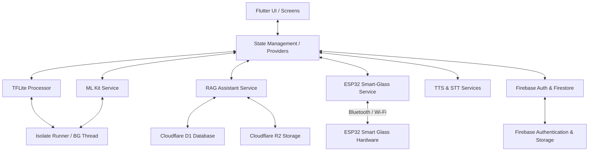
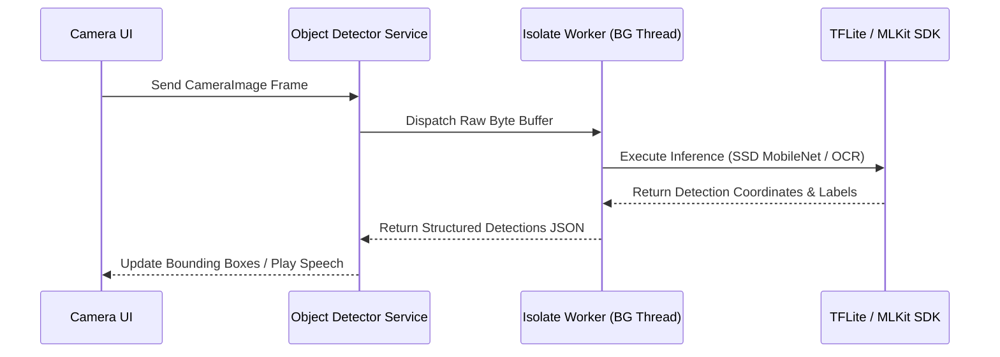

# Easylens - Architecture Documentation

Easylens is an advanced accessibility assistant mobile application designed to empower visually impaired and neurodivergent users. By combining on-device computer vision, local/cloud large language models, cloud databases, and hardware glass integration (ESP32), Easylens serves as a real-time smart companion.

---

## 1. System Architecture Overview

Easylens is built on a clean architectural pattern separating the **User Interface Layer**, **State & Controller Layer (Providers)**, and **Service/Infrastructure Layer (Platform Channels & Hardware Drivers)**.

### High-Level Architecture Flowchart



---

## 2. Directory Layout & Core Modules

The Flutter codebase is structured as follows:

```
lib/
├── main.dart                      # App initialization & MultiProvider configuration
├── constants/                     # Global constants (colors, styles)
├── models/                        # Declarative data models (preferences, contacts, notifications)
├── utils/                         # Global helper methods, navigation routing
├── services/                      # System interfaces and third-party integrations
│   ├── storage/                   # Cloudflare D1 (SQL) and R2 (Object) Storage clients
│   ├── firebase_service.dart      # User Auth, Firestore syncing
│   ├── ml_kit_service.dart        # Image Labeling, Text Recognition (OCR)
│   ├── object_detector_service.dart # Object detection pipelines
│   ├── tflite_processor.dart      # TensorFlow Lite execution
│   ├── isolate_runner.dart        # Multithreaded CPU heavy task isolation
│   ├── esp32_service.dart         # Bluetooth / Local networking for ESP32 glasses
│   ├── rag_service.dart           # Retrieval-Augmented Generation service
│   ├── stt_service.dart           # Speech-To-Text wrapper
│   └── tts_service.dart           # Text-To-Speech wrapper
└── screens/                       # User interfaces organized by features
    ├── welcome/                   # Application splash & onboarding
    ├── login/                     # Secure Authentication entry
    ├── signup/                    # Multi-step step-by-step preference setup
    ├── dashboard/                 # Central navigation hub & Voice Buddy panel
    ├── object_detection/          # Live camera computer vision feed
    ├── rag_assistant/             # Voice/Text RAG Assistant panel
    └── settings/                  # Personalization (Speech speeds, visual contrasts, units)
```

---

## 3. Core Subsystem Workflows

### A. Real-Time Computer Vision (Object & Text Detection)
To avoid UI lag (jank) during real-time image processing, Easylens utilizes **Dart Isolates**. Frame processing is offloaded to a separate CPU thread worker.



### B. Voice-Activated RAG Assistant
Easylens implements an offline-first hybrid RAG (Retrieval-Augmented Generation) assistant using local models combined with cloud storage logs.

1. **Voice Input:** User speaks a query (captured via `SttService`).
2. **Local Context Enrichment:** The query is compared against local preferences and cached knowledge.
3. **Inference Execution:** Run locally via `flutter_gemma` or synced using Cloudflare D1 SQL vectors.
4. **Voice Output:** Returns text response parsed into natural speech via `TtsService`.

### C. Hardware Glass Integration (ESP32)
The app connects to a custom wearable device built on the ESP32 chip.
* **Stream Capture:** The glass sends remote video frame buffers or triggers SOS buttons.
* **Control Channel:** Easylens sends haptic buzz commands or system indicators back to the glasses via Bluetooth Low Energy (BLE) or WebSockets.

---

## 4. Databases & Storage Architecture

Easylens uses a redundant hybrid storage engine to balance latency and security:

* **Firebase Auth & Firestore:** Stores primary profile records, passwords, emergency contacts, and active configurations.
* **Cloudflare D1 (D1 Database):** Houses relational logs and vectorized search embeddings for the RAG Engine.
* **Cloudflare R2 Bucket:** Stores large media files, uploaded voice memos, and saved image captures.
* **Local SharedPreferences:** Fast sync store for offline settings (e.g., high-contrast theme, selected language, preferred speech speed).

---

## 5. Security & Verification Features

* **Network Encryption:** All API traffic to Cloudflare and Firebase uses strict TLS.
* **Camera Safety:** Live camera streams are processed locally in volatile memory; they are never uploaded to the cloud without explicit user command.
* **SOS Protocol:** Emergency triggers query location metadata via GPS (`Geolocator`) and automatically trigger an SMS (`SmsService`) to preset emergency contacts.
