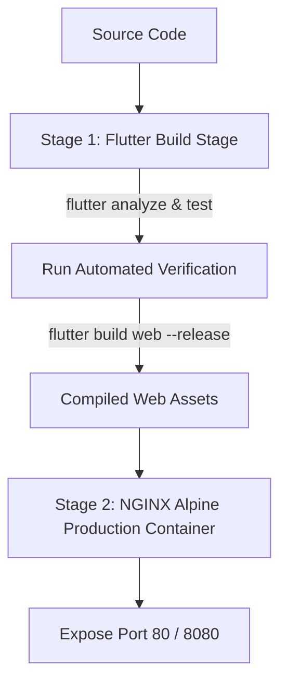

# 🐳 EasyLens Docker & Containerization Guide

Welcome to the **EasyLens Docker Setup & Deployment Guide**. This document explains how the EasyLens web application is containerized, built, tested, and deployed automatically via Docker and GitHub Container Registry (GHCR).

---

## 📐 Architecture Overview

The container setup uses a **Multi-Stage Dockerfile** to maintain extreme portability, fast builds, and high security:



### Key Components

- **`Dockerfile`**: 2-stage build environment (`cirrusci/flutter:stable` ➡️ `nginx:1.25-alpine`).
- **`nginx.conf`**: Custom NGINX configuration for Single Page Application (SPA) routing, Gzip compression, and asset caching.
- **`docker-compose.yml`**: One-command local container orchestration.
- **`.dockerignore`**: Excludes native OS folders, local build caches, and large binary models (`model.bin`).

---

## ⚡ Quick Start: Running Locally with Docker

### Prerequisites
- [Docker Desktop](https://www.docker.com/products/docker-desktop/) installed and running.

### 1. Using Docker Compose (Recommended)

To build and launch the containerized application with a single command:

```bash
docker compose up --build
```

Once started, open your browser and navigate to:
👉 **`http://localhost:8080`**

To stop the container:
```bash
docker compose down
```

---

### 2. Using Docker CLI Manually

If you prefer building and running using standard Docker CLI commands:

#### A. Build the Docker Image
```bash
docker build -t easylens-web:latest .
```

#### B. Run the Container
```bash
docker run -d \
  --name easylens_app \
  -p 8080:80 \
  --restart always \
  easylens-web:latest
```

#### C. Test Container Health
```bash
curl -f http://localhost:8080/
```

#### D. View Container Logs
```bash
docker logs -f easylens_app
```

#### E. Stop & Remove Container
```bash
docker stop easylens_app && docker rm easylens_app
```

---

## 📦 Pulling Pre-Built Image from GitHub Packages (GHCR)

Every code update pushed to `main` is automatically compiled and published to **GitHub Container Registry (GHCR)**. You can pull and run the pre-built image without needing Flutter installed locally.

### 1. Pull the Image
```bash
docker pull ghcr.io/thes-is-it/easylens:latest
```

### 2. Run the Container
```bash
docker run -d \
  --name easylens_live \
  -p 8080:80 \
  --restart always \
  ghcr.io/thes-is-it/easylens:latest
```

---

## 🔄 Automated CI/CD Workflow (`.github/workflows/ci_cd.yml`)

Whenever a commit is pushed to `main` or a Pull Request is opened:

1. **`analyze_and_test`**:
   - Executes static analysis (`flutter analyze --no-fatal-warnings --no-fatal-infos`).
   - Executes unit tests (`flutter test`).
2. **`docker_build_and_publish`**:
   - Compiles multi-stage Docker image.
   - Spins up a test container and runs live `curl` health verification.
   - Publishes image package to `ghcr.io/thes-is-it/easylens:latest`.
3. **`build_android`**:
   - Builds the production Android release APK (`easylens-release-apk`).

---

## 🛠️ Environment Configuration

By default, Docker container build steps create a mock `.env` file for compile safety. To supply live production variables during deployment:

```bash
docker run -d \
  -p 8080:80 \
  --env-file .env \
  ghcr.io/thes-is-it/easylens:latest
```

---

## 📄 License & Maintainers
Maintained by **Thes-IS-IT EasyLens Team**.
