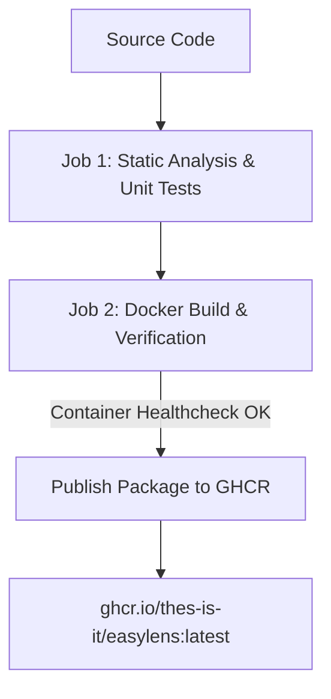

# EasyLens Docker & Containerization Guide

This document explains how the EasyLens container image is built, tested, and published automatically as a Docker package to the GitHub Container Registry (GHCR).

---

### 01 — ARCHITECTURE OVERVIEW

The container setup uses an NGINX production server:



#### Key Components

- `Dockerfile`: NGINX container serving the application portal (`nginx:1.25-alpine`).
- `nginx.conf`: NGINX server configuration with Gzip compression and asset caching headers.
- `docker-compose.yml`: Local container orchestration.
- `.dockerignore`: Excludes build caches, native OS folders, and large binary models (`model.bin`).

---

### 02 — QUICK START: RUNNING LOCALLY WITH DOCKER

#### Prerequisites

> - `Docker Desktop` installed and running.

#### Using Docker Compose (Recommended)

To build and launch the containerized application locally:

```bash
docker compose up --build
```

Once started, navigate to:
`http://localhost:8080`

To stop the container:
```bash
docker compose down
```

#### Using Docker CLI Manually

##### Build the Docker Image
```bash
docker build -t easylens:latest .
```

##### Run the Container
```bash
docker run -d \
  --name easylens_app \
  -p 8080:80 \
  --restart always \
  easylens:latest
```

##### Test Container Health
```bash
curl -f http://localhost:8080/
```

---

### 03 — PULLING PRE-BUILT PACKAGE IMAGE FROM GITHUB PACKAGES (GHCR)

On every push to the `main` branch, GitHub Actions compiles and publishes the official Docker package image directly to GitHub Container Registry (GHCR). You can pull and run the package without building locally:

```bash
# Pull the latest Docker package
docker pull ghcr.io/thes-is-it/easylens:latest

# Run the containerized app
docker run -d \
  --name easylens_live \
  -p 8080:80 \
  --restart always \
  ghcr.io/thes-is-it/easylens:latest
```

---

### 04 — AUTOMATED CI/CD WORKFLOW (`.github/workflows/ci_cd.yml`)

1. **`analyze_and_test`**:
   - Runs static code analysis (`flutter analyze --no-fatal-warnings --no-fatal-infos`).
   - Executes all unit tests (`flutter test`).
2. **`docker_build_and_publish`**:
   - Builds Docker image and verifies container health (`curl http://localhost:8080/`).
   - Publishes Docker package to GitHub Packages (`ghcr.io/thes-is-it/easylens:latest`).

---

### 05 — LICENSE & MAINTAINERS

Maintained by the Thes-IS-IT Research Team (Holy Angel University):
- **Graciella Mhervie D. Jimenez**
- **Jian Kalel D. Marquez**
- **Arron Kian M. Parejas**
- **Jenica Sarah B. Tongol**

EasyLens is licensed under a Modified MIT License with Academic Thesis Conditions. See [`LICENSE.md`](LICENSE.md) for full terms.
