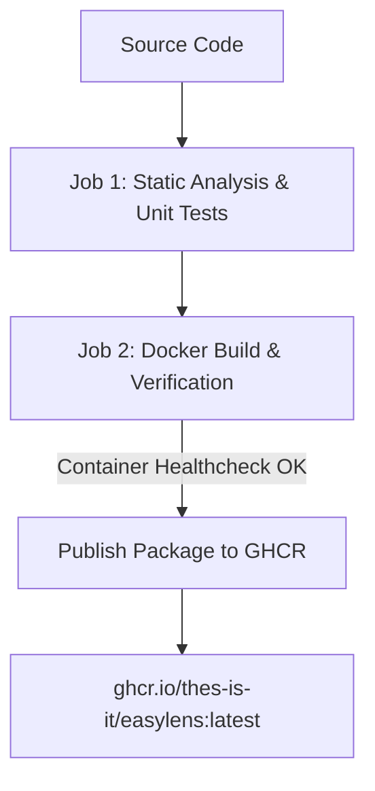

# 🐳 EasyLens Docker & Containerization Guide

Welcome to the **EasyLens Docker Setup & Deployment Guide**. This document explains how the EasyLens container image is built, tested, and published automatically as a Docker Package to **GitHub Container Registry (GHCR)**.

---

## 📐 Architecture Overview

The container setup uses a lightweight, high-performance NGINX production server:



### Key Components

- **`Dockerfile`**: Lightweight NGINX container serving the application portal (`nginx:1.25-alpine`).
- **`nginx.conf`**: Optimized NGINX server configuration with Gzip compression and asset caching headers.
- **`docker-compose.yml`**: One-command local container orchestration.
- **`.dockerignore`**: Excludes build caches, native OS folders, and large binary models (`model.bin`).

---

## ⚡ Quick Start: Running Locally with Docker

### Prerequisites
- [Docker Desktop](https://www.docker.com/products/docker-desktop/) installed and running.

### 1. Using Docker Compose (Recommended)

To build and launch the containerized application locally with a single command:

```bash
docker compose up --build
```

Once started, open your browser and navigate to:
👉 **`http://localhost:8080`**

To stop the container:
```bash
docker compose down
```

---

### 2. Using Docker CLI Manually

#### A. Build the Docker Image
```bash
docker build -t easylens:latest .
```

#### B. Run the Container
```bash
docker run -d \
  --name easylens_app \
  -p 8080:80 \
  --restart always \
  easylens:latest
```

#### C. Test Container Health
```bash
curl -f http://localhost:8080/
```

---

## 📦 Pulling Pre-Built Package Image from GitHub Packages (GHCR)

On every push to `main`, GitHub Actions compiles and publishes the official Docker package image directly to **GitHub Container Registry (GHCR)**. You can pull and run the package without building locally:

```bash
# Pull the latest Docker package
docker pull ghcr.io/thes-is-it/easylens:latest

# Run the containerized app
docker run -d \
  --name easylens_live \
  -p 8080:80 \
  --restart always \
  ghcr.io/thes-is-it/easylens:latest
```

---

## 🔄 Automated CI/CD Workflow (`.github/workflows/ci_cd.yml`)

1. **`analyze_and_test`**:
   - Runs static code analysis (`flutter analyze --no-fatal-warnings --no-fatal-infos`).
   - Executes all unit tests (`flutter test`).
2. **`docker_build_and_publish`**:
   - Builds Docker image and verifies container health (`curl http://localhost:8080/`).
   - Publishes Docker Package to **GitHub Packages** (`ghcr.io/thes-is-it/easylens:latest`).

---

## 📄 License & Maintainers
Maintained by **Thes-IS-IT EasyLens Team**.
