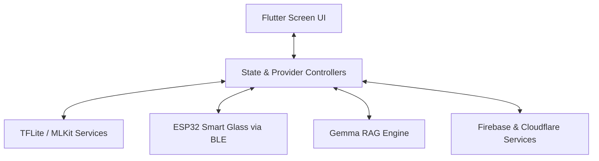

# Easylens 👓

Easylens is a state-of-the-art accessibility assistant mobile application designed to empower visually impaired and neurodivergent users. By blending local computer vision, on-device and cloud large language models, cloud storage databases, and edge wearable glasses integration, Easylens functions as a real-time smart companion.

---

## 🚀 Key Features

*   **Real-time Object & Text Detection:** Runs locally using TensorFlow Lite and ML Kit, offloaded to background thread workers (Dart Isolates) to prevent frame lags.
*   **Voice-Activated RAG Assistant:** An offline-first hybrid Retrieval-Augmented Generation agent powered by Gemma local models.
*   **Hardware Smart-Glass Integration:** Integrates with an ESP32 hardware device to stream camera frames, exchange control instructions, or trigger SOS signals via BLE/WebSockets.
*   **Safety & SOS Engine:** Coordinates device GPS location data to auto-dispatch cellular SMS notifications to preset emergency contacts in critical situations.
*   **Accessible-First UI:** Custom designed for high contrast preferences, screen readers, variable speech synthesis (TTS) playback speeds, and intuitive voice commands (STT).

---

## 🛠️ Tech Stack & Services

*   **Framework:** Flutter (Dart)
*   **Identity & Config Sync:** Firebase Authentication & Cloud Firestore
*   **Data & Embedding Storage:** Cloudflare D1 (Relational/Vectors) & Cloudflare R2 (Object Storage)
*   **On-Device Models:** Google ML Kit (OCR / Image Labeling), `flutter_gemma` (Local LLM), TensorFlow Lite (`tflite_flutter`)
*   **Hardware Control:** Bluetooth Low Energy (BLE) & local WebSockets interfacing with ESP32 microcontrollers

---

## 📐 Architecture

For a complete breakdown of the project layout, database systems, and data flow execution, please view the [Full Architecture Document](file:///Users/arronkianparejas/easylens/docs/ARCHITECTURE.md).



---

## 💻 Developer Guide

### Prerequisites
*   Flutter SDK (version matching `pubspec.yaml` environment limits)
*   Android SDK / Xcode

### Running the App

#### Running on Android Emulator
Because the app bundles complex native libraries (ML Kit, Gemma, TensorFlow), debug builds compile for all target ABIs by default. To avoid installation disk errors on the emulator (e.g. `Requested internal only, but not enough space`), run the app by targeting only the emulator architecture (`x86_64`):

```bash
flutter run --target-platform android-x64
```

#### Running on Physical Devices
To run or build for arm64 physical architectures (modern Android devices):

```bash
flutter run --target-platform android-arm64
```
