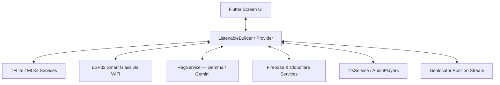

# EasyLens

EasyLens is an accessibility assistant mobile application designed for visually impaired and neurodivergent users. **At its core, EasyLens operates on a custom fine-tuned MobileNetV2 object detection pipeline.** This edge vision engine acts as the primary "lens," integrating local computer vision, on-device large language models (`Gemma`/`Gemini`), cloud storage, and wearable ESP32 smart glasses into a real-time assistant.

---

### 01 — KEY FEATURES

| Feature | Description |
|---|---|
| **Custom Object Detector** | **Core Component:** Custom fine-tuned MobileNetV2 SSD drawing real-time bounding boxes via Dart Isolate background threads for instant obstacle TTS alerts. |
| **Speech Navigation** | Turn-by-turn guidance controlled via continuous speech (STT). Includes Filipino/Tagalog support, dynamic map pinning, and global arrival notifications. |
| **Buddy Local AI** | On-device Gemma-IT 2B LLM for English; Google Gemini 3.6 Flash (Low) for Filipino. Full voice I/O and RAG knowledge base. |
| **Nearby Text Scanner** | Supported by ML Kit OCR; reads text aloud; forwards to Buddy for intelligent context explanation. |
| **SOS & Emergency** | SMS dispatch to active emergency contacts via the MensaHero gateway. |
| **Voice Personas** | 6 personas (including Maya for native Tagalog) with distinct pitch/rate. Applied universally across all TTS output. |
| **Filipino Language** | Full app localization — UI strings, greetings, Buddy, Navigation, Settings — all switch live. |
| **Dynamic Theming** | Default (light) and Black (AMOLED) themes with 8 accent color choices applied globally in real time. |
| **ESP32 Smart Glass** | Streams MJPEG video from a custom ESP32-CAM head-mounted device over WiFi directly into the Object Detection pipeline. |
| **Shake to Undo** | Accelerometer gesture (>2.5g) triggers undo action + TTS confirmation. |
| **Bark Sound Cue** | `bark_dashboard.mp3` plays once on welcome/startup and tab interactions. |

---

### 02 — TECH STACK & SERVICES

#### Core
- Flutter (Dart SDK `^3.11.5`) — Cross-platform mobile runtime
- `Provider` + `ListenableBuilder` — Reactive state management

#### AI / ML
- `flutter_gemma: ^0.13.6` — On-device Gemma-IT 2B (English Buddy, offline)
- `google_generative_ai: ^0.4.4` — Gemini 3.6 Flash (Low) API (Filipino Buddy)
- `google_mlkit_text_recognition: ^0.15.1` — On-device OCR (Text Scanner)
- `google_mlkit_image_labeling: ^0.14.2` — On-device image labeling
- `tflite_flutter: ^0.12.1` — MobileNetV2 SSD object detection

#### Audio & Accessibility
- `flutter_tts: ^4.2.5` — Text-to-Speech with persona support
- `speech_to_text: ^7.4.0` — Voice input for Buddy and navigation
- `audioplayers: ^6.1.0` — Sound effect cues (`bark_dashboard.mp3`, etc.)

#### Location & Sensors
- `google_maps_flutter: ^2.5.3` — Map rendering and route display
- `geolocator: ^11.0.0` — GPS position stream
- `sensors_plus: ^5.0.1` — Accelerometer (shake detection)

#### Cloud & Storage
- Firebase Auth + Firestore + Storage — Auth, profile sync, avatar storage
- Notion REST API (`NotionService`) — Direct dual sync of user feedback to Notion Database
- Cloudflare R2 — Object storage (captures, backups)
- Cloudflare D1 — Serverless SQL (relational sync)
- `shared_preferences: ^2.2.3` — Local on-device key-value store

#### Networking
- `http: ^1.2.1` — REST calls (Google Maps routing, Ollama, Geocoding, ESP32)
- `flutter_dotenv: ^5.2.1` — `.env` secrets management

---

### 03 — ARCHITECTURE

For a complete breakdown of the project layout, database systems, and data flow, see the [`architecture.md`](docs/architecture/architecture.md) document.



#### Key Documents & Technical Specifications Index

| Category / Folder | Document File | Description |
|---|---|---|
| **Architecture** | [`architecture.md`](docs/architecture/architecture.md) | Comprehensive technical system architecture, `Provider` state flow, and database models. |
| | [`ai_architecture.md`](docs/architecture/ai_architecture.md) | On-device Gemma-IT 2B LLM, Gemini 3.6 Flash (Low), RAG engine, and Ollama fallback. |
| | [`local_storage_architecture.md`](docs/architecture/local_storage_architecture.md) | SQLite database caching, `SharedPreferences` key-value store, and Firestore sync. |
| | [`object_detection_architecture.md`](docs/architecture/object_detection_architecture.md) | Real-time TFLite MobileNetV2 SSD pipeline, ML Kit, and Speech Navigation logic. |
| **System & UML Diagrams** | [`system_architecture_and_uml.md`](docs/system_architecture/system_architecture_and_uml.md) | Complete UML Class, Component, Sequence, and State Machine diagrams. |
| **Data Flow & Diagrams (DFD)**| [`data_flow_diagrams.md`](docs/dfd/data_flow_diagrams.md) | Current vs. Proposed Level-1 and Level-2 Data Flow Diagrams (DFD). |
| | [`use_case_diagrams.md`](docs/dfd/use_case_diagrams.md) | Simplified and Detailed Architectural Use Case Diagrams (UCD) and specifications. |
| | [`entity_relationship_diagram.md`](docs/dfd/entity_relationship_diagram.md) | Conceptual and Relational ERD models for Cloudflare D1 and local SQLite. |
| | [`data_dictionary.md`](docs/dfd/data_dictionary.md) | Database schemas, field data types, nullability, and primary/foreign key constraints. |
| | [`gantt_chart.md`](docs/dfd/gantt_chart.md) | Project implementation timeline and execution schedule (Dec 2025 – Aug 2026). |
| | [`dataset_specifications.md`](docs/dfd/dataset_specifications.md) | COCO 26-to-24 class dataset curation, ML Kit object detection comparison and support. |
| **Vision & AI Engines** | [`face_registration_and_recognition.md`](docs/vision_and_ai/face_registration_and_recognition.md) | 25-dimensional geometric landmark feature vector extraction and face recognition pipeline. |
| | [`ai_memory_and_guardrails.md`](docs/vision_and_ai/ai_memory_and_guardrails.md) | Conversational context memory windowing, system prompts, and Gemini guardrails. |
| | [`algorithm.md`](docs/vision_and_ai/algorithm.md) | Mathematical spatial hazard scoring, IoU algorithms, and bounding box math. |
| **Specifications & Quality** | [`software_and_hardware_specifications.md`](docs/specifications/software_and_hardware_specifications.md) | Hardware specifications, ESP32-CAM-MB, OV2640 70°, thermal dissipation, and device requirements. |
| | [`usability_quality_metrics.md`](docs/specifications/usability_quality_metrics.md) | Empirical ISO/IEC 25010, ISO/IEC 5055, and WCAG 2.2 AAA usability evaluation targets. |
| | [`software.md`](docs/specifications/software.md) | Full software component and technology stack table, Android APK, and iOS IPA specs. |
| **Features & Modules** | [`features.md`](docs/features_and_modules/features.md) | Screen-by-screen application feature catalog and accessibility controls. |
| | [`navigation_warning_system.md`](docs/features_and_modules/navigation_warning_system.md) | Multimodal spatial audio and tactile haptic obstacle proximity warning engine. |
| **Training & Notebooks** | [`mobilenetv2_transfer_learning_workflow.md`](docs/training/mobilenetv2_transfer_learning_workflow.md) | Figure 4.1 Multi-Phase transfer learning and unfreezing workflow flowcharts. |
| | [`mobilenetv2_finetuning_report.md`](docs/training/mobilenetv2_finetuning_report.md) | MobileNetV2 fine-tuning empirical evaluation report (>85% Top-1 / 2.48ms latency). |
| | [`hybrid_ai_fusion_app_integration.md`](docs/training/hybrid_ai_fusion_app_integration.md) | Multi-tier AI fusion architecture combining TFLite, ML Kit, and Gemma LLM. |
| | [`easylens.ipynb`](docs/training/easylens.ipynb) | Jupyter Notebook with complete 4-phase MobileNetV2 fine-tuning training code. |
| **Setup & Cloud Config** | [`security_configuration.md`](docs/setup/security_configuration.md) | Security key management, `.env` file templates, and credential isolation. |
| | [`cloudflare_r2_setup.md`](docs/setup/cloudflare_r2_setup.md) | Cloudflare R2 bucket setup, CORS policy, and AWS SigV4 signing configuration. |
| | [`cicd_pipeline.md`](docs/setup/cicd_pipeline.md) | Continuous Integration and release build pipeline specifications. |
| **Releases & Navigation** | [`releases.md`](docs/releases.md) | Official release notes and version changelog history (v1.0 - v20.0). |
| | [`readme.md`](docs/readme.md) | Documentation index map and topic directory guide. |
| **Canonical Reference** | [`readme.md`](docs/source-of-truth/readme.md) | Canonical source-of-truth technical specifications (Chapters 01 - 10). |

---

### 04 — DEVELOPER GUIDE

#### Prerequisites

> - Flutter SDK (version matching `pubspec.yaml` environment — SDK `^3.11.5`)
> - Android SDK 21+ / Xcode 14+
> - A physical Android device or emulator
> - Firebase project configured (see `google-services.json`)
> - `.env` file with required keys (see `.env.example`)

#### Environment Variables

```env
GEMINI_API_KEY=your_gemini_api_key
FIREBASE_API_KEY=...
FIREBASE_APP_ID=...
FIREBASE_MESSAGING_SENDER_ID=...
FIREBASE_PROJECT_ID=...
FIREBASE_STORAGE_BUCKET=...
GOOGLE_MAPS_KEY=your_maps_api_key
MENSAHERO_API_KEY=your_sms_gateway_key
MENSAHERO_BASE_URL=https://mensahero.onrender.com
ACCOUNT_ID=your_cloudflare_account_id
S3_API=https://<account_id>.r2.cloudflarestorage.com/<bucket>
ACCESS_KEY_ID=...
SECRET_ACCESS_KEY=...
BUCKET_NAME=easylens
```

#### Running the App

##### Physical Device (Recommended)
```bash
flutter run --target-platform android-arm64
```

##### Android Emulator

> **Note:** Because the application bundles complex native libraries (`ML Kit`, `Gemma`, `TensorFlow Lite`), debug builds compile for all ABIs by default. To avoid `Requested internal only, but not enough space` errors on the emulator:

```bash
flutter run --target-platform android-x64
```

##### Wireless ADB (Samsung Galaxy A55 / Similar)
```bash
adb connect <device-ip>:5555
flutter run
```

#### Installing the On-Device Gemma Model

The Gemma-IT 2B model (`model.bin`, ~1.3 GB) must be pushed to the device manually:

```bash
adb push model.bin /sdcard/Android/data/com.company.easylens/files/model.bin
```

Then restart the application. Buddy will automatically detect the model and use it for English queries.

#### Running Tests
```bash
flutter test
flutter analyze
```

#### ESP32 Hardware Setup

To stream live video into the object detection pipeline, you must connect your mobile device to the ESP32's local Wi-Fi Access Point:

> **Network Name (SSID):** `EasyLens-Camera`  
> **Password:** *(None / Open Network)*  

Flash the `hardware/esp32_cam_wifi_ap/esp32_cam_wifi_ap.ino` sketch to your ESP32-CAM module to initiate the MJPEG stream.

---

### 05 — LANGUAGE SUPPORT

| Language | Code | UI | Buddy | TTS Voice |
|---|---|---|---|---|
| English | `en` | Yes | Gemma (offline) | `en-US` persona |
| Filipino / Tagalog | `fil` | Yes | Gemini 3.6 Flash (Low) | `en-US` persona (Filipino text pronounced correctly) |

---

### 06 — PROJECT STRUCTURE (ABBREVIATED)

```text
easylens/
├── lib/
│   ├── constants/        # AppColors — dynamic theme tokens
│   ├── models/           # UserPreferences, AppNotification, EmergencyContact
│   ├── services/         # TtsService, RagService, SettingsService, Esp32Service…
│   ├── screens/
│   │   ├── dashboard/    # Home, Buddy, Navbar, Mascot Banner
│   │   ├── navigation/   # GPS turn-by-turn with proximity TTS
│   │   ├── hardware/     # ESP32 camera + ML Kit live feed
│   │   ├── settings/     # Full settings panel + Voice Feedback screen
│   │   ├── emergency/    # SOS dispatch
│   │   ├── contacts/     # Emergency contact management
│   │   ├── notifications/ # In-app notification log
│   │   ├── signup/       # 8-step onboarding wizard
│   │   └── object_detection/ # TFLite bounding box screen
│   └── utils/            # AppRoute (declarative navigation)
├── assets/
│   ├── mascots/          # Buddy mascot images (idle, thinking, listening…)
│   ├── models/           # TFLite model files
│   ├── images/           # App images
│   └── sounds/           # bark_dashboard.mp3 and other audio cues
├── docs/                 # Full technical documentation
└── .env                  # API keys and secrets (never commit)
```

---

### 07 — SECURITY

- All API keys stored in `.env` (excluded from git via `.gitignore`)
- Cloudflare R2 uploads use client-side **AWS Signature Version 4** (HMAC-SHA256) — no secrets transmitted in plaintext
- Firebase Security Rules enforce per-user read/write isolation
- Gemma runs fully **on-device** for English — no user query data leaves the device

---

### 08 — LICENSE

> TODO: Add license information.
