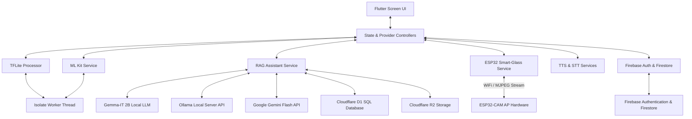
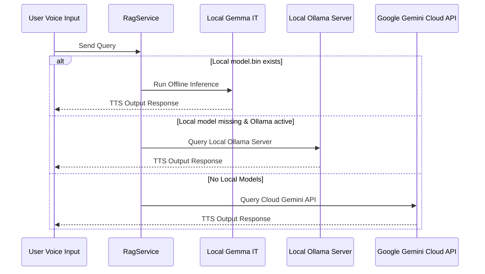

# Easylens - Comprehensive Technical Architecture

Easylens is a state-of-the-art accessibility assistant designed to empower visually impaired and neurodivergent users. By blending local computer vision, on-device and cloud generative models, unified storage layers, and ESP32 hardware streaming, Easylens acts as a real-time voice and visual companion.

---

## 1. High-Level Architecture Flowchart

The following diagram illustrates how UI controllers interact with underlying offline services, remote cloud databases, and external hardware devices.



---

## 2. Directory Layout & Core Modules

The codebase strictly follows a modular service-oriented architecture:

```
lib/
├── main.dart                      # Multi-provider initialization & services startup
├── constants/
│   └── colors.dart                # Accessible high-contrast themes & UI specs
├── models/
│   ├── user_preferences.dart      # Accessible profiles (themes, speech rate, aids)
│   ├── app_notification.dart      # Application logging & notification formats
│   └── emergency_contact.dart     # Emergency SMS profiles
├── utils/
│   └── app_route.dart             # Declarative app navigation pathways
├── services/
│   ├── storage/
│   │   ├── storage_service.dart   # Abstract storage base interface
│   │   ├── cloudflare_d1_service.dart # Relational configuration sync
│   │   └── cloudflare_r2_service.dart # AWS Signature V4 S3 upload logic
│   ├── firebase_service.dart      # Profile synchronization
│   ├── ml_kit_service.dart        # Real-time Google OCR (Text Recognition)
│   ├── object_detector_service.dart # Object detector pipelines
│   ├── tflite_processor.dart      # TensorFlow Lite execution pipelines
│   ├── isolate_runner.dart        # Dart Isolate worker pools (Background threads)
│   ├── esp32_service.dart         # ESP32-CAM MJPEG stream parse engine
│   ├── rag_service.dart           # Offline-first local/cloud RAG coordinator
│   ├── stt_service.dart           # Speech-To-Text configurations
│   ├── tts_service.dart           # Text-To-Speech engine
│   ├── settings_service.dart      # SharedPreferences config wrapper
│   ├── sms_service.dart           # Cellular SMS emergency dispatch
│   └── notification_service.dart  # System notification push wrapper
└── screens/
    ├── welcome/                   # Application introduction screen
    ├── login/                     # Secure entry portals
    ├── signup/                    # Step-by-step preference setup flow
    │   ├── steps/                 # Multi-step layout directories
    │   └── celebration_screen.dart # Celebration screen
    ├── dashboard/                 # Central navigation hub & Voice Buddy
    ├── object_detection/          # Real-time computer vision live feed
    ├── rag_assistant/             # Voice-first RAG chat assistant
    └── settings/                  # UI Customization panels
```

---

## 3. Subsystem Specifications

### A. RAG Engine & LLM Integrations
Easylens uses `RagService` as a multi-tier fallback generation coordinator to handle user queries offline and online:

1.  **Tier 1: On-Device Google Gemma (`flutter_gemma`)**
    *   Loads local model binary `.bin` files (`gemma-2b-it`).
    *   Funnels keyword-enriched local context to the offline model.
    *   Operates with a maximum limit of `1024` generation tokens.
2.  **Tier 2: Local Ollama Fallback**
    *   Targets local development instances (`http://10.0.2.2:11434` on Android emulator).
    *   Dynamically probes local servers for models (`llama3.2:latest`, `gemma2:2b`, `qwen2.5:0.5b`).
3.  **Tier 3: Google Gemini API (`google_generative_ai`)**
    *   Cloud fallback when network connectivity is present.



### B. Computer Vision & Isolate Threads
To prevent dropping frames on the main UI thread during video capture, heavy tasks are delegated to `IsolateRunner`:
*   **TFLite Model:** `ssd_mobilenet_v2.tflite` (64 MB) detects 80 standard classes from the MS-COCO dataset.
*   **Input Handling:** Crops and resizes frame buffers to `300x300` pixels.
*   **OCR Model:** ML Kit Text Recognition processes camera buffers to find labels and hazard signs.

### C. Hardware Integration (ESP32-CAM)
Easylens connects directly to a custom head-mounted ESP32-CAM device:
*   **WiFi AP Mode:** ESP32 acts as an Access Point (SSID: `EasyLens-Camera`).
*   **MJPEG Stream Reader:** `Esp32Service` parses the MJPEG raw boundary streams from `http://192.168.4.1:81/stream` and emits parsed frame updates to observers.
*   **GPIO Controls:** Controls the hardware flash LED remotely through HTTP endpoints:
    *   LED On: `GET http://192.168.4.1:81/led?val=1`
    *   LED Off: `GET http://192.168.4.1:81/led?val=0`

---

## 4. Storage & Sync Layers

*   **Cloudflare D1 Database:** Serverless SQLite database. Synchronizes user profiles, configurations, and contacts securely using token authorized HTTP payloads.
*   **Cloudflare R2 Bucket:** Stores larger media captures, backups, and user avatars. Built with client-side AWS Signature Version 4 HMAC generation (`sha256` payload hashes).
*   **Firebase Store:** Manages credentials via Firebase Auth and stores quick settings variables.
*   **SharedPreferences:** Holds localized device flags (e.g. contrast choices, speech rate).
