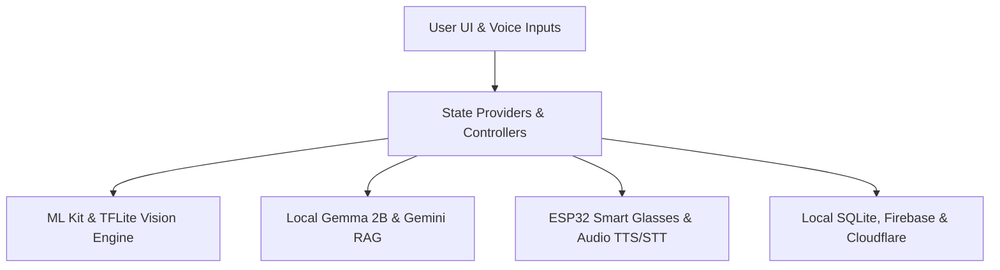
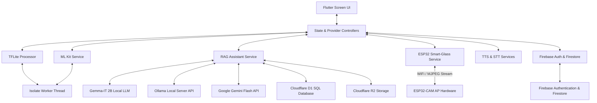
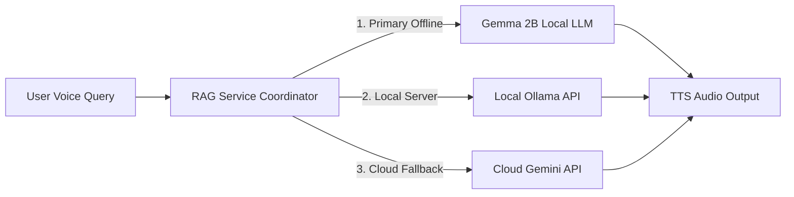
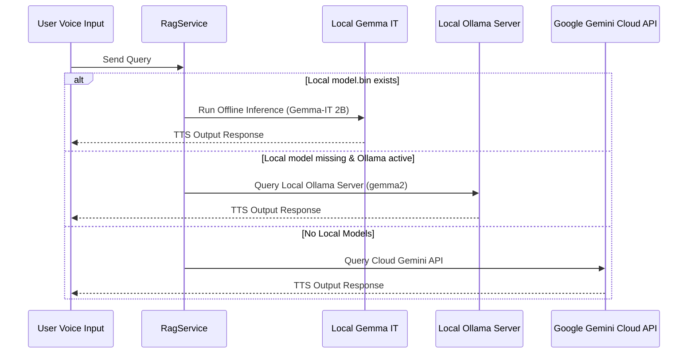
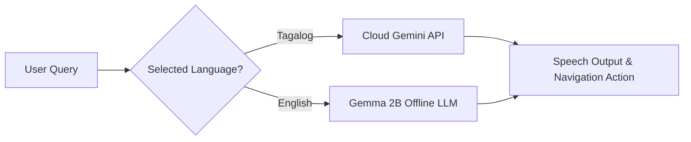
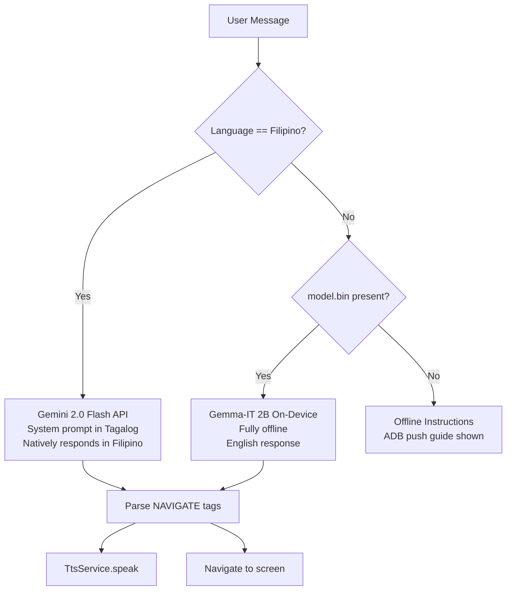
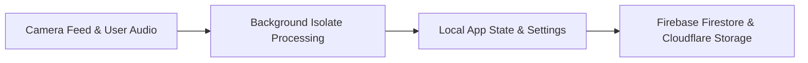
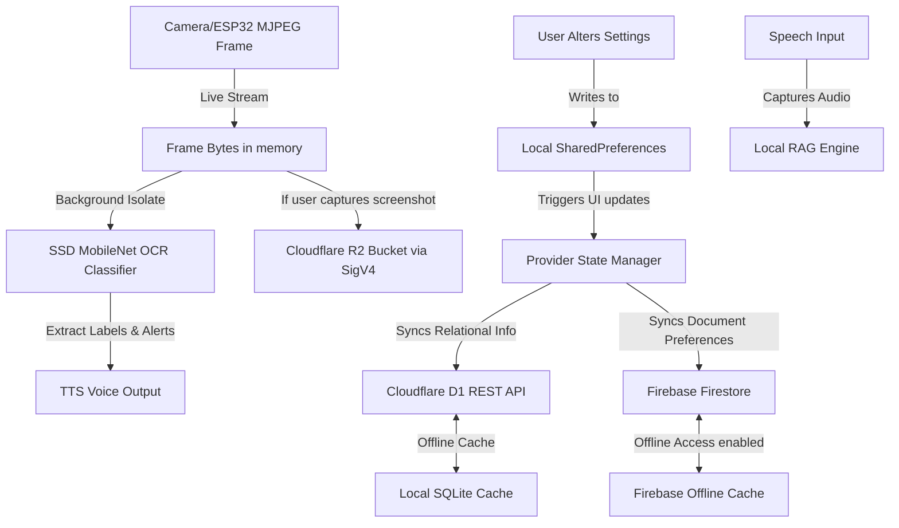

# Easylens - Comprehensive Technical Architecture

Easylens is a state-of-the-art accessibility assistant designed to empower visually impaired and neurodivergent users. By blending local computer vision, on-device and cloud generative models, unified storage layers, and ESP32 hardware streaming, Easylens acts as a real-time voice and visual companion.

---

## 1. Complete Technology Stack & Specifications

### Core Framework & State Management
*   **Flutter (Dart SDK `^3.11.5`):** Serves as the cross-platform application runtime.
*   **Provider Pattern (`provider: ^6.1.2`):** Handles reactive state management, linking hardware event triggers, ML classification labels, and settings adjustments across UI widgets.
*   **Declarative Navigation:** Custom router wrapper in `app_route.dart` facilitating transition configurations suitable for accessibility focus frames.

### Artificial Intelligence & On-Device Models
1.  **Object Detection Pipeline (`tflite_flutter: ^0.12.1`):**
    *   **Inference Engine:** TensorFlow Lite C-API bindings for Dart.
    *   **Execution Model:** MobileNetV2 SSD trained on the MS-COCO dataset. Takes `300x300` RGB arrays and generates class IDs, bounding boxes, and scores. Runs on 4 threads via CPU interpreter options.
2.  **On-Device LLM - Google Gemma (`flutter_gemma: ^0.13.6`):**
    *   **Model:** Gemma-IT 2B (Instruction Tuned).
    *   **Interface:** Google AI Edge SDK. Uses hardware acceleration (NNAPI/GPU delegates where available) to perform offline prompts using context extracted locally.
3.  **Local Ollama Server Fallback:**
    *   Connects to an external local Ollama daemon using HTTP protocols on `http://10.0.2.2:11434` (Android) or `http://localhost:11434` (iOS).
    *   Supports `gemma2:2b` for local developer testing.
4.  **Cloud LLM - Google Gemini (`google_generative_ai: ^0.4.4`):**
    *   Targets remote `gemini-1.5-flash` or similar models for rich conversational tasks when Internet access is detected.
5.  **Text Recognition & Image Labeling (`google_mlkit_text_recognition: ^0.15.1`, `google_mlkit_image_labeling: ^0.14.2`):**
    *   Performs low-latency on-device Optical Character Recognition (OCR) to parse labels, prescription text, and warning signs.

### Hardware & Peripherals (ESP32-CAM)
*   **Local Networking Server:** The ESP32 hosts a local open WiFi Access Point (AP) named `EasyLens-Camera`.
*   **MJPEG Video Receiver:** `Esp32Service` establishes an HTTP persistent boundary stream to `http://192.168.4.1:81/stream`, chunk-decodes raw JPEG frames, and updates visual frames.
*   **Hardware Control Endpoint:** Sends micro-control GET requests to adjust flash LED levels (`/led?val=1` or `/led?val=0`).

### Audio & Accessibility Engagements
*   **Text-to-Speech (`flutter_tts: ^4.2.5`):** Reads parsed OCR texts, warning labels, and companion remarks. Supports pitch, rate, and volume configurations.
*   **Speech-to-Text (`speech_to_text: ^7.4.0`):** Listens for user queries to feed directly into the local RAG assistant.

### Databases & Cloud Storage
1.  **Cloudflare D1 (D1 SQL Database):**
    *   Serverless database running on Cloudflare Workers.
    *   Stores relational data, sync history, and emergency contact mappings. Communicates securely via API HTTP request payloads.
2.  **Cloudflare R2 Bucket (S3-Compatible Object Store):**
    *   Stores profile avatars, captured hazard reports, and diagnostic clips.
    *   **Security Protocol:** Custom client-side AWS Signature Version 4 implementation using HMAC-SHA256 (`crypto: ^3.0.3`) to directly sign payload requests on-device without exposing secrets.
3.  **Firebase Services (`firebase_core: ^3.1.1`, `firebase_auth: ^5.1.2`):**
    *   Provides token-based secure authentication and real-time document synchronization.

---

## 2. High-Level Architecture Flowchart

#### Simplified Architecture Overview


#### Detailed Architecture Diagram


---

## 3. Directory Layout & Core Modules

```
lib/
├── main.dart                      # Multi-provider initialization & services startup
├── constants/
│   └── colors.dart                # Accessible high-contrast themes & UI specs
├── models/
│   ├── user_preferences.dart      # Accessible profiles (themes, speech rate, aids)
│   ├── app_notification.dart      # Application logging & notification formats
│   └── emergency_contact.dart     # Emergency SMS profiles
├── utils/
│   └── app_route.dart             # Declarative app navigation pathways
├── services/
│   ├── storage/
│   │   ├── storage_service.dart   # Abstract storage base interface
│   │   ├── cloudflare_d1_service.dart # Relational configuration sync
│   │   └── cloudflare_r2_service.dart # AWS Signature V4 S3 upload logic
│   ├── firebase_service.dart      # Profile synchronization
│   ├── ml_kit_service.dart        # Real-time Google OCR (Text Recognition)
│   ├── object_detector_service.dart # Object detector pipelines
│   ├── tflite_processor.dart      # TensorFlow Lite execution pipelines
│   ├── isolate_runner.dart        # Dart Isolate worker pools (Background threads)
│   ├── esp32_service.dart         # ESP32-CAM MJPEG stream parse engine
│   ├── rag_service.dart           # Offline-first local/cloud RAG coordinator
│   ├── stt_service.dart           # Speech-To-Text configurations
│   ├── tts_service.dart           # Text-To-Speech engine
│   ├── settings_service.dart      # SharedPreferences config wrapper
│   ├── sms_service.dart           # Cellular SMS emergency dispatch
│   └── notification_service.dart  # System notification push wrapper
└── screens/
    ├── welcome/                   # Application introduction screen
    ├── login/                     # Secure entry portals
    ├── signup/                    # Step-by-step preference setup flow
    │   ├── steps/                 # Multi-step layout directories
    │   └── celebration_screen.dart # Celebration screen
    ├── dashboard/                 # Central navigation hub & Voice Buddy
    ├── object_detection/          # Real-time computer vision live feed
    ├── rag_assistant/             # Voice-first RAG chat assistant
    └── settings/                  # UI Customization panels
```

---

## 4. Subsystem Specifications

### A. RAG Engine & LLM Integrations
Easylens uses `RagService` as a multi-tier fallback generation coordinator to handle user queries offline and online:

#### Simplified RAG Inference Flow


#### Detailed RAG Sequence Diagram


### B. Computer Vision & Isolate Threads
To prevent dropping frames on the main UI thread during video capture, heavy tasks are delegated to `IsolateRunner`:
*   **TFLite Model:** `ssd_mobilenet_v2.tflite` (64 MB) detects 80 standard classes from the MS-COCO dataset.
*   **Input Handling:** Crops and resizes frame buffers to `300x300` pixels.
*   **OCR Model:** ML Kit Text Recognition processes camera buffers to find labels and hazard signs.

### C. Hardware Integration (ESP32-CAM)
Easylens connects directly to a custom head-mounted ESP32-CAM device:
*   **WiFi AP Mode:** ESP32 acts as an Access Point (SSID: `EasyLens-Camera`).
*   **MJPEG Stream Reader:** `Esp32Service` parses the MJPEG raw boundary streams from `http://192.168.4.1:81/stream` and emits parsed frame updates to observers.
*   **GPIO Controls:** Controls the hardware flash LED remotely through HTTP endpoints:
    *   LED On: `GET http://192.168.4.1:81/led?val=1`
    *   LED Off: `GET http://192.168.4.1:81/led?val=0`

---

## 6. Buddy AI Language Routing

`RagService` acts as a smart router that selects the correct LLM backend based on the active app language:

#### Simplified Language Routing Flow


#### Detailed Language Routing Flowchart


### Filipino Gemini Prompt Design
The `askBuddyGemini` method sends a **system instruction written entirely in Tagalog** to Gemini. This guarantees the model responds in Filipino regardless of the user's question language. Navigation tags (`[NAVIGATE: x]`) are embedded in the system prompt so Buddy can still open any screen.

### TTS Locale for Filipino
The TTS voice locale is set to `en-US` even when Filipino is active, because:
- Filipino (Tagalog) contains many English loanwords that `en-US` pronounces correctly
- Android's `fil-PH` TTS voice is robotic and unintelligible on most devices
- The selected voice persona's pitch/rate applies normally on the English voice engine

---

## 7. Translation & Localization Architecture

UI string translation is handled by `TranslationService`, a static class with a map of language keys to English/Filipino strings.

### Live Update Pattern
Every screen that displays translated content is wrapped in:
```dart
ListenableBuilder(
  listenable: SettingsService(),
  builder: (context, _) {
    final lang = SettingsService().selectedLanguage;
    // ... read TranslationService.translate(key, lang)
  },
)
```
This ensures that changing the language in Settings instantly re-renders all visible text without navigating away.

### Translation Key Map (core keys)
| Key | English | Filipino |
|---|---|---|
| `talk_to_buddy` | Talk to Buddy (Local AI) | Kausapin si Buddy (Lokal AI) |
| `nearby_text` | Nearby Text | Teksto sa Malapit |
| `nearby_objects` | Nearby Objects | Bagay sa Malapit |
| `audio_navigation` | Audio Navigation | Audio Nabigasyon |
| `sos_emergency` | SOS Emergency | SOS Emerhensya |
| `metric` | Metric | Metriko |
| `imperial` | Imperial | Imperial |

---

## 8. Proximity Navigation TTS System

During active navigation (`_navState == 1`), the GPS position stream triggers `_checkNavigationProgress()` on every location update.

### Anti-spam mechanism
A timestamp-based cooldown (`_navAlertCooldownMs = 8000 ms`) ensures TTS is never spoken more than once per 8 seconds regardless of GPS update frequency.

### Distance thresholds
| Distance | Action |
|---|---|
| < 200 m to next waypoint | Repeats current step instruction |
| < 80 m to next waypoint | Warns "In X meters, [step]" |
| < 30 m to next waypoint | Auto-advances step index + reads next step |
| < 80 m to destination | "Almost there! X meters away" |
| < 20 m to destination | "You have arrived!" + transitions to navState 2 |

Step waypoints are estimated by interpolating the Google Maps `_routePoints` array using the current step index fraction. This gives a smooth positional estimate even when step coordinate data is not available.

---

## 9. Dynamic Theming Architecture

All color values in the app are resolved at runtime through `AppColors` — a class of static getters that query `SettingsService` on every access:

```dart
static Color get primaryBackground =>
    SettingsService().appearanceTheme == 'Black'
        ? const Color(0xFF111111)
        : Colors.white;
```

This means no widget needs to be rebuilt from the root when the theme changes. Any widget that reads `AppColors.*` will display the correct color on its next paint cycle. Combined with `ListenableBuilder`, theme switches are instant app-wide.

### Theme Token Table
| Token | Default (light) | Black (dark) |
|---|---|---|
| `lightBackground` | `#F5F7FF` | `#000000` |
| `primaryBackground` | `#FFFFFF` | `#111111` |
| `primaryText` | `#000000` | `#FFFFFF` |
| `primaryButton` | `#002663` (navy) | Accent color |
| `cardBorder` | transparent | `#333333` |
| `textMuted` | `#6B7280` | `#9CA3AF` |

---

## 10. Audio Cue System

EasyLens uses `audioplayers` (separate from `flutter_tts`) for non-speech audio feedback:

*   **`AudioPlayer`** is instantiated per screen that needs sound cues and disposed with the widget lifecycle.
*   All tab switches in `DashboardScreen` are routed through `_onTabChanged(index)` — the single authoritative handler for tab navigation. This ensures the bark cue fires exactly once regardless of whether the user tapped the navbar, a dashboard button, or Buddy navigated them home.

### Registered Sound Assets
```
assets/sounds/
└── bark_dashboard.mp3   # Plays once when returning to Dashboard Home tab
```

---

## 5. Storage & Sync Layers

*   **Cloudflare D1 Database:** Serverless SQLite database. Synchronizes user profiles, configurations, and contacts securely using token authorized HTTP payloads.
*   **Cloudflare R2 Bucket:** Stores larger media captures, backups, and user avatars. Built with client-side AWS Signature Version 4 HMAC generation (`sha256` payload hashes).
*   **Firebase Store:** Manages credentials via Firebase Auth and stores quick settings variables.
*   **SharedPreferences:** Holds localized device flags (e.g. contrast choices, speech rate).

---

## 6. Data Synchronization Flowchart

The following flowchart describes the pipeline of reading user profile settings, hardware frame streams, and offline RAG queries, along with how state is synchronized across Local Storage and Cloud Storage:

#### Simplified Data Sync Flow


#### Detailed Data Synchronization Diagram


---

## 7. Database Schemas

Below are the detailed layout structures implemented across local devices and remote servers:

### A. Local SharedPreferences Schema
Fast, key-value variables cached directly on the physical mobile device:

| Key Name | Data Type | Default Value | Description |
|---|---|---|---|
| `easylens_notifications` | String (JSON Array) | `[]` | Persisted notification history (limits up to 100 entries). |
| `esp32_stream_url` | String | `http://192.168.4.1:81/stream` | Saved endpoint address for ESP32 MJPEG stream targets. |
| `user_language` | String | `English` | Active UI language configuration setting. |
| `high_contrast_theme` | String | `Black` | Theme setting targeting visual impairments. |
| `voice_feedback_enabled` | Boolean | `true` | TTS speech output global toggles. |
| `speech_rate` | Double (Float) | `0.5` | Pace factor used in speech synthesis. |
| `voice_persona_id` | String | `aria` | Current voice character profile selected. |

### B. Firebase Firestore Schema
Main document schemas storing active profile information under the `/users` collection:

#### Document: `/users/{userId}`
```json
{
  "email": "String (e.g. user@easylens.com)",
  "displayName": "String (e.g. John Doe)",
  "createdAt": "Timestamp (e.g. 2026-07-08T12:00:00Z)",
  "preferences": {
    "language": "English",
    "faceIdUnlock": false,
    "appearanceTheme": "Black",
    "accentColorIndex": 0,
    "shakeToUndo": true,
    "voiceFeedback": true,
    "navigationAssistant": true,
    "hapticFeedback": true,
    "speechRate": 0.5,
    "pitch": 0.5,
    "voicePersonaId": "aria",
    "unitsPreference": "Metric",
    "globalNotifications": true,
    "buddyFollowUp": true,
    "obstacleAlerts": true,
    "batteryAlerts": false,
    "connectionAlerts": false
  },
  "emergencyContacts": [
    {
      "name": "String (e.g. Sarah Doe)",
      "phone": "String (e.g. +1234567890)",
      "relationship": "String (e.g. Spouse)",
      "isActive": true
    }
  ]
}
```

### C. Cloudflare D1 SQL Schema
The relational layout deployed globally in Cloudflare's serverless D1 engine:

#### Table 1: `users`
```sql
CREATE TABLE users (
  id TEXT PRIMARY KEY,               -- Matches Firebase Authentication UID
  email TEXT,                        -- Primary contact email address
  display_name TEXT,                 -- User full name
  preferences_json TEXT,             -- Serialized UserPreferences object
  updated_at DATETIME DEFAULT CURRENT_TIMESTAMP
);
```

#### Table 2: `contacts`
```sql
CREATE TABLE contacts (
  id TEXT PRIMARY KEY,               -- Unique contact UUID
  user_id TEXT,                      -- Foreign Key references users(id)
  name TEXT,                         -- Contact name
  phone TEXT,                        -- Cellular number
  relationship TEXT,                 -- Relation type (e.g. Parent, Caregiver)
  is_active INTEGER DEFAULT 1,       -- 1 = true, 0 = false
  created_at DATETIME DEFAULT CURRENT_TIMESTAMP,
  FOREIGN KEY(user_id) REFERENCES users(id) ON DELETE CASCADE
);
```
