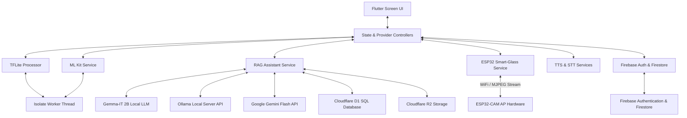
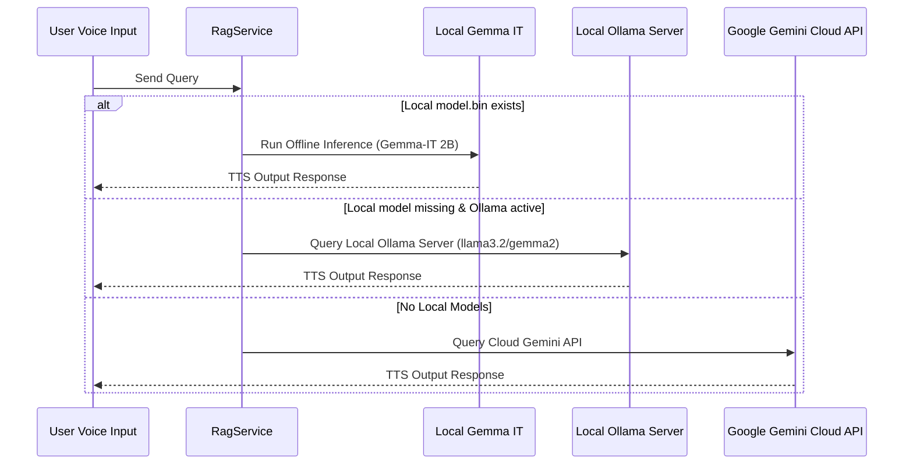

# Easylens - Comprehensive Technical Architecture

Easylens is a state-of-the-art accessibility assistant designed to empower visually impaired and neurodivergent users. By blending local computer vision, on-device and cloud generative models, unified storage layers, and ESP32 hardware streaming, Easylens acts as a real-time voice and visual companion.

---

## 1. Complete Technology Stack & Specifications

### Core Framework & State Management
*   **Flutter (Dart SDK `^3.11.5`):** Serves as the cross-platform application runtime.
*   **Provider Pattern (`provider: ^6.1.2`):** Handles reactive state management, linking hardware event triggers, ML classification labels, and settings adjustments across UI widgets.
*   **Declarative Navigation:** Custom router wrapper in `app_route.dart` facilitating transition configurations suitable for accessibility focus frames.

### Artificial Intelligence & On-Device Models
1.  **Object Detection Pipeline (`tflite_flutter: ^0.12.1`):**
    *   **Inference Engine:** TensorFlow Lite C-API bindings for Dart.
    *   **Execution Model:** MobileNetV2 SSD trained on the MS-COCO dataset. Takes `300x300` RGB arrays and generates class IDs, bounding boxes, and scores. Runs on 4 threads via CPU interpreter options.
2.  **On-Device LLM - Google Gemma (`flutter_gemma: ^0.13.6`):**
    *   **Model:** Gemma-IT 2B (Instruction Tuned).
    *   **Interface:** Google AI Edge SDK. Uses hardware acceleration (NNAPI/GPU delegates where available) to perform offline prompts using context extracted locally.
3.  **Local Ollama Server Fallback:**
    *   Connects to an external local Ollama daemon using HTTP protocols on `http://10.0.2.2:11434` (Android) or `http://localhost:11434` (iOS).
    *   Supports models like `llama3.2`, `gemma2:2b`, and `qwen2.5:0.5b`.
4.  **Cloud LLM - Google Gemini (`google_generative_ai: ^0.4.4`):**
    *   Targets remote `gemini-1.5-flash` or similar models for rich conversational tasks when Internet access is detected.
5.  **Text Recognition & Image Labeling (`google_mlkit_text_recognition: ^0.15.1`, `google_mlkit_image_labeling: ^0.14.2`):**
    *   Performs low-latency on-device Optical Character Recognition (OCR) to parse labels, prescription text, and warning signs.

### Hardware & Peripherals (ESP32-CAM)
*   **Local Networking Server:** The ESP32 hosts a local open WiFi Access Point (AP) named `EasyLens-Camera`.
*   **MJPEG Video Receiver:** `Esp32Service` establishes an HTTP persistent boundary stream to `http://192.168.4.1:81/stream`, chunk-decodes raw JPEG frames, and updates visual frames.
*   **Hardware Control Endpoint:** Sends micro-control GET requests to adjust flash LED levels (`/led?val=1` or `/led?val=0`).

### Audio & Accessibility Engagements
*   **Text-to-Speech (`flutter_tts: ^4.2.5`):** Reads parsed OCR texts, warning labels, and companion remarks. Supports pitch, rate, and volume configurations.
*   **Speech-to-Text (`speech_to_text: ^7.4.0`):** Listens for user queries to feed directly into the local RAG assistant.

### Databases & Cloud Storage
1.  **Cloudflare D1 (D1 SQL Database):**
    *   Serverless database running on Cloudflare Workers.
    *   Stores relational data, sync history, and emergency contact mappings. Communicates securely via API HTTP request payloads.
2.  **Cloudflare R2 Bucket (S3-Compatible Object Store):**
    *   Stores profile avatars, captured hazard reports, and diagnostic clips.
    *   **Security Protocol:** Custom client-side AWS Signature Version 4 implementation using HMAC-SHA256 (`crypto: ^3.0.3`) to directly sign payload requests on-device without exposing secrets.
3.  **Firebase Services (`firebase_core: ^3.1.1`, `firebase_auth: ^5.1.2`):**
    *   Provides token-based secure authentication and real-time document synchronization.

---

## 2. High-Level Architecture Flowchart



---

## 3. Directory Layout & Core Modules

```
lib/
├── main.dart                      # Multi-provider initialization & services startup
├── constants/
│   └── colors.dart                # Accessible high-contrast themes & UI specs
├── models/
│   ├── user_preferences.dart      # Accessible profiles (themes, speech rate, aids)
│   ├── app_notification.dart      # Application logging & notification formats
│   └── emergency_contact.dart     # Emergency SMS profiles
├── utils/
│   └── app_route.dart             # Declarative app navigation pathways
├── services/
│   ├── storage/
│   │   ├── storage_service.dart   # Abstract storage base interface
│   │   ├── cloudflare_d1_service.dart # Relational configuration sync
│   │   └── cloudflare_r2_service.dart # AWS Signature V4 S3 upload logic
│   ├── firebase_service.dart      # Profile synchronization
│   ├── ml_kit_service.dart        # Real-time Google OCR (Text Recognition)
│   ├── object_detector_service.dart # Object detector pipelines
│   ├── tflite_processor.dart      # TensorFlow Lite execution pipelines
│   ├── isolate_runner.dart        # Dart Isolate worker pools (Background threads)
│   ├── esp32_service.dart         # ESP32-CAM MJPEG stream parse engine
│   ├── rag_service.dart           # Offline-first local/cloud RAG coordinator
│   ├── stt_service.dart           # Speech-To-Text configurations
│   ├── tts_service.dart           # Text-To-Speech engine
│   ├── settings_service.dart      # SharedPreferences config wrapper
│   ├── sms_service.dart           # Cellular SMS emergency dispatch
│   └── notification_service.dart  # System notification push wrapper
└── screens/
    ├── welcome/                   # Application introduction screen
    ├── login/                     # Secure entry portals
    ├── signup/                    # Step-by-step preference setup flow
    │   ├── steps/                 # Multi-step layout directories
    │   └── celebration_screen.dart # Celebration screen
    ├── dashboard/                 # Central navigation hub & Voice Buddy
    ├── object_detection/          # Real-time computer vision live feed
    ├── rag_assistant/             # Voice-first RAG chat assistant
    └── settings/                  # UI Customization panels
```

---

## 4. Subsystem Specifications

### A. RAG Engine & LLM Integrations
Easylens uses `RagService` as a multi-tier fallback generation coordinator to handle user queries offline and online:



### B. Computer Vision & Isolate Threads
To prevent dropping frames on the main UI thread during video capture, heavy tasks are delegated to `IsolateRunner`:
*   **TFLite Model:** `ssd_mobilenet_v2.tflite` (64 MB) detects 80 standard classes from the MS-COCO dataset.
*   **Input Handling:** Crops and resizes frame buffers to `300x300` pixels.
*   **OCR Model:** ML Kit Text Recognition processes camera buffers to find labels and hazard signs.

### C. Hardware Integration (ESP32-CAM)
Easylens connects directly to a custom head-mounted ESP32-CAM device:
*   **WiFi AP Mode:** ESP32 acts as an Access Point (SSID: `EasyLens-Camera`).
*   **MJPEG Stream Reader:** `Esp32Service` parses the MJPEG raw boundary streams from `http://192.168.4.1:81/stream` and emits parsed frame updates to observers.
*   **GPIO Controls:** Controls the hardware flash LED remotely through HTTP endpoints:
    *   LED On: `GET http://192.168.4.1:81/led?val=1`
    *   LED Off: `GET http://192.168.4.1:81/led?val=0`

---

## 5. Storage & Sync Layers

*   **Cloudflare D1 Database:** Serverless SQLite database. Synchronizes user profiles, configurations, and contacts securely using token authorized HTTP payloads.
*   **Cloudflare R2 Bucket:** Stores larger media captures, backups, and user avatars. Built with client-side AWS Signature Version 4 HMAC generation (`sha256` payload hashes).
*   **Firebase Store:** Manages credentials via Firebase Auth and stores quick settings variables.
*   **SharedPreferences:** Holds localized device flags (e.g. contrast choices, speech rate).
