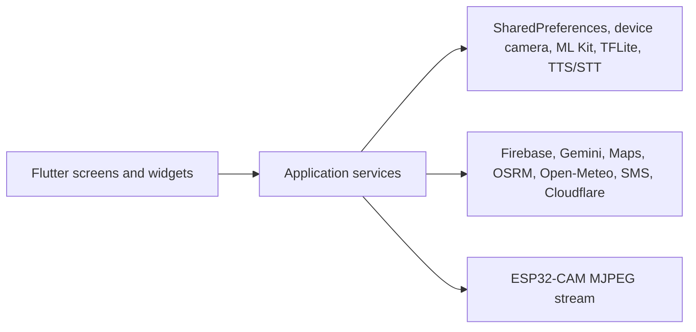

# Architecture overview

The maintained architecture reference is [02 — Architecture](source-of-truth/02_architecture.md).

At a glance, `main.dart` initializes dotenv, Firebase, the RAG knowledge base,
notifications, and ESP32 settings before rendering `EasyLensApp`. UI screens
call singleton services and rebuild primarily from `ChangeNotifier` services.

Use the source-of-truth document for responsibilities, initialization order,
and the limits of each optional integration.
