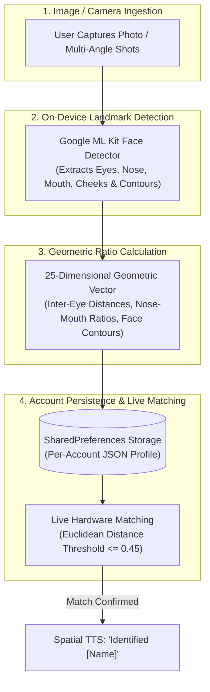
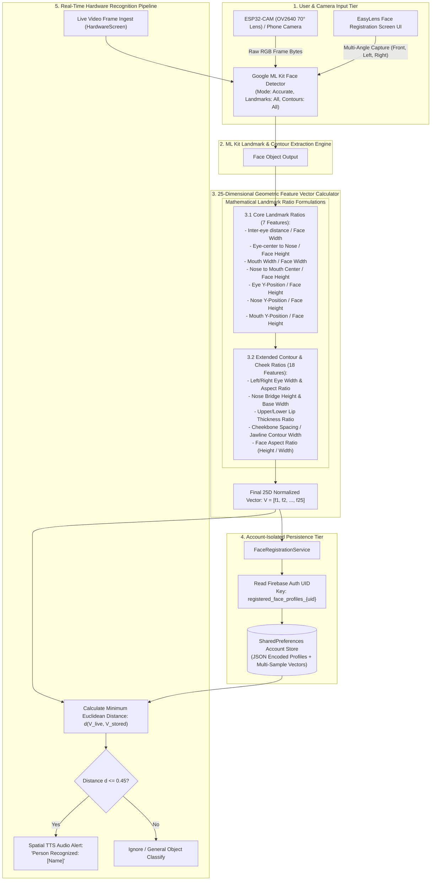

# EasyLens - Face Registration & Recognition Architecture Specification

---

## 1. Executive Summary & Overview

This document details the underlying engineering architecture, mathematical geometric feature extraction model, registration workflow, and live matching pipeline for **Face Recognition** in **EasyLens**.

Instead of heavy pixel-grid alignment or cloud-dependent API calls, EasyLens utilizes a **Client-Side Geometric Landmark & Contour Vector Engine** powered by `google_mlkit_face_detection`. It extracts a normalized 25-dimensional geometric ratio vector per face, ensuring $100\%$ offline processing, zero privacy risk, and real-time execution ($<15\text{ ms}$) on live video streams.

---

## 2. Simplified High-Level Flowchart

---

## 3. Detailed Architectural & Data Flow Pipeline

---

## 4. How Registration Works (Step-by-Step Technical Breakdown)

### Step 1: Image Ingestion & Landmark Detection
* The user opens the **Face Registration Screen** ([face_registration_screen.dart](file:///Users/arronkianparejas/easylens/lib/screens/face_registration/face_registration_screen.dart)) and captures a photo (or 3 multi-angle shots: Frontal, Left 15°, Right 15°).
* The image is passed to `Google ML Kit FaceDetector` configured with `FaceDetectorOptions(performanceMode: FaceDetectorMode.accurate, enableLandmarks: true, enableContours: true)`.

### Step 2: 25-Dimensional Geometric Feature Vector Extraction
Unlike standard facial recognition that requires heavy deep neural network embeddings (e.g., FaceNet 128D/512D), EasyLens calculates **25 normalized geometric landmark ratios** via `extractFaceFeatures(Face face, Size imageSize)`:

1. **Inter-Eye Distance**: $d(\text{Eye}_{\text{left}}, \text{Eye}_{\text{right}}) / \text{BBox}_{\text{width}}$
2. **Eye-Nose Elevation**: $d(\text{Eye}_{\text{center}}, \text{Nose}_{\text{base}}) / \text{BBox}_{\text{height}}$
3. **Mouth Scale Ratio**: $d(\text{Mouth}_{\text{left}}, \text{Mouth}_{\text{right}}) / \text{BBox}_{\text{width}}$
4. **Nose-Mouth Elevation**: $d(\text{Nose}_{\text{base}}, \text{Mouth}_{\text{center}}) / \text{BBox}_{\text{height}}$
5. **Vertical Relative Positions**: Eye Y-offset, Nose Y-offset, Mouth Y-offset normalized by bounding box height $\text{BBox}_{\text{height}}$.
6. **Contour & Facial Geometry**: 18 additional ratios including cheekbone spacing, jawline contour width, nose bridge height, lip thickness, and overall facial aspect ratio ($\text{BBox}_{\text{height}} / \text{BBox}_{\text{width}}$).

### Step 3: Account-Isolated Local Persistence
* The extracted 25D vector is packaged into a `FaceProfile` object containing:
  * `id`: Unique UUID
  * `name`: Person's name entered by the user
  * `multiSampleFeatures`: Array of feature vectors from multi-angle captures
  * `userId`: Firebase Auth UID of the active user
  * `registeredAt`: Timestamp
* Stored in `SharedPreferences` under the isolated account key `registered_face_profiles_{uid}` managed by [face_registration_service.dart](file:///Users/arronkianparejas/easylens/lib/services/face_registration_service.dart).

### Step 4: Real-Time Matching & Recognition Engine
* During continuous vision streaming, each detected face in the frame generates a 25D live vector $V_{\text{live}}$.
* The system computes the **Euclidean Distance** against all stored vectors $V_{\text{stored}}$:
  $$d(V_{\text{live}}, V_{\text{stored}}) = \sqrt{\sum_{i=1}^{25} (V_{\text{live}}[i] - V_{\text{stored}}[i])^2}$$
* **Threshold Match**: If $d \le 0.45$, the match is verified, and EasyLens triggers immediate priority Spatial Text-to-Speech audio feedback: `"[Name] detected in front of you"`.
