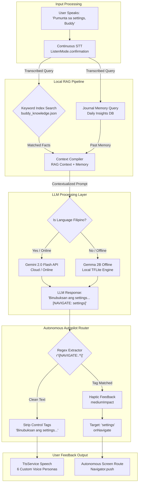

# EasyLens: Local LLM & Gemini Integration Architecture

EasyLens implements a hybrid on-device and cloud AI assistant system (Buddy) designed to act as a fully autonomous companion. It blends on-device local models, cloud fallbacks, semantic memory (Retrieval-Augmented Generation), and an autonomous autopilot router that executes app actions based on conversational intents.

---

## 1. AI Model Stack

### Local Offline Model: Google Gemma 2B
* **Library**: `flutter_gemma: ^0.13.6`
* **Execution**: Runs fully on-device on the GPU/CPU using Google's AI Edge SDK.
* **Usage**: Primary conversational model for English speech input when offline.
* **Data Flow**: On startup, `RagService` searches the local app directory for `model.bin` (~1.3 GB). If not found, users can push it manually via Android Debug Bridge (ADB) or stream it using the built-in downloader.

### Cloud Online Model: Google Gemini 2.0 Flash
* **Library**: `google_generative_ai: ^0.4.4`
* **Usage**: Primary engine for Filipino/Tagalog queries, and acting as a high-fidelity fallback when the local model file is missing or when the user has active internet access.
* **Localization**: When the user's language is set to Tagalog, Gemini 2.0 Flash synthesizes natural Tagalog prompts based on Tagalog RAG contexts, acting as a highly fluent assistant.

---

## 2. Retrieval-Augmented Generation (RAG) Pipeline

The `RagService` uses a lightweight, keyword-based local search index to retrieve relevant environmental and operational context before passing prompts to the LLM.

### Context Sources:
1. **Factual Base Knowledge (`buddy_knowledge.json`)**:
   - Contains a localized JSON array of facts regarding the app's mascot identity, features, help documents, campus safety bounds, and MS-COCO object metadata.
   - Key phrases in user questions are matched against `"keywords"` lists in both English and Tagalog.
2. **Dynamic Journal Memory (`JournalService`)**:
   - Every question and answer is cached in a local database.
   - At the end of each session, the system compiles these interactions into "daily journals" and extracts user preferences or contextual insights.
   - If a user asks Buddy something that relates to their past visits, the matched journals are appended to the context.

---

## 3. Autonomous Navigation Agent (LLM Router)

Instead of just acting as a chatbot, Buddy functions as a fully autonomous autopilot controller that navigates the user through the app based on speech intents.

### Routing tags:
The system prompts instruct the LLM to attach a navigation command tag at the end of its generated response if the user requests an action (e.g. `[NAVIGATE: settings]`).

Supported navigation tags include:
- `[NAVIGATE: home]` -> Switch to Dashboard
- `[NAVIGATE: nav]` -> Audio Turn-by-Turn GPS Map Navigation
- `[NAVIGATE: hardware]` -> EasyLens Camera / ESP32 HUD View
- `[NAVIGATE: text]` -> Nearby Text Scanner (OCR)
- `[NAVIGATE: objects]` -> Object Detector (Bounding Boxes)
- `[NAVIGATE: emergency]` -> SOS Dispatch Screen
- `[NAVIGATE: settings]` -> Settings Screen
- `[NAVIGATE: notifications]` -> Notifications Log
- `[NAVIGATE: contacts]` -> Emergency Contacts
- `[NAVIGATE: journal]` -> Buddy's Memory Journal

### Parsing & Execution Flow:
1. **Tag Detection**: When a response is received, `_detectNavigationTarget` uses a regular expression (`r'\[NAVIGATE:\s*([^\]]+)\]'`) to check for the presence of a tag.
2. **Heuristic Fallback**: If the LLM misses formatting the tag, the router applies a secondary regex match over the user's raw query and response content.
3. **Autopilot Transition**: If a routing command is detected, the app:
   - Triggers `HapticFeedback.mediumImpact()` to notify the user tactilely.
   - Pops the overlay sheets.
   - Safely executes `onNavigate(matchedKey)` to swap tabs or push screens autonomously.
4. **TTS Filter**: The `[NAVIGATE: ...]` tag is stripped from the text output, and only the clean conversational sentence is spoken aloud via `TtsService`.

---

## 4. Complete AI Interaction & Decision Loop

The flowchart below shows how user audio is ingested, analyzed, matched with memory, routed autonomously, and outputted back to the user:

