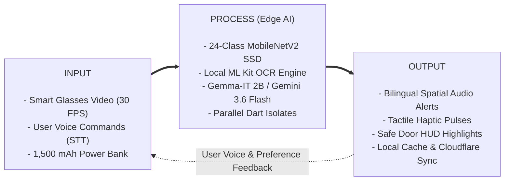
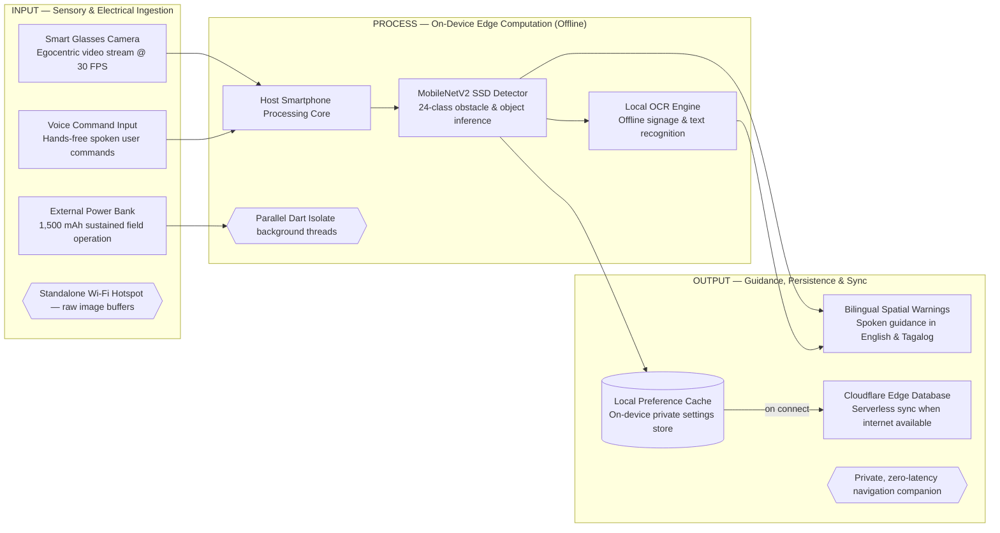

# EasyLens - Conceptual Framework & Theoretical System Architecture (IPO Model)

---

### 01 — THEORETICAL FOUNDATION & RESEARCH PARADIGM

The conceptual framework of **EasyLens** is established upon the intersection of **Universal Design Theory**, **Assistive Technology Interaction Models**, **Cognitive Load & Dual-Coding Theory**, and **Distributed Edge-AI Computing Paradigms**.

```text
+---------------------------------------------------------------------------------------------------+
|                                  THEORETICAL FOUNDATION PILLARS                                   |
+---------------------------------------------------------------------------------------------------+
|  1. Universal Design & Accessibility (Mace et al., ISO/IEC 25010, WCAG 2.2 AAA, UN CRPD Art. 9)   |
|  2. Dual-Coding & Multimodal Sensory Integration (Paivio, Sweller Cognitive Load Theory)          |
|  3. Edge-Computing & Embedded AI Low-Latency Inference Paradigm                                   |
|  4. Retrieval-Augmented Generation (RAG) & Guardrailed Conversational AI Architecture             |
+---------------------------------------------------------------------------------------------------+
```

1. **Universal Design & Accessibility (ISO/IEC 25010 & WCAG 2.2 AAA)**: 
   EasyLens provides equitable, intuitive, and perceptible access to environmental information for visually impaired, blind, and neurodivergent individuals without requiring sighted human assistance.
2. **Dual-Coding & Multimodal Sensory Integration**:
   By simultaneously synthesizing **spatial audio alerts**, **tactile haptics**, and **high-contrast visual cues**, the system distributes information across complementary sensory channels, minimizing cognitive fatigue during physical navigation.
3. **Edge-Computing & Embedded AI Architecture**:
   To ensure privacy and critical real-time safety, computer vision inference (24-class MobileNetV2 SSD object detection, OCR, spatial proximity calculation) and core LLM reasoning (**Gemma-IT 2B**) execute on-device at the edge, eliminating reliance on active internet connectivity.
4. **Retrieval-Augmented Generation (RAG) & Guardrailed Intelligence**:
   The conversational assistant ("Buddy") pairs on-device **Gemma-IT 2B** with cloud **Google Gemini 3.6 Flash (Low)** using localized domain knowledge (`buddy_knowledge.json`) and episodic interaction journals (`JournalService`) with strict semantic guardrails to prevent AI hallucinations and provide deterministic spatial guidance.

---

### 02 — SIMPLIFIED CONCEPTUAL FRAMEWORK (IPO MODEL)

#### 2.1 Ultra-Simplified Executive IPO Diagram



#### 2.2 Subsystem Architecture IPO Flowchart



---

### 03 — DETAILED BREAKDOWN OF IPO STAGES

#### 3.1 Input Stage (Sensory & Electrical Ingestion)

| Category | Input Element | Technical Description & Specification |
| :--- | :--- | :--- |
| **Wearable Optics & Sensors** | **Smart Glasses Camera (OV2640 70°)** | Egocentric live video capture ($640 \times 480$ VGA @ 30 FPS) from the ESP32-CAM wearable glasses unit. |
| | **Voice Command Input** | Hands-free spoken user commands captured via device microphone using `speech_to_text: ^7.4.0`. |
| | **Standalone Wi-Fi Hotspot** | Dedicated local wireless AP (`EasyLens-Camera` @ `192.168.4.1:81`) streaming raw MJPEG frame buffers. |
| **Electrical & Hardware** | **External Power Bank** | 1,500 mAh Li-Po power reservoir providing regulated 5.0V DC rail for sustained continuous field operation. |
| | **Heatsink Pad & Box Frame** | Direct-contact thermal heatsink on ESP32 SoC housed within a 3D-printed PETG module box frame. |
| **Software & AI Models** | **MobileNetV2 SSD Detector** | Fine-tuned 24-class edge object detection model ($300 \times 300 \times 3$ RGB input tensor). |
| | **Local OCR Engine** | Google ML Kit on-device text recognition for offline signage, door labels, and print media. |
| | **Gemma-IT 2B (On-Device)** | Local 2B instruction-tuned LLM running offline on-device via Google AI Edge SDK. |
| | **Google Gemini 3.6 Flash (Low)** | Cloud multimodal conversational LLM for rich Filipino/Tagalog synthesis and complex scene reasoning. |
| | **Domain Knowledge Base** | Localized knowledge corpus (`buddy_knowledge.json`) with campus safety bounds, object facts, and FAQs. |
| **User Settings & Profiles** | **Accessibility Preferences** | Language mode (English / Filipino), speech rate ($0.3 - 1.0$), contrast theme, and mobility aid profiles. |
| | **Emergency Contacts** | 11-digit validated mobile numbers for SOS distress dispatch. |

---

#### 3.2 Process Stage (On-Device Edge Computation - Offline)

```mermaid
flowchart TD
    subgraph Step1 ["Step 1: Frame Ingestion & Wireless Transport"]
        P1A["Stream MJPEG frames from ESP32 Standalone Wi-Fi Hotspot (192.168.4.1:81)"]
        P1B["Chunk-decode bytes and buffer latest complete video frame @ 30 FPS"]
    end

    subgraph Step2 ["Step 2: Host Smartphone Processing Core & Dart Isolates"]
        P2A["Dispatch frame bytes to parallel background worker thread (IsolateRunner)"]
        P2B["Normalize pixel intensities and resize frame to 300x300 RGB tensor"]
    end

    subgraph Step3 ["Step 3: Multi-Tier Edge AI Inference"]
        P3A["MobileNetV2 SSD: 24-class obstacle and object inference (Bounding Boxes & Scores)"]
        P3B["Door Fixture Classifier: Safe door tracking and green HUD highlight verification"]
        P3C["Local OCR Engine: Offline text recognition from high-resolution frame regions"]
        P3D["Spatial Hazard Algorithm: Euclidean distance, Center-of-Mass & IoU threat scoring"]
        P3E["RAG Engine: Gemma-IT 2B (Offline) & Gemini 3.6 Flash (Low) conversational reasoning"]
    end

    subgraph Step4 ["Step 4: Multimodal Synthesis & Priority Arbitration"]
        P4A{"Evaluate Threat Urgency"}
        P4B["Audio Priority Manager: Interrupt low-priority speech for immediate collision hazards"]
        P4C["Flutter TTS Engine: Synthesize bilingual spatial warnings in English or Tagalog"]
        P4D["Haptic Driver: Trigger tactile vibration pulse sequences"]
    end

    subgraph Step5 ["Step 5: Local Caching & Serverless Cloud Sync"]
        P5A["Store settings, preferences & telemetry in Local Preference Cache (SQLite)"]
        P5B["On Internet Connect: Sync relational logs to Cloudflare D1 & AWS SigV4 signed R2 store"]
    end

    Step1 --> Step2 --> Step3 --> Step4 --> Step5
```



1. **Standalone Wi-Fi Hotspot Stream Ingestion**:
   The ESP32-CAM module hosts an independent Access Point (`EasyLens-Camera`). The `Esp32Service` establishes an HTTP persistent stream to `http://192.168.4.1:81/stream`, chunk-decoding MJPEG frames at 30 FPS without requiring external routers.
2. **Host Smartphone Processing Core & Dart Isolates**:
   To ensure a 60 FPS smooth mobile UI, heavy image decoding and tensor conversions execute in parallel background Dart Isolates (`isolate_runner.dart`), transforming raw pixels into normalized $300 \times 300 \times 3$ tensors.
3. **Multi-Tier Edge AI Inference Suite**:
   - **MobileNetV2 SSD Detector**: TensorFlow Lite C-API runs 4-thread CPU inference, outputting bounding boxes, class labels across 24 curated obstacle categories, and confidence scores ($\ge 0.65$).
   - **Safe Door Fixture Tracking**: Detects doors and hardware fixtures (knobs, handles, locks) and highlights them with safe green tracking overlays.
   - **Local OCR Engine**: Google ML Kit parses signs, bus placards, and prescription bottles directly on-device.
   - **Hybrid RAG Intelligence**: Couples on-device **Gemma-IT 2B** for offline speech guidance with **Google Gemini 3.6 Flash (Low)** for cloud-based Filipino/Tagalog multimodal queries.
4. **Spatial Hazard Scoring Formula**:
   Spatial hazard risk $S_{\text{hazard}}$ is quantified using normalized bounding box area ($A_i$), center deviation ($\Delta X_i$), and class criticality weight ($W_{\text{class}}$):
   $$S_{\text{hazard}} = W_{\text{class}} \times \left( \alpha \cdot \frac{\text{Area}_i}{\text{FrameArea}} + \beta \cdot (1.0 - |\Delta X_{\text{center}}|) \right)$$
5. **Bilingual Spatial Feedback Synthesis**:
   `AudioNotificationManager` coordinates between high-priority hazard alerts, OCR readouts, and conversational Buddy speech. `FlutterTts` renders natural bilingual speech (English & Tagalog), supported by directional tactile haptic pulses.
6. **Local Caching & Serverless Cloud Sync**:
   All settings and journal interactions are cached immediately in the **Local Preference Cache** (SQLite / SharedPreferences). When internet connectivity is detected, snapshots and telemetry sync to the **Cloudflare Edge Database** (Cloudflare D1 & R2 via AWS SigV4).

---

#### 3.3 Output Stage (Guidance, Persistence & Sync)

| Output Category | Specific Deliverables | Target User Impact |
| :--- | :--- | :--- |
| **Bilingual Spatial Warnings** | Directional collision warnings (e.g., *"Caution: Stairs 1 meter ahead"* / *"Mag-ingat: May hagdan 1 metro sa harap"*). | Immediate collision prevention and safe forward mobility. |
| | Spoken OCR text readouts (Room numbers, signs, labels). | Environmental literacy and independent navigation. |
| | Conversational voice companion (Buddy Q&A in English and Filipino). | Hands-free interactive assistance and cognitive reassurance. |
| **Tactile & Visual Outputs** | Directional tactile haptic vibrations. | Non-auditory alert channel for noisy surroundings. |
| | High-contrast accessible UI (WCAG 2.2 AAA compliance). | Clear interface for low-vision users and assistive coaches. |
| | Safe green tracking door highlight boxes on HUD. | Immediate recognition of safe doorways and exits. |
| **Persistence & Cloud Sync** | **Local Preference Cache** (SQLite on-device private store). | Instant offline boot and private preference retention. |
| | **Cloudflare Edge Database Sync** (D1 SQL & R2 Storage). | Encrypted backup of hazard history and user profiles on connect. |
| | Automated emergency SOS SMS dispatch with live GPS. | Rapid emergency response in distress scenarios. |
| **Empirical Research Targets** | **$\ge 90\%$ Obstacle Avoidance Success Rate**. | Validated physical autonomy in standardized trials. |
| | **$< 100\text{ ms}$ Total Edge Alert Latency**. | Real-time safety response preventing collisions. |
| | **$2.75\text{h} - 8.25\text{h}$ Continuous Field Battery Life**. | Reliable all-day field usage on 1,500 mAh battery bank. |

---

### 04 — RESEARCH VARIABLES & SYSTEM RELATIONSHIPS

```mermaid
flowchart LR
    subgraph IV ["INDEPENDENT VARIABLES (IV)"]
        IV1["AI Inference Pipeline\n(MobileNetV2 SSD vs. ML Kit OCR vs. Gemma-IT 2B)"]
        IV2["User Input Modalities\n(Hands-free Voice STT vs. Screen Touch)"]
        IV3["Localization Mode\n(English vs. Filipino / Tagalog)"]
    end

    subgraph MV ["MODERATING / INTERVENING VARIABLES (MV)"]
        MV1["Ambient Illumination & Lux\n(Daylight vs. Low-Light Flash LED)"]
        MV2["Network Connectivity State\n(Offline Edge Mode vs. Online Cloud)"]
        MV3["Thermal State & Heatsink Dissipation\n(Aluminum Heatsink Pad & Battery Charge)"]
    end

    subgraph DV ["DEPENDENT VARIABLES (DV)"]
        DV1["Inference & Alert Latency\n(Target: < 100 ms Edge Latency)"]
        DV2["Obstacle Detection Accuracy\n(Target: ≥ 85% mAP)"]
        DV3["Navigation Autonomy & Success\n(Target: ≥ 90% Obstacle Avoidance)"]
        DV4["Field Battery Runtime\n(Target: 2.75h to 8.25h on 1500 mAh)"]
    end

    IV --> MV
    MV --> DV
    IV --> DV
```



#### Research Variable Matrix

| Variable Type | Variable Name | Measurement Unit | Operational Definition in EasyLens |
| :--- | :--- | :--- | :--- |
| **Independent Variable ($IV_1$)** | AI Processing Pipeline | Model Architecture | Execution tier: TFLite 24-class SSD, ML Kit OCR, Gemma-IT 2B, or Gemini 3.6 Flash (Low). |
| **Independent Variable ($IV_2$)** | User Input Modality | Input Type | Hands-free spoken voice commands vs. accessible touch gestures. |
| **Independent Variable ($IV_3$)** | Localization Mode | Language Locale | English vs. Filipino (Tagalog) bilingual synthesis. |
| **Moderating Variable ($MV_1$)** | Ambient Lighting | Lux ($\text{lx}$) | Environmental illumination and dynamic flash LED activation. |
| **Moderating Variable ($MV_2$)** | Network Connectivity | Online vs. Offline | Determines whether queries stay on-device (Gemma-IT 2B) or route to cloud (Gemini 3.6 Flash Low). |
| **Moderating Variable ($MV_3$)** | Hardware Thermal State | Temperature ($^\circ\text{C}$) | Heat dissipation via heatsink pad preventing SoC thermal throttling. |
| **Dependent Variable ($DV_1$)** | Alert Latency | Milliseconds ($\text{ms}$) | Elapsed time from camera frame ingestion to spatial audio warning ($< 100\text{ ms}$). |
| **Dependent Variable ($DV_2$)** | Detection Precision | Mean Average Precision ($mAP$) | Precision of 24-class obstacle detection and OCR text extraction. |
| **Dependent Variable ($DV_3$)** | Navigation Autonomy | Success Rate ($\%$) | Percentage of successful obstacle avoidances during mobility trials ($\ge 90\%$). |
| **Dependent Variable ($DV_4$)** | Battery Field Runtime | Hours ($\text{hours}$) | Operational duration on a single 1,500 mAh battery charge ($2.75\text{h} - 8.25\text{h}$). |

---

### 05 — COMPONENT SPECIFICATIONS MAPPING TABLE

| Framework Stage | System Component | File / Service Reference | Role & Implementation Responsibility |
| :--- | :--- | :--- | :--- |
| **Input** | Smart Glasses Camera | `hardware/esp32_cam_wifi_ap/` | Hosts Wi-Fi AP `EasyLens-Camera`, streams $640 \times 480$ MJPEG @ 30 FPS. |
| **Input** | OV2640 70° Lens | Hardware Spec §2.2 | 70° Light Wide Angle lens for wide forward spatial capture. |
| **Input** | External Power Bank | Hardware Spec §2.3 | 1,500 mAh Li-Po powerbank with regulated 5.0V DC synchronous boost rail. |
| **Input** | Voice Command Input | `lib/services/voice_service.dart` | Hands-free spoken voice input via `speech_to_text: ^7.4.0`. |
| **Input** | Knowledge Base | `assets/models/buddy_knowledge.json` | Localized facts on campus bounds, safety rules, and FAQs. |
| **Process** | Host Processing Core | `lib/services/esp32_service.dart` | Stream receiver and MJPEG frame chunk decoder. |
| **Process** | Parallel Dart Isolates | `lib/services/isolate_runner.dart` | Heavy background compute thread normalizing $300 \times 300$ RGB tensors. |
| **Process** | MobileNetV2 SSD | `lib/services/tflite_processor.dart` | 24-class obstacle and object inference on 4 CPU threads. |
| **Process** | Local OCR Engine | `lib/services/ml_kit_service.dart` | Google ML Kit on-device signage and text recognition. |
| **Process** | Gemma-IT 2B | `flutter_gemma: ^0.13.6` | Offline 2B parameter conversational LLM running on-device. |
| **Process** | Gemini 3.6 Flash (Low)| `google_generative_ai: ^0.4.4` | Cloud multimodal assistant for Tagalog synthesis and deep reasoning. |
| **Process** | Audio Priority Mgr | `lib/services/navigation_voice_assistant.dart` | Arbitrates alert priority, interrupting dialogue for imminent hazards. |
| **Output** | Bilingual Warnings | `lib/services/tts_service.dart` | Speaks spatial collision warnings and OCR text in English & Tagalog. |
| **Output** | Tactile Haptics | `HapticFeedback.heavyImpact()` | Directional vibration patterns for proximity alerts. |
| **Output** | Local Preference Cache| `lib/services/journal_service.dart` | SQLite / SharedPreferences on-device private settings store. |
| **Output** | Cloudflare Edge DB | `lib/services/storage/cloudflare_d1_service.dart` | Serverless relational telemetry and AWS SigV4 signed R2 media sync on connect. |
| **Feedback** | User Adaptation Loop | `lib/models/user_preferences.dart` | Adjusts speech rate, alert thresholds, and language preferences dynamically. |
