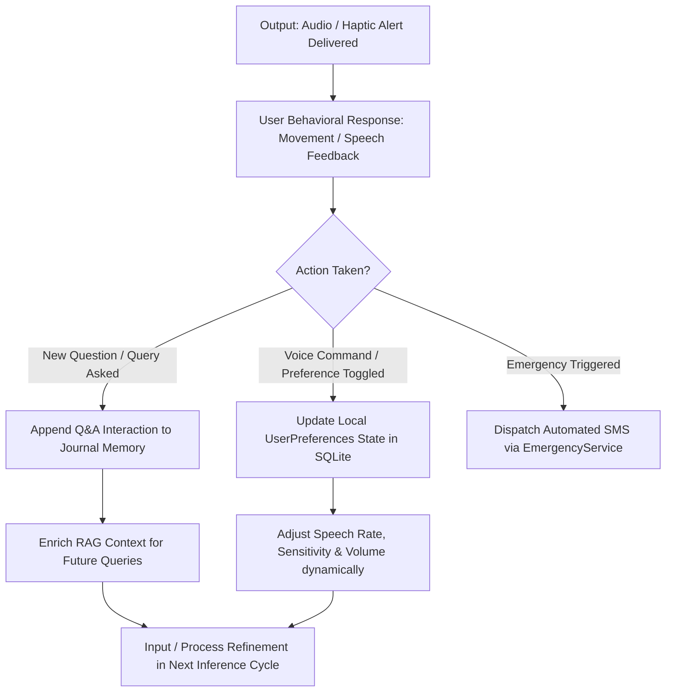
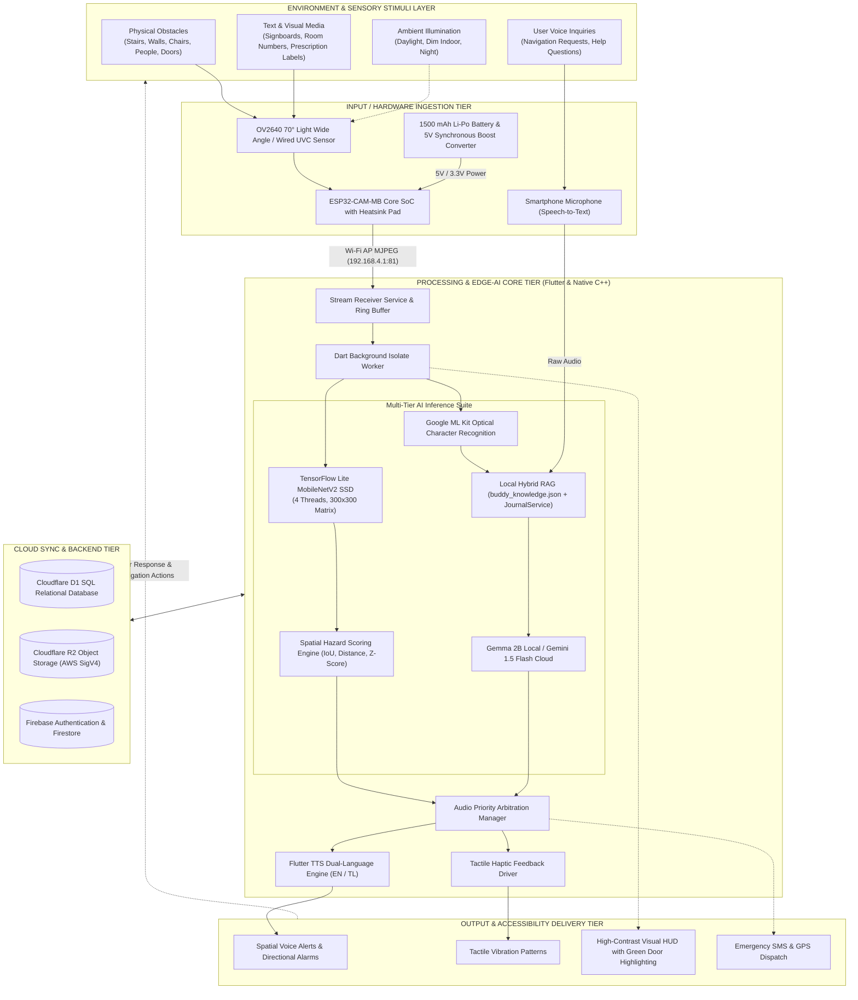

# EasyLens - Conceptual Framework & Theoretical System Architecture (IPO Model)

---

### 01 — THEORETICAL FOUNDATION & RESEARCH PARADIGM

The conceptual framework of **EasyLens** is established upon the intersection of **Universal Design Theory**, **Assistive Technology Interaction Models**, **Cognitive Load & Dual-Coding Theory**, and **Distributed Edge-AI Computing Paradigms**. 

```text
+---------------------------------------------------------------------------------------------------+
|                                  THEORETICAL FOUNDATION PILLARS                                   |
+---------------------------------------------------------------------------------------------------+
|  1. Universal Design & Accessibility (Mace et al., ISO/IEC 25010, WCAG 2.2 AAA, UN CRPD Art. 9)   |
|  2. Dual-Coding & Multimodal Sensory Integration (Paivio, Sweller Cognitive Load Theory)          |
|  3. Edge-Computing & Embedded AI Low-Latency Inference Paradigm                                   |
|  4. Retrieval-Augmented Generation (RAG) & Guardrailed Conversational AI Architecture             |
+---------------------------------------------------------------------------------------------------+
```

1. **Universal Design & Accessibility (ISO/IEC 25010 & WCAG 2.2 AAA)**: 
   EasyLens provides equitable, intuitive, and perceptible access to environmental information for visually impaired, blind, and neurodivergent individuals without requiring sighted human assistance.
2. **Dual-Coding & Multimodal Sensory Integration**:
   By simultaneously synthesizing **spatial audio alerts**, **tactile haptics**, and **high-contrast visual cues**, the system distributes information across complementary sensory channels, minimizing cognitive fatigue during physical navigation.
3. **Edge-Computing & Embedded AI Architecture**:
   To ensure privacy and critical real-time safety, computer vision inference (object detection, OCR, spatial proximity calculation) and core LLM reasoning execute on-device at the edge, removing dependency on continuous internet connectivity.
4. **Retrieval-Augmented Generation (RAG) & Guardrailed Intelligence**:
   The conversational assistant ("Buddy") uses a localized domain knowledge base (`buddy_knowledge.json`) and episodic interaction journals (`JournalService`) with strict semantic guardrails to prevent AI hallucinations and provide deterministic spatial guidance.

---

### 02 — CONCEPTUAL FRAMEWORK (IPO MODEL OVERVIEW)

The conceptual framework is structured around the **Input-Process-Output (IPO) Model**, enhanced with a **Continuous Feedback and Environmental Mediation Loop**.

```mermaid
graph LR
    subgraph INPUT ["1. INPUT LAYER"]
        direction TB
        IN_HW["Hardware & Sensors\n• ESP32-CAM OV2640 70°\n• Wired UVC Camera (USB-OTG)\n• 1500 mAh Powerbank (5V)\n• Smartphone Mic & GPS"]
        IN_DATA["Software & AI Models\n• MobileNetV2 SSD (300x300)\n• ML Kit OCR & Labeling\n• Gemma 2B & Gemini 1.5 Flash\n• Local RAG Knowledge Base"]
        IN_USER["User Profiles & Settings\n• English / Filipino Locale\n• Speech Rate & Audio Volume\n• Emergency SOS Contacts"]
    end

    subgraph PROCESS ["2. PROCESS LAYER"]
        direction TB
        PR_INGEST["Data Ingestion & Streaming\n• Wi-Fi AP Stream (192.168.4.1)\n• USB-OTG Frame Receiver\n• Low-latency Frame Buffer"]
        PR_PRE["Parallel Preprocessing\n• Dart Background Isolates\n• Tensor Normalization\n• Image Resizing (300x300)"]
        PR_AI["Multi-Tier AI Inference\n• Real-Time Object Detection\n• Optical Character Recognition\n• Spatial Hazard Math (IoU/Z-Score)\n• Guardrailed LLM Reasoning"]
        PR_SYNTH["Multimodal Synthesis\n• Audio Priority Queuing\n• Dual-Language TTS Engine\n• Tactile Haptic Modulation\n• AWS SigV4 / Cloudflare Sync"]
    end

    subgraph OUTPUT ["3. OUTPUT LAYER"]
        direction TB
        OUT_AUDIO["Spatial Audio & Speech\n• Directional Proximity Alerts\n• Spoken OCR & Signage Readout\n• Buddy Voice Guidance (EN/TL)"]
        OUT_TACTILE["Tactile & Visual Cues\n• Directional Haptic Pulses\n• High-Contrast Screen HUD\n• Color-Coded Door Highlights"]
        OUT_ACT["Safety & Action Dispatch\n• Automated SOS Emergency Alert\n• Autopilot Screen Navigation"]
        OUT_IMPACT["User Safety & Autonomy\n• Collision Avoidance (≥90%)\n• Sub-100ms Alert Latency\n• Independent Mobility"]
    end

    INPUT ==> PROCESS
    PROCESS ==> OUTPUT

    OUTPUT -.->|"User Voice Commands & Preference Adjustments"| INPUT
    OUTPUT -.->|"Hazard Logs, Telemetry & Interaction Memory"| PROCESS
```



---

### 03 — DETAILED BREAKDOWN OF IPO STAGES

#### 3.1 Input Stage (Inputs to the System)

| Category | Input Element | Technical Description & Specification |
| :--- | :--- | :--- |
| **Wearable Optics & Sensors** | **OV2640 70° Wide Lens** | Real-time continuous video capture (VGA $640 \times 480$ @ 25–30 FPS) via ESP32-CAM module. |
| | **Wired UVC Camera** | Direct USB Video Class streaming via Micro-USB / USB-C OTG cable. |
| | **Microphone & Speech Input** | Hands-free voice speech-to-text input (`speech_to_text: ^7.4.0`) for voice queries. |
| | **Device Sensors** | Smartphone accelerometer, gyroscope, and GPS location coordinates (`geolocator: ^13.0.1`). |
| **Physical & Electrical** | **1500 mAh Powerbank** | Regulated 5.0V DC power rail ($5.55\text{ Wh}$) with $88\%$ synchronous boost efficiency. |
| | **Heatsink Pad & Enclosure** | Aluminum heatsink on ESP32 SoC with 3D-printed PETG module box frame. |
| **Software & AI Models** | **MobileNetV2 SSD Model** | Quantized TFLite object detection model ($300 \times 300 \times 3$ RGB input tensor). |
| | **Google ML Kit OCR** | On-device text recognition model for signs, medicine labels, and print media. |
| | **Google Gemma 2B (On-Device)** | Local instruction-tuned LLM (`model.bin` ~1.3 GB) running on CPU/GPU via Google AI Edge SDK. |
| | **Google Gemini 1.5 Flash** | Cloud multimodal LLM for rich conversational comprehension and Tagalog synthesis. |
| | **Domain Knowledge Base** | Localized knowledge corpus (`buddy_knowledge.json`) with campus safety bounds & FAQs. |
| **User Configurations** | **Accessibility Preferences** | Language mode (English / Filipino), TTS speech rate ($0.3 - 1.0$), contrast theme, and mobility aids. |
| | **Emergency Contacts** | 11-digit validated cellular numbers for SOS distress dispatch. |

---

#### 3.2 Process Stage (Data Ingestion, Computation & Transformation)

```mermaid
flowchart TD
    subgraph Step1 ["Step 1: Frame Ingestion & Transport"]
        P1A["Capture MJPEG stream from ESP32 AP (192.168.4.1:81) or UVC OTG"]
        P1B["Chunk-decode bytes and buffer latest complete frame"]
    end

    subgraph Step2 ["Step 2: Dart Isolate Parallelization"]
        P2A["Offload frame bytes to Background Worker Thread (IsolateRunner)"]
        P2B["Resize frame to 300x300 RGB matrix and normalize pixel intensities"]
    end

    subgraph Step3 ["Step 3: Multi-Tier AI Vision & Language Processing"]
        P3A["TFLite Interpreter: MobileNetV2 SSD Detection (Bounding Boxes, Class IDs, Scores)"]
        P3B["ML Kit Engine: Text Block Extraction and Script Parsing"]
        P3C["Spatial Hazard Algorithm: Calculate Euclidean Distance, Center-of-Mass & IoU"]
        P3D["RAG Engine: Match Query Keywords against buddy_knowledge.json and Journal Memory"]
        P3E["LLM Reasoner: Generate Natural Language Guidance (Gemma Local / Gemini Cloud)"]
    end

    subgraph Step4 ["Step 4: Priority Arbitration & Feedback Synthesis"]
        P4A{"Evaluate Alert Urgency"}
        P4B["Audio Priority Manager: Interrupt low-priority speech for immediate collision hazards"]
        P4C["Flutter TTS: Synthesize localized speech in English or Tagalog"]
        P4D["Haptic Feedback Driver: Trigger directional vibration patterns"]
    end

    subgraph Step5 ["Step 5: Telemetry & Cloud Synchronization"]
        P5A["AWS SigV4 HMAC-SHA256 Client-Side Signature Generation"]
        P5B["Push Encrypted Snapshots to Cloudflare R2 Bucket"]
        P5C["Log Relational Incident Telemetry to Cloudflare D1 SQL & Firebase"]
    end

    Step1 --> Step2 --> Step3 --> Step4 --> Step5
```



1. **Continuous Video Streaming & Transport**:
   The mobile app connects to the ESP32 Wi-Fi Access Point (`EasyLens-Camera`) or USB-OTG pipeline. The `Esp32Service` establishes a persistent HTTP boundary stream to `http://192.168.4.1:81/stream`, chunk-decoding MJPEG frames at 25–30 FPS.
2. **Background Multi-Threaded Isolate Worker**:
   To prevent dropping UI frames, raw byte arrays are passed across Dart `Isolate` ports. The isolate converts frames into normalized $300 \times 300 \times 3$ float32/uint8 arrays.
3. **Multi-Tier Edge Vision & AI Inference**:
   - **Object Detection**: TensorFlow Lite C-API executes inference across 4 CPU threads. Bounding boxes, class names (e.g., `person`, `stairs`, `chair`, `door`), and confidence scores ($\ge 0.65$) are extracted.
   - **Door & Fixture Specialization**: Detects doors and hardware fixtures (knobs, handles, locks) and highlights them with safe green tracking overlays.
   - **Optical Character Recognition**: Google ML Kit analyzes high-resolution crops to extract text tokens in real time.
   - **Local & Hybrid RAG Reasoning**: `RagService` searches `buddy_knowledge.json` and episodic memory in `JournalService` to answer queries via on-device Gemma 2B or cloud Gemini 1.5 Flash.
4. **Spatial Hazard Scoring Formula**:
   Spatial risk $S_{\text{hazard}}$ is quantified using normalized bounding box area ($A_i$), center deviation ($\Delta X_i$), and class criticality weight ($W_{\text{class}}$):
   $$S_{\text{hazard}} = W_{\text{class}} \times \left( \alpha \cdot \frac{\text{Area}_i}{\text{FrameArea}} + \beta \cdot (1.0 - |\Delta X_{\text{center}}|) \right)$$
5. **Multimodal Feedback Generation**:
   The `AudioNotificationManager` coordinates between high-priority hazard alarms, OCR readouts, and conversational dialogue. `FlutterTts` converts synthesized messages into localized speech (English/Filipino), while haptic motors pulse to provide tactile feedback.
6. **Secure Telemetry & Cloud Storage**:
   Hazard logs and diagnostic snapshots are signed on-device via **AWS Signature Version 4** with HMAC-SHA256 and uploaded to **Cloudflare R2** and **Cloudflare D1 SQL** without exposing secret keys.

---

#### 3.3 Output Stage (Outputs of the System)

| Output Category | Specific Output Deliverables | Target User Impact |
| :--- | :--- | :--- |
| **Auditory & Speech Outputs** | **Spatial Collision Alerts** (e.g., *"Caution: Low-hanging obstruction 1 meter ahead"*). | Immediate collision prevention and hands-free environmental awareness. |
| | **Spoken OCR Text Readouts** (e.g., Medicine labels, bus signs, room numbers). | Information accessibility for daily independence. |
| | **Conversational Buddy Guidance** in English and Filipino (Tagalog). | Cognitive companionship, Q&A, and campus navigation assistance. |
| **Tactile & Visual Outputs** | **Directional Haptic Pulses** (Short rapid pulses for immediate proximity). | Non-auditory warning channel in noisy environments. |
| | **High-Contrast Screen HUD** (WCAG 2.2 AAA compliant color palettes). | Clear visual interface for low-vision and assistive coaches. |
| | **Green Tracking Door Highlighting** on HUD display. | Safe entry point recognition and pathway confirmation. |
| **Autopilot & Emergency Actions** | **Automated SOS Dispatch** with real-time GPS coordinates. | Emergency response activation during severe disorientation or distress. |
| | **Declarative Route Navigation** (`[NAVIGATE: <screen>]` auto-transitions). | Zero-touch screen navigation for non-sighted users. |
| **Empirical Research Outcomes** | **$\ge 90\%$ Obstacle Avoidance Success Rate**. | Validated navigation autonomy in real-world trials. |
| | **$< 100\text{ ms}$ Edge Vision Inference Latency**. | Rapid response time preventing physical injury. |
| | **$2.75\text{h} - 8.25\text{h}$ Battery Runtime**. | Reliable continuous mobility on a single 1500 mAh charge cycle. |

---

#### 3.4 Feedback Loop (Continuous System Tuning & Adaptation)

The feedback loop ensures real-time responsiveness and continuous system optimization:



1. **User Preference Adjustments**: Users can dynamically modify speech rates, change language modes, toggle between wired/wireless camera feeds, or adjust hazard sensitivity via voice or accessible touch controls.
2. **Episodic Context Enrichment**: Interaction history is saved into local SQLite database records by `JournalService`, allowing Buddy to remember user habits and navigation history.
3. **Hardware Health Monitoring**: Continuous battery voltage sampling and thermal monitoring ensure graceful degradation to low-power duty cycling when the 1500 mAh battery falls below $20\%$.

---

### 04 — RESEARCH VARIABLES & SYSTEM RELATIONSHIPS

To rigorously evaluate the EasyLens assistive system, the conceptual framework defines the following **Independent**, **Moderating (Intervening)**, and **Dependent Variables**:

```mermaid
flowchart LR
    subgraph IV ["INDEPENDENT VARIABLES (IV)"]
        IV1["Camera Ingestion Source\n(ESP32-CAM Wi-Fi vs. Wired UVC)"]
        IV2["AI Model Architecture & Pipeline\n(MobileNetV2 SSD vs. ML Kit vs. Gemma)"]
        IV3["Input Modalities\n(Voice STT vs. Accessibility Touch)"]
    end

    subgraph MV ["MODERATING / INTERVENING VARIABLES (MV)"]
        MV1["Ambient Illumination & Lighting\n(Flash LED Active vs. Dark Environment)"]
        MV2["Network Connectivity State\n(Offline Edge Mode vs. Online Cloud)"]
        MV3["Hardware Thermal & Battery State\n(Heatsink Pad Cooling & 1500mAh Charge)"]
    end

    subgraph DV ["DEPENDENT VARIABLES (DV)"]
        DV1["Inference & Alert Latency\n(Target: < 100 ms Edge Latency)"]
        DV2["Obstacle Detection Accuracy\n(Target: ≥ 85% mAP)"]
        DV3["User Navigation Autonomy & Safety\n(Target: ≥ 90% Success Rate)"]
        DV4["Continuous Battery Runtime\n(Target: 2.75h to 8.25h)"]
    end

    IV --> MV
    MV --> DV
    IV --> DV
```



#### Research Variable Matrix

| Variable Type | Variable Name | Measurement Unit / Metric | Operational Definition in EasyLens |
| :--- | :--- | :--- | :--- |
| **Independent Variable ($IV_1$)** | Camera Ingestion Mode | Protocol (Wi-Fi MJPEG vs. USB-OTG) | Method used to stream visual frames into the Flutter engine. |
| **Independent Variable ($IV_2$)** | AI Processing Pipeline | Model Tier (TFLite SSD / ML Kit / Gemma) | The active edge or cloud model executing classification or reasoning. |
| **Independent Variable ($IV_3$)** | User Input Modality | Input Type (Voice Speech vs. Screen Touch) | How the visually impaired user conveys commands to EasyLens. |
| **Moderating Variable ($MV_1$)** | Ambient Lighting | Lux ($\text{lx}$) / Flash LED status | Environmental illumination affecting camera sensor exposure. |
| **Moderating Variable ($MV_2$)** | Network Connectivity | Online (Wi-Fi/Cellular) vs. Offline | Determines whether the system routes queries to cloud Gemini or local Gemma. |
| **Moderating Variable ($MV_3$)** | Thermal & Battery State | Temperature ($^\circ\text{C}$) & Current ($\text{mA}$) | Heat dissipation via heatsink pad and battery drain on the 1500 mAh pack. |
| **Dependent Variable ($DV_1$)** | Alert Latency | Milliseconds ($\text{ms}$) | Total elapsed time from frame capture to audio alert output ($< 100\text{ ms}$). |
| **Dependent Variable ($DV_2$)** | Detection Precision | Mean Average Precision ($mAP\text{ @ }0.5$) | Accuracy of identifying obstacles, doors, and text tokens. |
| **Dependent Variable ($DV_3$)** | Navigation Autonomy | Success Rate Percentage ($\%$) | Proportion of successful obstacle avoidances in standardized course trials ($\ge 90\%$). |
| **Dependent Variable ($DV_4$)** | Battery Operational Lifetime | Hours ($\text{hours}$) | Continuous operating duration on a full $1500\text{ mAh}$ charge ($2.75\text{h} - 8.25\text{h}$). |

---

### 05 — EXTENDED CONCEPTUAL FRAMEWORK (ENVIRONMENTAL INTERACTION MODEL)

The complete academic architecture model illustrates how external environmental stimuli and user actions pass through the edge computing system to generate assistive feedback:



---

### 06 — COMPONENT SPECIFICATIONS MAPPING TABLE

| Framework Stage | System Component | File / Service Reference | Role & Implementation Responsibility |
| :--- | :--- | :--- | :--- |
| **Input** | ESP32-CAM-MB | `hardware/esp32_cam_wifi_ap/` | Hosts Wi-Fi AP `EasyLens-Camera`, captures $640 \times 480$ MJPEG stream. |
| **Input** | OV2640 Lens | Hardware Spec §2.2 | 70° Light Wide Angle lens providing wide-angle forward spatial coverage. |
| **Input** | 1500 mAh Powerbank | Hardware Spec §2.3 | Pocket power supply with regulated 5V output and 88% boost efficiency. |
| **Input** | Speech-to-Text | `lib/services/voice_service.dart` | Captures user speech input via device microphone. |
| **Input** | Local Knowledge Base | `assets/models/buddy_knowledge.json` | Factual corpus with safety bounds, object descriptions, and FAQs. |
| **Process** | Stream Receiver | `lib/services/esp32_service.dart` | HTTP chunk decoder buffering continuous camera frame bytes. |
| **Process** | Background Isolate | `lib/services/isolate_runner.dart` | Asynchronous worker thread normalizing $300 \times 300$ RGB tensors. |
| **Process** | Object Detector | `lib/services/tflite_processor.dart` | TFLite MobileNetV2 SSD inference generating bounding boxes and class labels. |
| **Process** | Text Recognition | `lib/services/ml_kit_service.dart` | Google ML Kit on-device text parsing from video frames. |
| **Process** | Local LLM (Gemma) | `flutter_gemma: ^0.13.6` | Offline 2B parameter conversational inference on edge CPU/GPU. |
| **Process** | Cloud LLM (Gemini) | `google_generative_ai: ^0.4.4` | Multimodal online scene description and fluent Filipino/Tagalog synthesis. |
| **Process** | Audio Priority Mgr | `lib/services/navigation_voice_assistant.dart` | Manages alert queues, prioritizing immediate hazard collision warnings. |
| **Process** | AWS SigV4 Signer | `lib/services/storage/cloudflare_r2_service.dart` | Signs S3-compatible snapshot uploads on-device without exposing API secrets. |
| **Output** | Spatial Audio / TTS | `lib/services/tts_service.dart` | Speaks alerts, signages, and responses in English or Filipino. |
| **Output** | Tactile Haptics | `HapticFeedback.heavyImpact()` | Vibrates device with distinct pulses for proximity warning. |
| **Output** | High-Contrast HUD | `lib/screens/hardware/hardware_screen.dart` | Accessible screen HUD with green bounding boxes for doors and red for hazards. |
| **Output** | SOS Emergency Alert | `lib/services/emergency_service.dart` | Sends automated SMS with GPS location to registered emergency contacts. |
| **Feedback** | Journal Memory | `lib/services/journal_service.dart` | Caches interaction history in SQLite to enrich conversational context. |
| **Feedback** | User Preferences | `lib/models/user_preferences.dart` | Persists user-configured speech rates, languages, and theme preferences. |

---

### 07 — RESEARCH DEFENSE & COMPLIANCE SUMMARY

#### Why This Conceptual Framework Is Complete & Rigorous

1. **Alignment with Standard IPO Methodology**:
   Clearly defines all physical, sensory, and digital inputs; all on-device isolate preprocessing, edge AI model inference, and priority arbitration processes; and all multimodal outputs delivered to the visually impaired user.
2. **Distinct from Data Flow & System Architecture**:
   Unlike pure DFDs (which map packet streams) or UML Class Diagrams (which map software objects), this Conceptual Framework articulates the **theoretical constructs, causal relationships, independent/dependent variables, and empirical feedback loops** governing the study.
3. **Hardware-Software Synergy**:
   Directly reflects the physical wearable unit (ESP32-CAM-MB CH340G baseboard, OV2640 70° Light Wide Angle Lens, Heatsink Pad, 1500 mAh Powerbank, 3D Printed Box Frame) integrated seamlessly with the Flutter edge application.
4. **Dual-Language & Accessibility Compliance**:
   Explicitly includes Filipino (Tagalog) and English dual-locale processing, ISO/IEC 25010 usability metrics, and WCAG 2.2 AAA accessibility standards.
