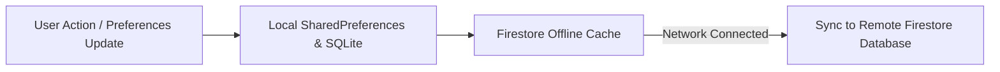

# Local Storage & Firebase Cloud Sync Architecture

This document provides a comprehensive technical blueprint for implementing local persistent storage and Firebase Cloud sync in the EasyLens application. It outlines schemas, sync rules, security, and step-by-step implementation.

---

### 01 — STORAGE PACKAGE COMPARISON (LOCAL STORAGE)

For offline-first local persistence, the following options are recommended:

| Storage Option | Best Used For | Pros | Cons | Recommendation |
| :--- | :--- | :--- | :--- | :--- |
| **`shared_preferences`** | Simple key-value config settings. | - Extremely simple API.<br>- Built-in platform bindings. | - No relational support.<br>- Suboptimal performance for large datasets. | **Yes** (For simple theme/language flags). |
| **`isar`** | Complex relational collections, history tracking. | - High performance.<br>- Typed query filters.<br>- Indexing support. | - Requires code generation. | **Highly Recommended** (For structured entities like Contacts/Logs). |

---

### 02 — FIREBASE CLOUD FIRESTORE INTEGRATION (REMOTE DATABASE)

To make EasyLens collaborative and accessible across devices, user settings, emergency contacts, and logs are synchronized to Firebase Cloud Firestore.

#### A. Firestore Collections Schema

##### `/users/{userId}` (Document)
Holds global user status, profile metadata, and nested preferences map:
```json
{
  "uid": "String (matches Firebase Auth credential)",
  "email": "String",
  "displayName": "String",
  "updatedAt": "Timestamp",
  "preferences": {
    "language": "String (e.g., 'English')",
    "faceIdUnlock": "Boolean",
    "appearanceTheme": "String (e.g., 'Black')",
    "accentColorIndex": "Integer",
    "shakeToUndo": "Boolean",
    "voiceFeedback": "Boolean",
    "navigationAssistant": "Boolean",
    "hapticFeedback": "Boolean",
    "speechRate": "Double (0.0 to 1.0)",
    "pitch": "Double (0.0 to 1.0)",
    "voicePersonaId": "String (e.g., 'aria')",
    "unitsPreference": "String (e.g., 'Metric')",
    "globalNotifications": "Boolean",
    "buddyFollowUp": "Boolean",
    "obstacleAlerts": "Boolean",
    "batteryAlerts": "Boolean",
    "connectionAlerts": "Boolean"
  }
}
```

##### `/users/{userId}/contacts/{contactId}` (Subcollection Document)
Holds caregiver profiles linked to the primary account owner:
```json
{
  "name": "String",
  "phone": "String",
  "relationship": "String",
  "isActive": "Boolean",
  "createdAt": "Timestamp"
}
```

---

### 03 — SIMPLIFIED STORAGE & SYNC FLOWCHART



---

### 04 — STORAGE & CLOUD SYNCHRONIZATION STRATEGY

Firestore features built-in offline persistence that caches updates locally when offline and automatically syncs them to the cloud once network connectivity is restored.

#### Step 1: Enable Firestore Offline Cache
Initialize Firestore settings inside `lib/main.dart`:
```dart
import 'package:cloud_firestore/cloud_firestore.dart';

void main() async {
  WidgetsFlutterBinding.ensureInitialized();
  await Firebase.initializeApp();
  
  // Enable offline local caching S01
  FirebaseFirestore.instance.settings = const Settings(
    persistenceEnabled: true,
    cacheSizeBytes: Settings.CACHE_SIZE_UNLIMITED,
  );
  
  runApp(const EasyLensApp());
}
```

#### Step 2: Implement Firestore Sync
Update the preferences and contacts sync service functions:
```dart
import 'package:cloud_firestore/cloud_firestore.dart';
import '../../models/user_preferences.dart';
import '../../models/emergency_contact.dart';

class FirestoreStorageService {
  final FirebaseFirestore _firestore = FirebaseFirestore.instance;

  // Sync Preferences to Cloud
  Future<void> syncPreferences(String userId, UserPreferences prefs) async {
    await _firestore.collection('users').doc(userId).set({
      'preferences': prefs.toJson(),
      'updatedAt': FieldValue.serverTimestamp(),
    }, SetOptions(merge: true));
  }

  // Sync Emergency Contact to Cloud
  Future<void> syncContact(String userId, EmergencyContact contact) async {
    final contactId = contact.phone.replaceAll(' ', ''); // Unique ID S01
    await _firestore
        .collection('users')
        .doc(userId)
        .collection('contacts')
        .doc(contactId)
        .set(contact.toJson());
  }
}
```

---

### 05 — FIREBASE STORAGE (PROFILE AVATAR UPLOADS)

Store user custom avatars in Firebase Storage under structured pathways:
- Path: `/users/{userId}/avatar.png`

```dart
import 'dart:io';
import 'package:firebase_storage/firebase_storage.dart';

Future<String> uploadUserAvatar(String userId, File imageFile) async {
  final ref = FirebaseStorage.instance.ref().child('users/$userId/avatar.png');
  final uploadTask = await ref.putFile(imageFile);
  return await uploadTask.ref.getDownloadURL();
}
```

---

### 06 — SECURITY RULES (FIREWALL POLICY)

Deploy the following Firebase Security Rules to restrict cross-account reads and writes:

#### Firestore Security Rules
```javascript
rules_version = '2';
service cloud.firestore {
  match /databases/{database}/documents {
    // Users can only read and write their own documents
    match /users/{userId} {
      allow read, write: if request.auth != null && request.auth.uid == userId;
      
      match /contacts/{contactId} {
        allow read, write: if request.auth != null && request.auth.uid == userId;
      }
    }
  }
}
```

#### Firebase Storage Security Rules
```javascript
rules_version = '2';
service firebase.storage {
  match /b/{bucket}/o {
    match /users/{userId}/{allPaths=**} {
      allow read, write: if request.auth != null && request.auth.uid == userId;
    }
  }
}
```
