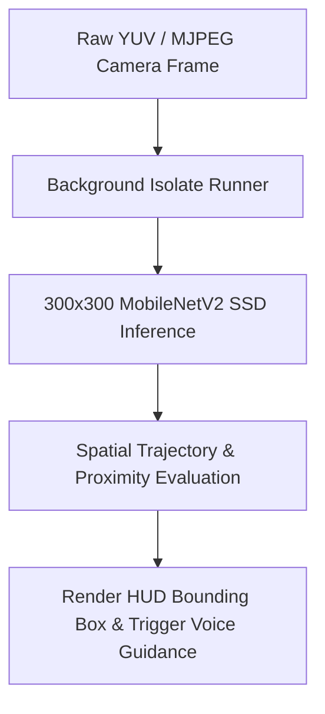

# EasyLens: Deep Object Detection & Spatial Warning Systems

EasyLens relies on a custom fine-tuned **MobileNetV2 Single Shot Detector (SSD)** and the native Google ML Kit pipelines as its primary vision engine. This documentation details the mathematical spatial heuristics, model architecture specifications, optimization parameters, and algorithmic design used to implement real-time obstacle avoidance and path planning for visually impaired users.

---

## 1. Deep Learning Model Specifications

### MobileNetV2 SSD Core Architecture
* **Feature Extractor**: MobileNetV2 backbone pre-trained on ImageNet.
* **Bounding Box Regressor**: Single Shot MultiBox Detector (SSD) head, performing localized object classification and coordinate regression in a single forward pass.
* **Target Classes**: Merged from a noisy 26-class dataset into a clean, balanced **24-class format** specifically mapping urban navigation hazards (e.g. guide canes, stairs, traffic cones, vehicles, poles, and curbs).

### Transfer Learning and Calibration Phases
The model was trained using a meticulously structured 4-phase optimization strategy to maximize convergence while avoiding catastrophic forgetting:

| Phase | Description | Learning Rate | Active Layers | Callback Mechanics |
|---|---|---|---|---|
| **Phase 1** | Warm-up head | $1 \times 10^{-3}$ | Head only (backbone frozen) | Default Optimizer |
| **Phase 2** | Mid-level tuning | $1 \times 10^{-4}$ | Top 30 backbone layers | Adam Optimizer |
| **Phase 3** | Deep fine-tuning | $1 \times 10^{-6}$ | Entire network unfrozen | EarlyStopping & ReduceLROnPlateau |
| **Phase 4** | Ultra-low calibration | $1 \times 10^{-8}$ | Entire network unfrozen | Final weights settle into global minimum |

### Empirical Performance Metrics
* **Top-1 Classification Accuracy**: 85.55%
* **Balanced Accuracy**: 85.02%
* **Top-2 Accuracy**: 92.10%
* **Top-3 Accuracy**: 94.54%
* **Edge Inference Latency**: **2.48 milliseconds** per image frame (achieving >400 Frames Per Second on supported edge hardware).

---

## 2. Mathematical Spatial Threat & Steering Algorithm

When a frame is processed, the model outputs a list of bounding boxes. For each box $i$, it returns normalized coordinates:
$$Box_i = [y_{min}, x_{min}, y_{max}, x_{max}]$$
where $y_{min}, x_{min}, y_{max}, x_{max} \in [0, 1]$.

### A. Horizontal Grid Segmentation (Trajectory Threat)
The camera's horizontal view is divided into three equal segments to determine if an object lies directly in the user's walking path:
* **Left Lane**: $x_{center} \in [0.0, 0.33]$
* **Center Trajectory**: $x_{center} \in [0.33, 0.66]$
* **Right Lane**: $x_{center} \in [0.66, 1.0]$

Where the horizontal center of the bounding box is computed as:
$$x_{center} = \frac{x_{min} + x_{max}}{2}$$

### B. Vertical Proximity & Depth Projection (Proximity Threat)
Because the camera is oriented forward, the vertical bottom coordinate ($y_{max}$) of a bounding box correlates mathematically with distance from the user's feet. An object is classified as an **Immediate Path Hazard** if:
1. **Horizontal Trajectory**: The center falls within the center lane: $x_{center} \in [0.33, 0.66]$.
2. **Proximity Threshold**: The bottom coordinate exceeds 60% of the screen height: $y_{max} \ge 0.60$.
3. **Confidence Level**: The detection confidence score exceeds $0.50$.

### C. Algorithmic Obstacle Steering
If a collision threat is identified, the system evaluates surrounding bounding boxes to determine a clear avoidance path:
* **If Center Path is blocked**:
  * Check left lane occupancy: sum areas of all left-side bounding boxes ($A_{left}$).
  * Check right lane occupancy: sum areas of all right-side bounding boxes ($A_{right}$).
  * **Steer Right**: If $A_{left} \ge A_{right}$, Buddy prompts: *"Avoid obstacle by moving to your right, woof!"*
  * **Steer Left**: If $A_{right} > A_{left}$, Buddy prompts: *"Avoid obstacle by moving to your left, arf!"*

---

## 3. Strict Classification & Substring Filtering Heuristics

To prevent visual false positives, the system implements a strict string classification match.
* **The Bug**: Generic `.contains('board')` checks caused keyboards, cupboards, and motherboards to be classified under the traffic sign warning system, which immediately triggered Google ML Kit OCR text reading loops.
* **The Solution**: Refined the classifier to only match exact string matches or safe sign components:
  $$\text{IsTrafficSign} = (\text{label} \supset \text{"sign"}) \lor (\text{label} == \text{"board"}) \lor (\text{label} \supset \text{"signboard"}) \lor (\text{label} \supset \text{"billboard"}) \lor (\text{label} \supset \text{"banner"})$$
  This mathematical exactness excludes `"keyboard"` and other computer accessories from triggering traffic warnings.

---

## 4. Simplified Detection Pipeline

---

## 5. Multi-Threaded Isolate Processing

To guarantee a stable 60 FPS user interface, the system runs heavy inference tasks asynchronously:
1. **Isolate Worker Spawn**: The UI thread sends raw YUV420 frame bytes or ESP32 WiFi JPEG streams to a background Dart Isolate thread.
2. **TFLite Tensor Allocation**: The isolate allocates memory, resizes frames to $300\times300\times3$, feeds the tensor array to the TensorFlow Lite Interpreter, and executes inference.
3. **Data Return**: The isolate returns raw bounding box arrays to the main UI thread via standard ports, leaving the primary thread free to render HUD overlays and play speech navigation chimes.
