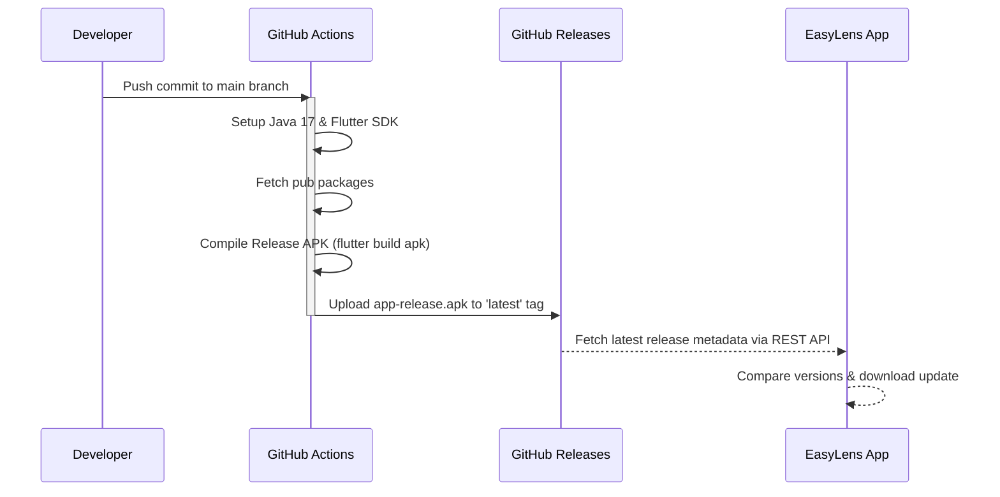
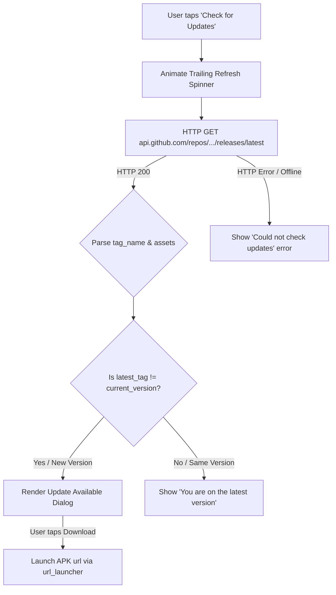

# EasyLens: CI/CD Pipeline & Automated OTA Updates

This document describes the automated build, integration, and Over-The-Air (OTA) updates architecture implemented in EasyLens. The system combines GitHub Actions builds with on-device REST API updates checking.

---

## 1. CI/CD Build Flow (GitHub Actions)

The build pipeline is configured inside [.github/workflows/release.yml](file:///Users/arronkianparejas/easylens/.github/workflows/release.yml). It is executed on every push to the `main` branch.



### Build Specifications
* **Runner Environment**: `ubuntu-latest`
* **Java Version**: `17` (Zulu distribution)
* **SDK Delegate**: `subosito/flutter-action@v2` (caching enabled for faster builds)
* **Target Output**: Release Android Package (`build/app/outputs/flutter-apk/app-release.apk`)
* **Deployer**: `ncipollo/release-action@v1`
  - Replaces and updates the file under tag `latest` (`allowUpdates: true`, `removeArtifacts: true`), guaranteeing that the update download links always yield the most up-to-date commit code.

---

## 2. On-Device OTA Updates Check Architecture

Instead of routing updates through third-party app stores (which can be difficult to navigate for screen readers), EasyLens embeds a lightweight, native update checker directly into Settings.



### Implementation Specifications

1. **Current App Version tag**: Hardcoded constant in [settings_screen.dart](file:///Users/arronkianparejas/easylens/lib/screens/settings/settings_screen.dart):
   ```dart
   static const String currentVersionTag = 'v1.2.0';
   ```
2. **Updates Fetch Call**: Performs an HTTP call:
   ```dart
   final response = await http.get(Uri.parse('https://api.github.com/repos/Thes-IS-IT/Easylens/releases/latest'));
   ```
3. **Download Resolution**: Parses the assets array to extract the download link for the release file ending in `.apk`:
   ```dart
   if (name.endsWith('.apk')) {
     apkUrl = asset['browser_download_url'];
   }
   ```
4. **Trigger & Browser Download**: When a user clicks "Download Now" on the update dialog, the app opens the browser download link using `url_launcher` to download and install the package immediately.
5. **Loader feedback**: During the API request, the trailing list tile icon is replaced dynamically with a custom `CircularProgressIndicator` to confirm to visually impaired users that the check is actively executing.
