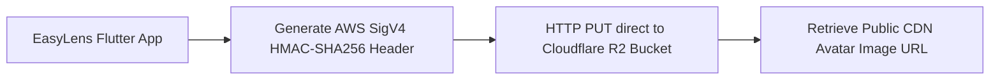

# Cloudflare R2 Setup Guide for EasyLens Profile Photos

Cloudflare R2 is an S3-compatible, zero-egress-fee object storage service. This document outlines the step-by-step setup to connect Cloudflare R2 to your EasyLens Flutter application for avatar uploads.

---

## 1. Environment Variable Configuration
The following variables have been appended to your [.env](file:///Users/arronkianparejas/easylens/.env) file. You must populate these with your credentials:

```env
CLOUDFLARE_R2_ACCOUNT_ID=your_cloudflare_account_id_here
CLOUDFLARE_R2_ACCESS_KEY_ID=your_r2_access_key_id_here
CLOUDFLARE_R2_SECRET_ACCESS_KEY=your_r2_secret_access_key_here
CLOUDFLARE_R2_BUCKET_NAME=easylens-profile-photos
CLOUDFLARE_R2_PUBLIC_URL=https://your-custom-subdomain.r2.dev
```

---

## 2. Cloudflare Dashboard Setup

### Step A: Create an R2 Bucket
1. Log in to the [Cloudflare Dashboard](https://dash.cloudflare.com/).
2. Navigate to **R2 Object Storage** from the left-hand sidebar.
3. Click **Create Bucket**.
4. Name the bucket `easylens-profile-photos` and click **Create Bucket**.

### Step B: Generate S3 Credentials (API Tokens)
To interact with R2 via S3-compatible APIs, you must generate access keys:
1. On the R2 page, click **Manage R2 API Tokens** on the right side.
2. Click **Create API Token**.
3. Configure the token:
   * **Token Name**: `EasyLens Mobile App Token`
   * **Permissions**: `Edit` (required to write and delete avatars).
   * **Scope**: Specific bucket `easylens-profile-photos`.
4. Click **Create Token**.
5. Copy the following keys immediately (they are only shown once):
   * **Access Key ID** (maps to `CLOUDFLARE_R2_ACCESS_KEY_ID`)
   * **Secret Access Key** (maps to `CLOUDFLARE_R2_SECRET_ACCESS_KEY`)
   * **Account ID** (find this on the main R2 page or S3 Endpoint URL, maps to `CLOUDFLARE_R2_ACCOUNT_ID`)

### Step C: Configure Public Access (To View Images)
To display uploaded avatars in the app, you need a public URL:
1. Open your bucket settings (`easylens-profile-photos`).
2. Go to the **Settings** tab.
3. Under **Public Access**, choose one of the options:
   * **R2.dev Subdomain**: Toggle to **Allowed** (good for testing).
   * **Custom Domain**: Connect a domain registered on Cloudflare (recommended for production).
4. Copy the public address and map it to `CLOUDFLARE_R2_PUBLIC_URL` in your `.env`.

---

## 3. CORS Policy Configuration
Since Flutter applications upload images directly from client devices, you must allow Cross-Origin Resource Sharing (CORS).
1. Go to your bucket **Settings** tab.
2. Scroll down to **CORS Policy** and click **Add CORS Policy**.
3. Paste the following JSON configuration:
```json
[
  {
    "AllowedOrigins": ["*"],
    "AllowedMethods": ["GET", "PUT", "POST", "DELETE", "HEAD"],
    "AllowedHeaders": ["*"],
    "ExposeHeaders": ["ETag"],
    "MaxAgeSeconds": 3000
  }
]
```
4. Click **Save**.

---

## 4. Simplified R2 Direct Upload Flow



---

## 5. Code Implementation Example (Dart / Flutter)
When implementing uploads in Dart, R2 acts exactly like an S3 endpoint. You can perform S3 Signature V4 uploads or use simple presigned URLs.

### S3 Endpoint URL Format
* `https://<ACCOUNT_ID>.r2.cloudflarestorage.com/<BUCKET_NAME>`

### Sample Raw HTTP Put Request (Using Presigned URLs)
If using a serverless helper to generate presigned URLs:
```dart
import 'dart:io';
import 'package:http/http.dart' as http;

Future<bool> uploadToR2(String presignedUrl, File file) async {
  final bytes = await file.readAsBytes();
  final response = await http.put(
    Uri.parse(presignedUrl),
    headers: {
      'Content-Type': 'image/png',
    },
    body: bytes,
  );
  return response.statusCode == 200;
}
```
