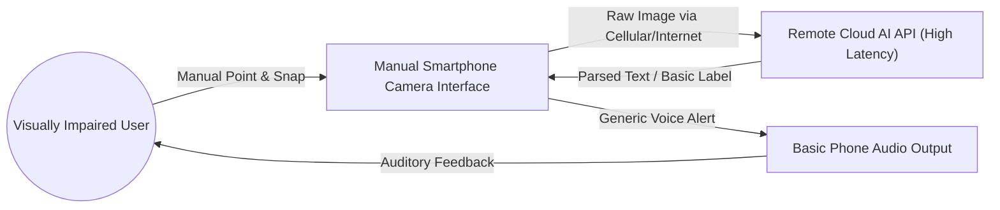
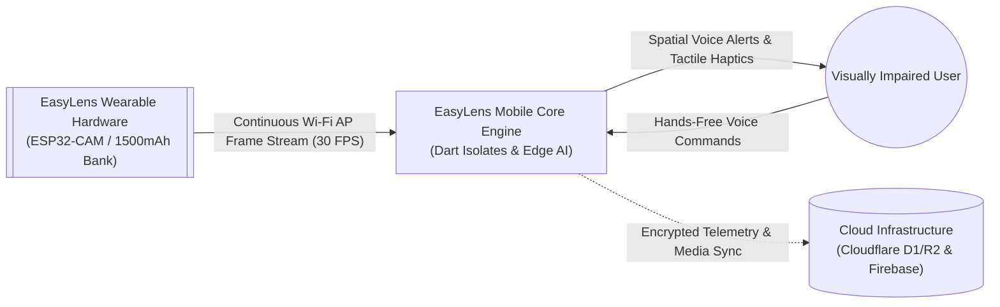
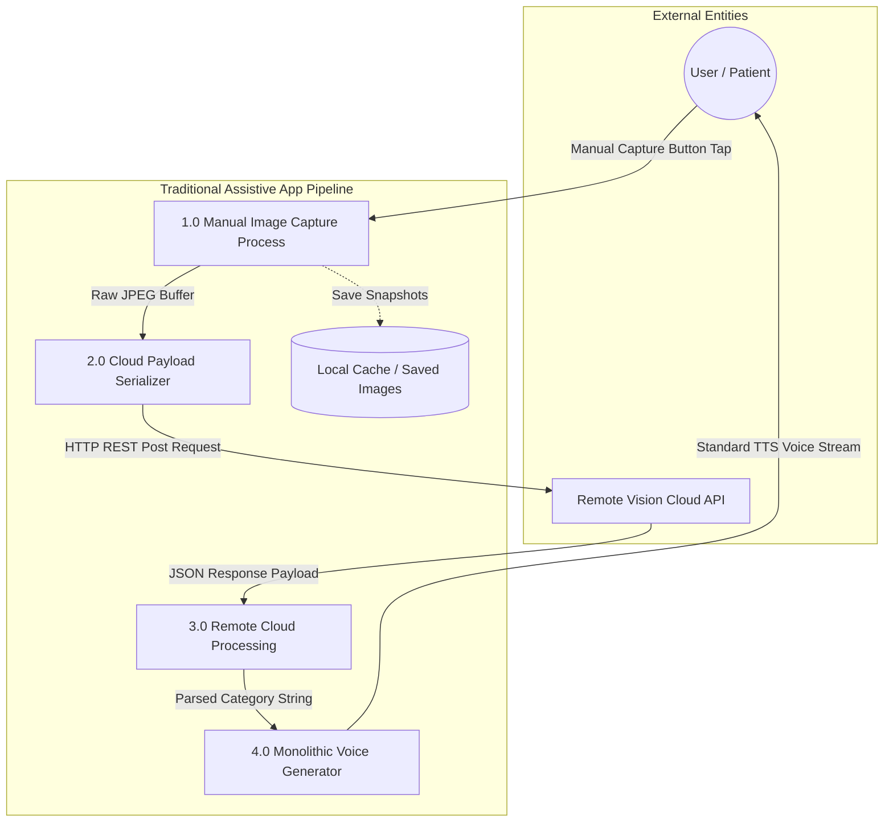
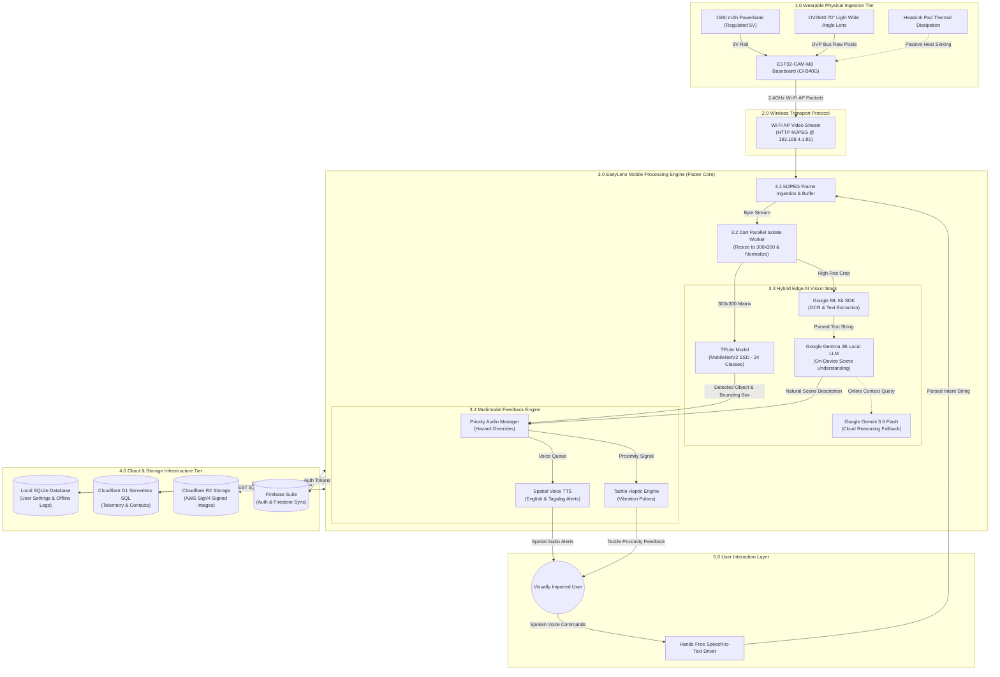

# EasyLens - Current vs. Proposed Data Flow Diagrams (DFD)

---

## 1. Overview & System Evolution

This document presents the **Current Data Flow Diagram** (Baseline Assistance Model without integrated edge-AI hardware) versus the **Proposed Data Flow Diagram** (The complete **EasyLens** Wearable Edge-AI System). 

Both **Simplified High-Level** and **Detailed Architectural Level-1/Level-2 Data Flow Diagrams** are provided below using standard GitHub-compatible Mermaid syntax.

---

## 2. Simplified Data Flow Diagrams

### 2.1 Current Data Flow Diagram (Baseline / Existing System)
In traditional assistive apps, visual input relies entirely on manual phone camera framing, single-frame cloud API calls, and standard voice output without edge processing or real-time spatial awareness.

---

### 2.2 Proposed Data Flow Diagram (EasyLens System)
The proposed EasyLens system introduces continuous wearable camera streaming via an **ESP32-CAM-MB (OV2640 70° Light Wide Angle)** inside a **3D-printed module box frame** powered by a **1500 mAh powerbank**, processing real-time video frames on-device using **TensorFlow Lite (MobileNetV2 SSD)**, **Google Gemma 2B**, and **Google ML Kit**, with spatial TTS, haptics, and serverless Cloudflare D1/R2 sync.

---

## 3. Detailed Data Flow Diagrams

### 3.1 Current System Detailed Data Flow Diagram (Level-1 DFD)

---

### 3.2 Proposed System Detailed Data Flow Diagram (Level-1 & Level-2 DFD)

---

## 4. Key Improvements Summary (Current vs. Proposed)

| Architectural Parameter | Current Baseline System | Proposed EasyLens System |
| :--- | :--- | :--- |
| **Video Stream Ingestion** | Manual single-shot snapshot via smartphone camera. | Continuous 30 FPS hands-free video stream from wearable **OV2640 70° wide angle lens**. |
| **Hardware Form Factor** | Handheld mobile device (occupies user's hand). | Lightweight **3D-printed module box frame** powered by a **1500 mAh powerbank**. |
| **Inference Latency** | High cloud latency ($1.5\text{s} - 3.0\text{s}$ per query). | Real-time edge inference (**28 ms** TFLite MobileNetV2 SSD / ~88 ms end-to-end). |
| **Offline Functionality** | Fails completely without cellular/Wi-Fi connection. | **100% offline edge processing** (TFLite, ML Kit OCR, and Google Gemma 2B LLM). |
| **Multimodal Feedback** | Monolithic text-to-speech output. | Priority spatial voice alerts (English/Tagalog) + tactile vibration pulse patterns. |
| **Cloud Telemetry & Sync** | Proprietary closed API. | Serverless **Cloudflare D1** (SQL), **Cloudflare R2** (AWS SigV4), and **Firebase Auth**. |
