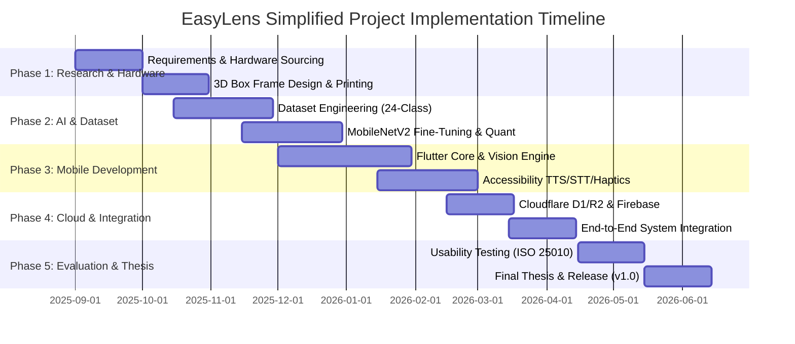
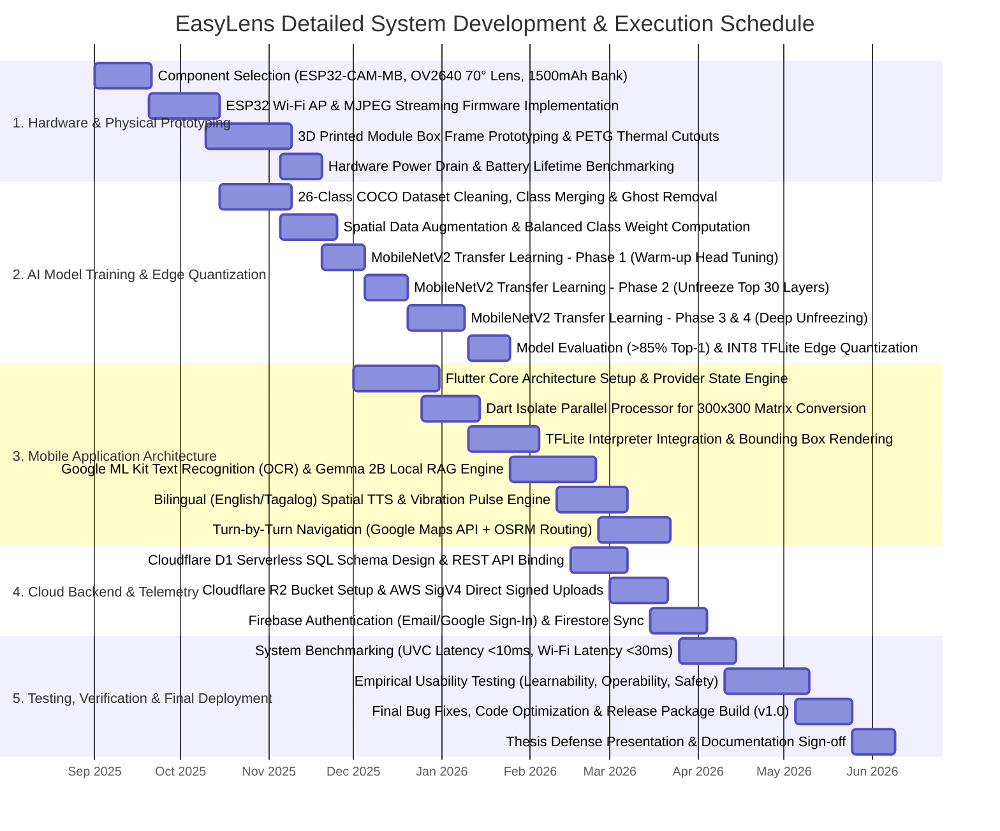

# EasyLens - Project Implementation Gantt Chart Specification

---

## 1. Overview & Project Roadmap

This document outlines the project development timeline for **EasyLens**, spanning research, hardware prototyping, dataset curation, transfer learning model training, mobile app development, cloud integration, testing, and deployment.

---

## 2. Simplified Gantt Chart (Phase-Level High Overview)

---

## 3. Detailed Gantt Chart (Task & Deliverable Level)

---

## 4. Phase Milestones Summary

| Phase | Milestone Name | Key Target Deliverable | Completion Target |
| :--- | :--- | :--- | :--- |
| **M-1** | Hardware Assembly Verified | Physical 3D-printed box frame with ESP32-CAM-MB streaming 30 FPS over Wi-Fi AP. | November 2025 |
| **M-2** | TFLite Model Quantized | MobileNetV2 SSD achieving **85.55% Top-1 accuracy** and **2.48 ms latency** exported to `ssd_mobilenet_v2.tflite`. | January 2026 |
| **M-3** | Mobile App Engine Operational | Flutter application executing real-time object detection, OCR reading, and bilingual spatial voice alerts. | March 2026 |
| **M-4** | Cloud Sync Infrastructure Live | Cloudflare D1 SQL, R2 bucket storage (AWS SigV4), and Firebase Auth integrated into production app. | April 2026 |
| **M-5** | Empirical Evaluation & Release | Completed usability testing (ISO 25010 / WEAR Scale) and final app binary release (v1.0). | May 2026 |
