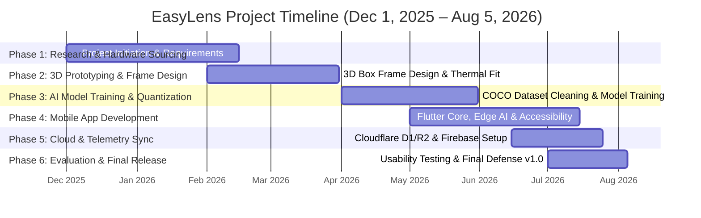
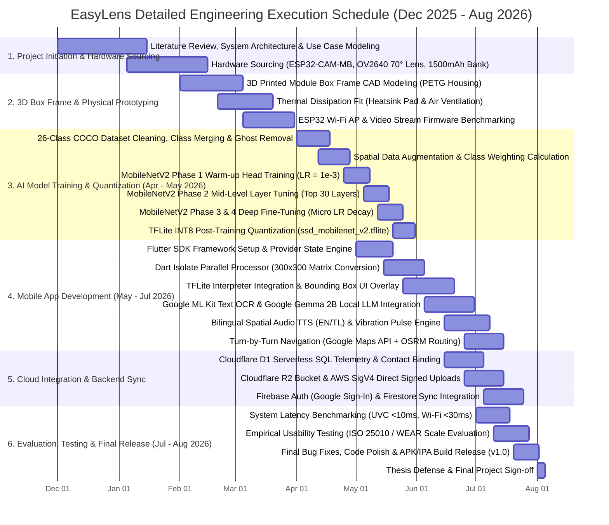

# EasyLens - Project Implementation Gantt Chart Specification

---

## 1. Overview & Project Roadmap

This document outlines the formal project development timeline for **EasyLens**, spanning **December 1, 2025 to August 5, 2026**.

The key project phases follow a chronological engineering roadmap:
1. **Phase 1: Project Initiation, Literature Review & Hardware Sourcing** *(Dec 1, 2025 – Feb 15, 2026)*
2. **Phase 2: 3D Box Frame Design & Physical Prototyping** *(Feb 1, 2026 – Mar 31, 2026)*
3. **Phase 3: Dataset Curation & MobileNetV2 Model Training** *(Apr 1, 2026 – May 31, 2026)*
4. **Phase 4: Flutter App Development, Edge AI Engine & Multimodal Accessibility** *(May 1, 2026 – Jul 15, 2026)*
5. **Phase 5: Cloud Integration (Cloudflare D1/R2 & Firebase)** *(Jun 15, 2026 – Jul 25, 2026)*
6. **Phase 6: Empirical Usability Evaluation, System Benchmarking & Release** *(Jul 1, 2026 – Aug 5, 2026)*

---

## 2. Simplified Gantt Chart (Phase-Level Overview)

---

## 3. Detailed Gantt Chart (Task & Deliverable Breakdown)

---

## 4. Phase Milestone Summary

| Phase | Target Date Range | Key Milestone Deliverable | Status / Output |
| :--- | :--- | :--- | :--- |
| **Phase 1** | Dec 1, 2025 – Feb 15, 2026 | System Requirements & Hardware Component Procurement | ESP32-CAM-MB, OV2640 70° Lens & 1500mAh Bank Sourced |
| **Phase 2** | Feb 1, 2026 – Mar 31, 2026 | 3D Printed Box Frame Prototyping & Thermal Verification | PETG Enclosure with Heatsink Pad Mounting |
| **Phase 3** | **Apr 1, 2026 – May 31, 2026** | **AI Model Training & INT8 Quantization** | **MobileNetV2 SSD (>85% Top-1) Exported to TFLite** |
| **Phase 4** | **May 1, 2026 – Jul 15, 2026** | **Flutter Mobile App Development & Vision Pipeline** | **60 FPS Accessible UI, TFLite, ML Kit OCR & Spatial TTS** |
| **Phase 5** | Jun 15, 2026 – Jul 25, 2026 | Cloud Infrastructure Integration | Cloudflare D1/R2 & Firebase Auth Sync Active |
| **Phase 6** | **Jul 1, 2026 – Aug 5, 2026** | **Empirical Evaluation, Thesis Defense & v1.0 Release** | **Usability Verification & Production Build Release** |
