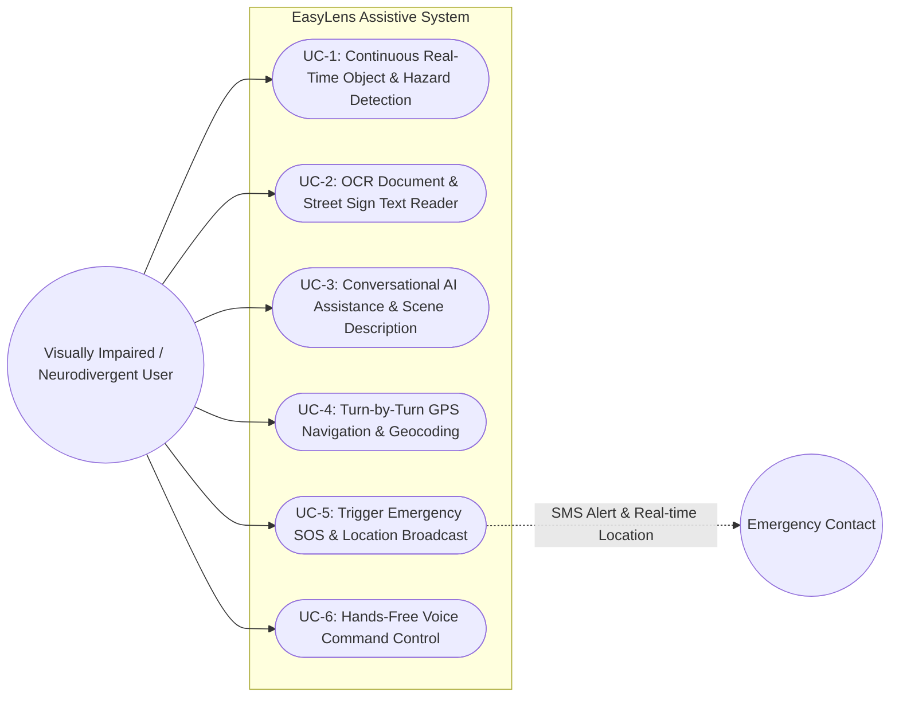
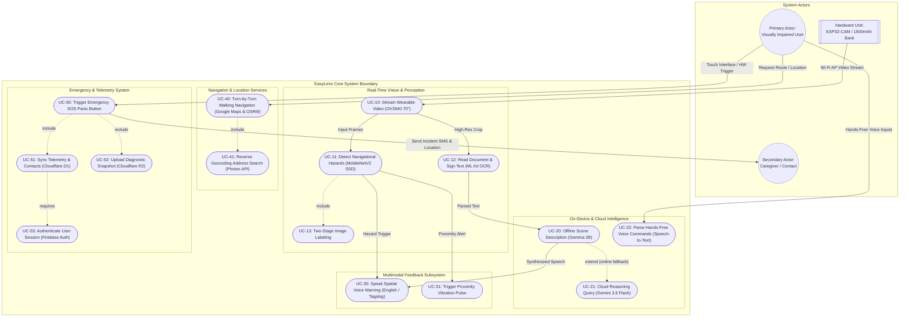

# EasyLens - Use Case Diagrams (UCD) Specification

---

## 1. Overview & System Scope

This document provides both **Simplified High-Level** and **Detailed Architectural Use Case Diagrams** for **EasyLens**. It models interactions between the primary actor (**Visually Impaired / Neurodivergent User**), secondary actors (**Emergency Contacts**, **Caregivers / System Administrators**), and system boundaries spanning **Wearable Physical Hardware**, **Edge Application Core**, and **Cloud Infrastructure Tier**.

---

## 2. Simplified Use Case Diagram

The high-level Use Case Diagram illustrates core interactions between the primary user and the primary system capabilities:

---

## 3. Detailed Architectural Use Case Diagram

The detailed Use Case Diagram captures system inclusions (`<<include>>`), extensions (`<<extend>>`), hardware sensor triggers, and cloud backend interfaces.

---

## 4. Use Case Specifications & Actor Descriptions

### 4.1 Actor Catalog

| Actor | Category | Description |
| :--- | :--- | :--- |
| **Visually Impaired / Neurodivergent User** | Primary | Interacts with EasyLens hands-free via spatial audio feedback, voice commands, screen-reader touch gestures, and physical hardware buttons. |
| **Wearable Hardware Unit** | System / Sensor | Captures continuous video frames via **OV2640 70° light wide angle lens**, powered by **ESP32-CAM-MB** and **1500 mAh powerbank**. |
| **Emergency Contact / Caregiver** | Secondary | Receives real-time SMS notifications, current GPS coordinates, and incident logs when an Emergency SOS is triggered. |
| **Cloud Services (Cloudflare D1/R2 & Firebase)** | Infrastructure | Manages serverless database records, secure AWS SigV4 media uploads, and user authentication sessions. |

---

### 4.2 Core Use Case Descriptions

| Use Case ID | Use Case Name | Primary Trigger | Key Operational Flow |
| :--- | :--- | :--- | :--- |
| **UC-10 / UC-11** | Real-Time Obstacle Detection | Camera power on & continuous Wi-Fi stream active. | Frame bytes ingestion $\rightarrow$ Dart isolate normalization $\rightarrow$ TFLite MobileNetV2 SSD inference $\rightarrow$ Priority spatial TTS & tactile vibration pulse output. |
| **UC-12 / UC-20** | OCR & Offline Scene Understanding | Spoken prompt or screen button tap. | ML Kit OCR extracts text string $\rightarrow$ Google Gemma 2B synthesizes natural speech $\rightarrow$ Spatial TTS speaks English/Tagalog output offline. |
| **UC-40** | Turn-by-Turn Walking Navigation | User voice command or location search. | Geocodes destination via Photon API $\rightarrow$ Calculates walking route via OSRM/Google Maps API $\rightarrow$ Emits spatial voice guidance cues. |
| **UC-50** | Emergency SOS & Telemetry Sync | Double-tap SOS button or voice command "*Emergency*". | Captures current GPS coordinates $\rightarrow$ Sends direct SMS alert to registered contact $\rightarrow$ Logs incident to Cloudflare D1 & uploads snapshot to R2. |
