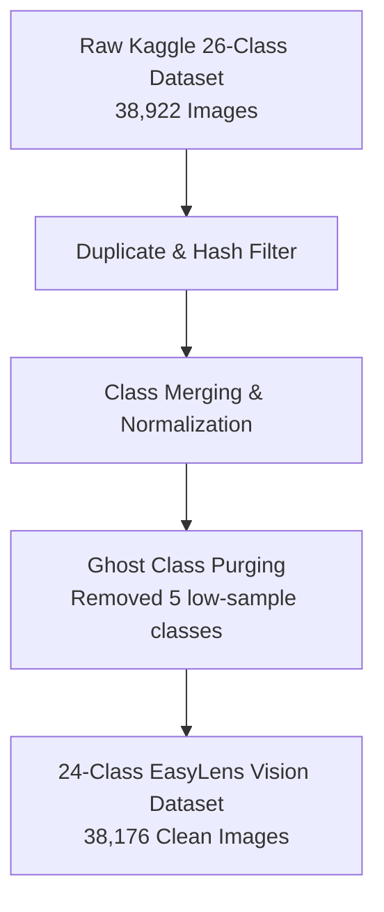
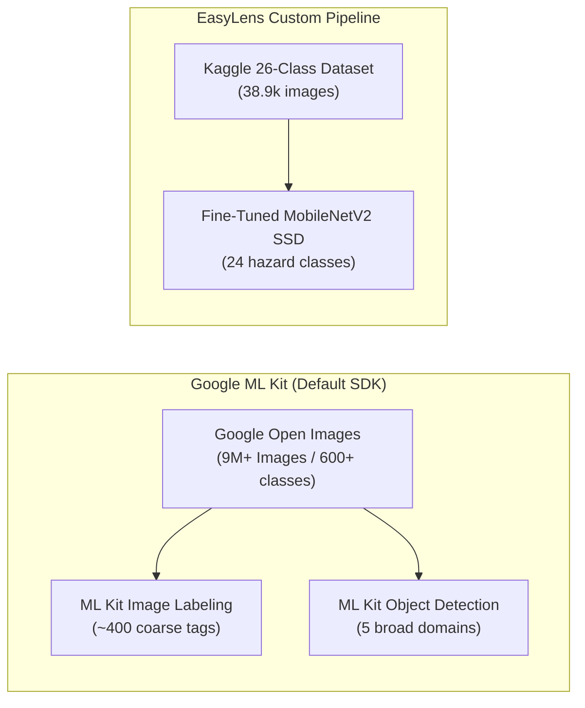

# EasyLens Computer Vision Datasets & ML Kit Integration

This document provides a comprehensive technical reference for the vision datasets, data preprocessing pipelines, and model baseline architectures used in **EasyLens**. It also details the comparative relationship between proprietary **Google ML Kit** vision datasets and EasyLens's custom-trained object detection dataset.

---

### 01 — EASYLENS CUSTOM VISION DATASET

EasyLens uses a fine-tuned MobileNetV2 Single Shot Detector (SSD) edge vision pipeline tailored for real-time obstacle avoidance for visually impaired users.

#### Primary Training Dataset
* **Source Dataset**: [Kaggle 26-Class Object Detection Dataset](https://www.kaggle.com/datasets/mohamedgobara/26-class-object-detection-dataset) (`Senior-Design-VIAD-4`)
* **Original Annotations**: 38,922 JPEG images annotated in COCO JSON format.
* **Domain Focus**: Urban navigation hazards, accessibility obstacles, pedestrian path markers, and common indoor/outdoor items.

#### Data Cleaning & 24-Class Consolidation
The raw Kaggle dataset underwent data-centric preprocessing prior to model training:
1. **Class Consolidation**: Overlapping label categories (such as `person` and `Person`) were merged into unified canonical representations.
2. **Ghost Class Removal**: Removed 5 low-frequency "ghost classes" (`bench`, `chair`, `handbag`, `umbrella`, `traffic_light`) that had $\le 3$ annotated images across the dataset, eliminating gradient noise during training.

#### Target Class Taxonomy (24 Classes)

| Category Index | Class Label | Domain Type | Risk Level |
|---|---|---|---|
| 0 | `person` | Dynamic Pedestrian | High |
| 1 | `bicycle` | Vehicle | Medium |
| 2 | `car` | Vehicle | High |
| 3 | `motorcycle` | Vehicle | High |
| 4 | `bus` | Vehicle | Critical |
| 5 | `truck` | Vehicle | Critical |
| 6 | `traffic_sign` | Navigation Signage | Low |
| 7 | `crosswalk` | Pedestrian Path | Medium |
| 8 | `pole` | Static Obstacle | Medium |
| 9 | `stair` / `stairs` | Vertical Hazard | High |
| 10 | `pothole` | Ground Defect | High |
| 11 | `door` | Architectural Feature | Low |
| 12 | `trash_can` | Street Furniture | Low |
| 13 | `fire_hydrant` | Ground Hazard | Medium |
| 14 | `dog` / `guide_dog` | Animal | Medium |
| 15 | `guide_cane` | Accessibility Tool | Low |
| 16 | `escalator` | Vertical Hazard | High |
| 17 | `elevator` | Architectural Feature | Low |
| 18 | `tree_branch` | Overhead Hazard | High |
| 19 | `construction_cone` | Path Obstruction | Medium |
| 20 | `barricade` | Path Blockage | High |
| 21 | `sidewalk_edge` | Elevation Change | Medium |
| 22 | `curb` | Elevation Change | Medium |
| 23 | `vehicle_other` | General Vehicle | High |

---

### 02 — GOOGLE ML KIT DATASETS VS. CUSTOM EASYLENS DATASET

Google ML Kit provides built-in mobile vision SDKs, but operates on different underlying datasets compared to EasyLens's fine-tuned model.

#### Comparative Matrix

| Dataset / Pipeline | Primary Creator / Source | Scale & Classes | Annotation Type | EasyLens Usage |
|---|---|---|---|---|
| **Kaggle 26-Class Dataset** | [Mohamed Gobara (Kaggle)](https://www.kaggle.com/datasets/mohamedgobara/26-class-object-detection-dataset) | 38,922 images / 26 classes (cleaned to 24) | 2D Bounding Boxes (COCO JSON) | **Primary Training Data** for MobileNetV2 SSD edge obstacle detector |
| **Google Open Images** | Google AI Research | 9M+ images / ~600 detection & ~20k classification tags | Bounding Boxes & Segmentation | Foundation for Google ML Kit's pre-trained default SDKs |
| **COCO Dataset** | Common Objects in Context | 328k images / 80 categories | Bounding Boxes & Masks | Pre-training base weights for backbone transfer learning |
| **LVIS Dataset** | FAIR / CMU | 164k images / 1,200+ classes | High-res Instance Segmentation Masks | **Not Used** (Compute overhead too high for ~2.5 ms edge inference) |
| **Pascal VOC** | University of Oxford / Vision Community | 11.5k images / 20 categories | Bounding Boxes | Legacy benchmark (Not used in EasyLens) |

---

### 03 — DUAL VISION ARCHITECTURE IN EASYLENS

EasyLens combines **Google ML Kit** and the **Custom MobileNetV2 SSD** in a hybrid edge architecture:

1. **Custom MobileNetV2 SSD (24 Classes)**:
   - Evaluates frames in a background Dart Isolate at **~2.48 ms latency**.
   - Outputs spatial bounding boxes used directly by the **Spatial Threat & Steering Algorithm** to give immediate voice guidance ("*Avoid obstacle by moving to your right*").

2. **Google ML Kit SDK Integration**:
   - **`google_mlkit_text_recognition`**: Used when bounding box heuristics identify traffic signs or boards, extracting on-street text dynamically via OCR.
   - **`google_mlkit_image_labeling`**: Used as a secondary fallback classifier when general scene context is requested by the Buddy AI companion.

---

### 04 — REFERENCES & DOCUMENTATION LINKS

* [Kaggle 26-Class Dataset Source](https://www.kaggle.com/datasets/mohamedgobara/26-class-object-detection-dataset)
* [MobileNetV2 Fine-Tuning Technical Report](file:///Users/arronkianparejas/easylens/docs/training/mobilenetv2_finetuning_report.md)
* [Object Detection Architecture Document](file:///Users/arronkianparejas/easylens/docs/object_detection_architecture.md)
* [AI Architecture Overview](file:///Users/arronkianparejas/easylens/docs/ai_architecture.md)
