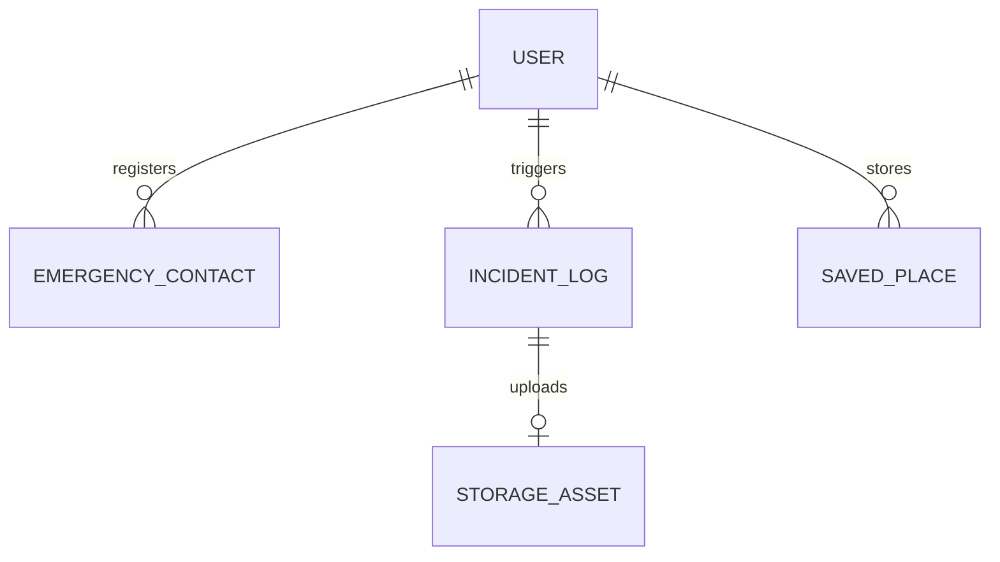
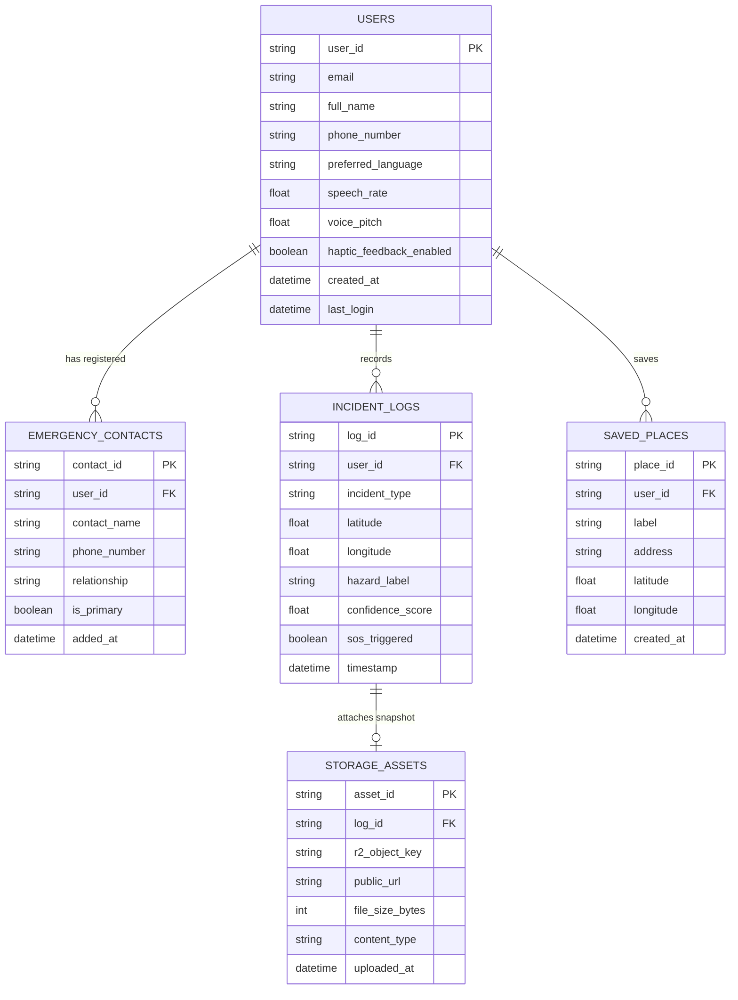

# EasyLens - Entity Relationship Diagram (ERD) Specification

---

### 01 — OVERVIEW & DATA ARCHITECTURE

This document defines the relational and document data architecture for **EasyLens**. Data persistence spans **Local SQLite Caching**, **Cloudflare D1 SQL Serverless Edge Database**, **Cloudflare R2 Object Storage**, and **Firebase Authentication & Firestore**.

---

### 02 — SIMPLIFIED ENTITY RELATIONSHIP DIAGRAM

The high-level ERD models core relationships between Users, Emergency Contacts, Detection Incident Logs, Navigational Saved Places, and Storage Assets.

---

### 03 — DETAILED ENTITY RELATIONSHIP DIAGRAM

The detailed ERD specifies exact primary keys (PK), foreign keys (FK), data types, constraints, and relational cardinality across the relational schema.

