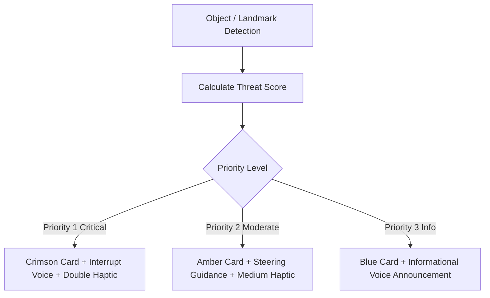

# EasyLens Navigation & Hazard Warning System

This document outlines the real-time hazard mapping, classification logic, alert feedback mechanisms, and the complete catalog of target objects utilized in the EasyLens edge computer vision and audio navigation systems.

---

### 01 — WARNING & HAZARD CATEGORIES

EasyLens classifies environmental features detected in the camera view into three hazard priority levels:

#### Priority 1: Critical Hazards (Immediate Action Required)
- **Haptic Alert**: Double high-intensity vibration sequence (vibrate, pause 150ms, vibrate).
- **Audio Feedback**: Priority Text-to-Speech (TTS) command interrupting previous speech.
- **UI Styling**: Crimson Red background card (`Color(0xFFFFEBEE)`) with error icon.
- **Triggers**:
  - **STOP!**: Bounding box proximity threshold exceeded; direct collision path detected.
  - **Fire Hazard!**: Inference detection of fire, open flames, or heavy smoke.
  - **Sharp / Weapon Hazard!**: Knives, weapons, or blades in path.
  - **Live Wires / Electrical Danger**: Exposed high-voltage lines, generators, or loose cables.

#### Priority 2: Moderate Hazards (Precautionary Actions)
- **Haptic Alert**: Single medium-impact haptic feedback impulse.
- **Audio Feedback**: Spoken guidance advising user on steering/speed adjustments.
- **UI Styling**: Amber/Orange background cards (`Color(0xFFFFF8E1)` or `Color(0xFFFFFDE7)`).
- **Triggers**:
  - **Vehicle Detected**: Approaching jeepneys, tricycles, cars, or motorcycles.
  - **Damaged Pathway**: Sidewalk cracks, potholes, or open grates.
  - **Stairs Detected**: Approaching step-downs or step-ups.
  - **Obstacle Ahead**: Generic pathway blockages (e.g. posts, poles, construction barriers).
  - **Multiple Hazards**: Extremely complex environment with multiple active threat items.
  - **Moving Too Fast**: Device motion exceeds accelerometer tracking limits for accurate visual scan.

#### Priority 3: Informational & Assistive Events
- **Haptic Alert**: None.
- **Audio Feedback**: Conversational announcements.
- **UI Styling**: Indigo/Blue background cards (`Color(0xFFE8EAF6)`).
- **Triggers**:
  - **Traffic Sign Located**: Crosswalk markers, Stop signs, or street warnings.
  - **Person Detected**: Nearby pedestrians (encouraging spatial awareness).
  - **GO Signal Detected**: Pedestrian green lights detected at traffic signals.
  - **Low Light Detected**: Ambient illumination falls below threshold, warning that camera scanning confidence is reduced.
  - **Path Clear**: Reverting to normal walking state (Green card).

---

### 02 — SIMPLIFIED HAZARD PIPELINE

---

### 03 — THREAT CALCULATION LOGIC

Threat scoring is computed dynamically for every detected object based on three primary factors:

$$\text{Threat Score} = (\text{Base Risk} \times 0.4) + (\text{Proximity Score} \times 0.4) + (\text{Velocity Score} \times 0.2)$$

1. **Base Risk (40%)**: Pre-assigned hazard level weight per class label (e.g., vehicles and stairs have higher base risk than tables or cups).
2. **Proximity Score (40%)**: Normalized bounding box area relative to image width/height (larger area indicates closer proximity).
3. **Velocity Score (20%)**: Change in bounding box area over time, highlighting objects that are moving rapidly towards the user.

---

### 04 — THE 24 CUSTOM TRAINED NAVIGATION OBJECTS

These are the 24 specific target classes trained for the core EasyLens visual classification and warning model, along with their empirical validation metrics:

| Class Object | Precision | Recall | F1-Score | Support | Visual Warning Role |
| :--- | :---: | :---: | :---: | :---: | :--- |
| **Bus** | 0.64 | 0.92 | 0.75 | 85 | Large transport vehicle in path |
| **Bushes** | 0.91 | 0.81 | 0.85 | 109 | Sidewalk greenery / obstacle |
| **Person** | 0.54 | 0.68 | 0.60 | 90 | Moving pedestrian detection |
| **Truck** | 0.89 | 0.45 | 0.60 | 38 | Heavy commercial vehicle hazard |
| **Bicycle** | 0.91 | 0.88 | 0.90 | 143 | Two-wheeled path obstacle |
| **Branch** | 0.72 | 0.95 | 0.82 | 19 | Overhead hazard / low hanging branch |
| **Car** | 0.84 | 0.76 | 0.80 | 75 | Automobile pathway block |
| **Crosswalk** | 0.95 | 0.92 | 0.94 | 155 | Road crossing assistance indicator |
| **Door** | 0.90 | 0.85 | 0.87 | 102 | Entryway / Exit pathway |
| **Elevator** | 0.90 | 0.93 | 0.92 | 100 | Indoor transition aid |
| **Fire Hydrant** | 0.97 | 0.98 | 0.98 | 101 | Sidewalk street obstacle |
| **Green Light** | 0.79 | 0.48 | 0.59 | 124 | Traffic signal "Safe to cross" |
| **Gun** | 0.88 | 0.89 | 0.88 | 107 | Critical threat detection |
| **Motorcycle** | 0.53 | 0.82 | 0.64 | 22 | Fast-moving transit hazard |
| **Pothole** | 0.80 | 0.97 | 0.88 | 33 | Elevation ground danger |
| **Rat** | 1.00 | 0.95 | 0.97 | 101 | Animal caution indicator |
| **Red Light** | 0.75 | 0.78 | 0.77 | 109 | Traffic signal "Stop crossing" |
| **Scooter** | 0.89 | 0.80 | 0.84 | 122 | Micro-mobility path transit |
| **Stairs** | 0.70 | 0.84 | 0.76 | 25 | Level changes step-up / step-down |
| **Stop Sign** | 0.89 | 0.95 | 0.92 | 74 | Stop warning signpost |
| **Traffic Cone** | 0.89 | 0.98 | 0.93 | 86 | Construction zone barrier |
| **Train** | 0.74 | 0.97 | 0.84 | 112 | Rail transit hazard |
| **Tree** | 0.90 | 0.94 | 0.92 | 100 | Large outdoor street obstacle |
| **Yellow Light** | 0.79 | 0.51 | 0.62 | 94 | Traffic signal "Caution transition" |

---

### 05 — THE 80 COCO DATASET CLASSES

These standard classes are loaded from `ssd_labels.txt` / `coco_labels.txt` to run SSD MobileNetV2 inference:

1. person
2. bicycle
3. car
4. motorcycle
5. airplane
6. bus
7. train
8. truck
9. boat
10. traffic light
11. fire hydrant
12. stop sign
13. parking meter
14. bench
15. bird
16. cat
17. dog
18. horse
19. sheep
20. cow
21. elephant
22. bear
23. zebra
24. giraffe
25. backpack
26. umbrella
27. handbag
28. tie
29. suitcase
30. frisbee
31. skis
32. snowboard
33. sports ball
34. kite
35. baseball bat
36. baseball glove
37. skateboard
38. surfboard
39. tennis racket
40. bottle
41. wine glass
42. cup
43. fork
44. knife
45. spoon
46. bowl
47. banana
48. apple
49. sandwich
50. orange
51. broccoli
52. carrot
53. hot dog
54. pizza
55. donut
56. cake
57. chair
58. couch
59. potted plant
60. bed
61. dining table
62. toilet
63. tv
64. laptop
65. mouse
66. remote
67. keyboard
68. cell phone
69. microwave
70. oven
71. toaster
72. sink
73. refrigerator
74. book
75. clock
76. vase
77. scissors
78. teddy bear
79. hair drier
80. toothbrush

---

### 06 — GOOGLE ML KIT IMAGE LABELER CATEGORIES (400+ CLASSES)

The default on-device Google ML Kit Image Labeling model categorizes images into over 400 groups. This model categorizes entities across standard domains:

#### Core Taxonomic Groups
- **Common Animals & Pets**: Cat, Dog, Bird, Horse, Rabbit, Elephant, Squirrel, Fish, Insect, etc.
- **Household Furniture & Decor**: Bed, Couch, Stool, Table, Chair, Desk, Cabinet, Drawer, Pillow, Vase, Clock, Lamp, Curtain, Rug.
- **Electronic Devices & Accessories**: Laptop, Computer, Monitor, Screen, Keyboard, Mouse, Telephone, Mobile Phone, Cable, Camera, Headphone, Speaker.
- **Kitchenware & Food**: Bottle, Cup, Wine glass, Mug, Fork, Knife, Spoon, Bowl, Plate, Oven, Stove, Microwave, Refrigerator, Bread, Apple, Banana, Pizza, Cake.
- **Outdoor Environment & Nature**: Trees, Grass, Plant, Flower, Scenery, Sky, Cloud, Sun, Mountain, Beach, Water, River, Sidewalk, Street, Path.
- **Vehicles & Infrastructure**: Automobile, Bus, Bicycle, Truck, Scooter, Train, Airplane, Station, Building, Wall, Pillar, Door, Window, Bridge, Roof.
- **Office & Stationary**: Book, Paper, Pen, Pencil, Notebook, Scissors, Backpack, Suitcase, Envelope.
- **Apparel & Sports Gear**: Clothing, Shoes, Hat, Tie, Bag, Watch, Umbrella, Ball, Racket, Skateboard, Surfboard, Kite.

#### On-Device Label Refinement Mapping
To prevent speech navigation clutter and unify vocabulary, EasyLens passes raw label strings through `_refineLabel()`:

| Raw Label | Refined Label | Category |
|---|---|---|
| `musical instrument` / `piano` / `electronic keyboard` | `laptop or keyboard` | Electronic/Input |
| `partition` / `divider` | `wall` | Architectural |
| `doorway` / `entrance` | `door` | Architectural |
| `stool` / `armchair` / `sofa` / `couch` | `chair` | Seating |
| `desk` / `tabletop` / `countertop` | `table` | Surfaces |
| `computer` / `screen` / `monitor` / `laptop` | `laptop or computer screen` | Display |
| `bottle` / `cup` / `mug` / `glass` / `tableware` | `cup or tableware` | Dining |
| `human` / `man` / `woman` / `child` / `pedestrian` / `bystander` / `people` | `person` | Obstacle/Target |
| `hand` / `face` / `finger` / `eye` / `hair` / `body` / `selfie` / `portrait` | `person` | Obstacle/Target |
| `hair dryer` / `hairdryer` | `hair drier` | Personal appliance |
