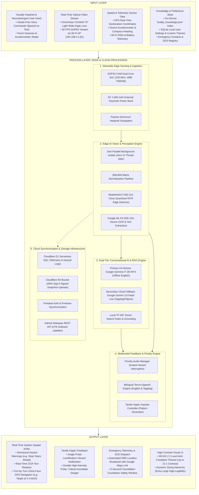

# Chapter 2: Theoretical & Conceptual Framework Figures

---

## Figure 2.1: Input-Process-Output (IPO) Conceptual Framework of the EasyLens System

### APA 7th Citation & Metadata
- **Figure Number**: Figure 2.1
- **Figure Title**: *Input-Process-Output (IPO) Conceptual Framework of the EasyLens System*
- **Manuscript Page**: 32
- **PDF Page**: 39
- **Image Asset**: [fig_2_1_ipo_conceptual_framework.png](file:///Users/arronkianparejas/easylens/docs/figures/assets/fig_2_1_ipo_conceptual_framework.png)

```
Figure 2.1
Input-Process-Output (IPO) Conceptual Framework of the EasyLens System

Note. Figure 2.1 provides a visual representation of the Input-Process-Output (IPO) conceptual framework underpinning the EasyLens system, illustrating the end-to-end transformation of multi-sensory environmental inputs into real-time assistive guidance.
```

---

### Technical Diagram (Mermaid)



---

### Architectural Narrative & Manuscript Context

The Input-Process-Output (IPO) model is the core structural paradigm of the EasyLens system. As documented on Manuscript Page 32:

1. **Input**: Environmental data is captured via the right-temple-mounted ESP32-CAM OV2640 sensor module and on-device smartphone sensors (GPS, accelerometer, microphone).
2. **Process**: Processing is divided into a strictly offline, edge-first computational pipeline on the smartphone device. Dart Isolates prevent garbage collection frame drops on the main Flutter UI thread. The 24-class fine-tuned MobileNetV2 SSD network performs object inference within 13–18 ms, while Google ML Kit handles on-device OCR. Conversational reasoning is executed locally via INT4 quantized Gemma-IT 2B, falling back to Google Gemini 3.6 Flash Low when internet connectivity is active for complex Tagalog language queries.
3. **Output**: Multi-sensory feedback channels provide users with low-latency spoken spatial audio cues, distinct tactile vibration pulses, and automated emergency SOS alerts, ensuring total navigational independence without visual dependency.
