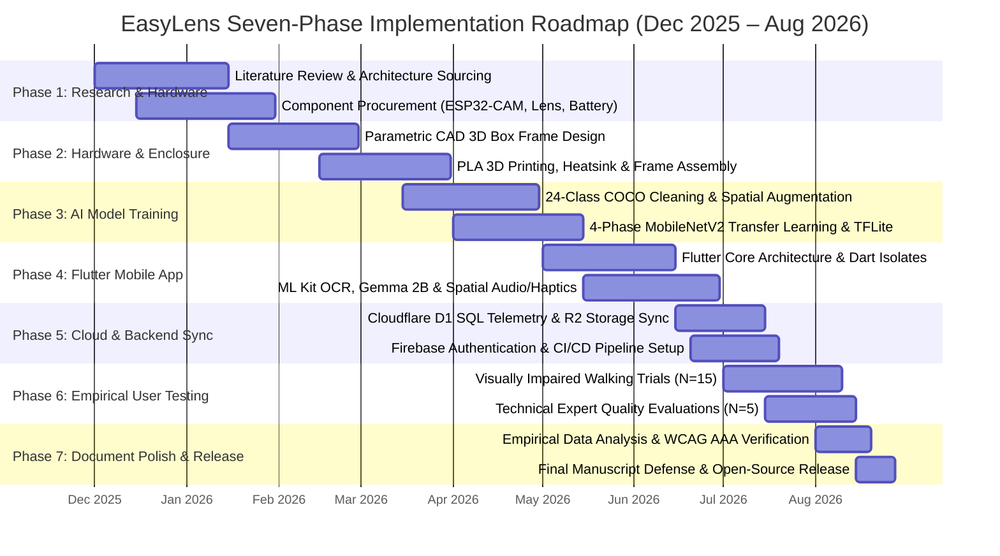
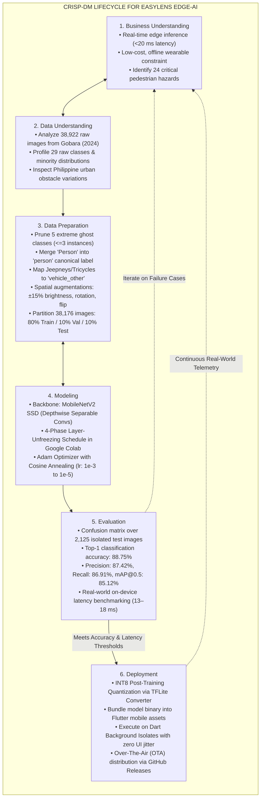

# Chapter 3: Research Methodology & Lifecycle Models

---

## Figure 3.1: EasyLens Project Implementation Timeline and Seven-Phase Activity Roadmap

### APA 7th Citation & Metadata
- **Figure Number**: Figure 3.1
- **Figure Title**: *EasyLens Project Implementation Timeline and Seven-Phase Activity Roadmap*
- **Manuscript Page**: 42
- **PDF Page**: 49
- **Image Asset**: [fig_3_1_timeline_roadmap.png](file:///Users/arronkianparejas/easylens/docs/figures/assets/fig_3_1_timeline_roadmap.png)

```
Figure 3.1
EasyLens Project Implementation Timeline and Seven-Phase Activity Roadmap

Note. Figure 3.1 represents the chronological Gantt chart mapping out the hardware prototyping, machine learning engineering, mobile software construction, empirical walking evaluations, and thesis document finalization phases executed between December 2025 and August 2026.
```

---

### Technical Diagram (Mermaid)



---

## Figure 3.2: The Six-Phase Cross-Industry Standard Process for Data Mining (CRISP-DM) Lifecycle for EasyLens AI Development

### APA 7th Citation & Metadata
- **Figure Number**: Figure 3.2
- **Figure Title**: *The Six-Phase Cross-Industry Standard Process for Data Mining (CRISP-DM) Lifecycle for EasyLens AI Development*
- **Manuscript Page**: 43
- **PDF Page**: 50
- **Image Asset**: [fig_3_2_crisp_dm_lifecycle.png](file:///Users/arronkianparejas/easylens/docs/figures/assets/fig_3_2_crisp_dm_lifecycle.png)

```
Figure 3.2
The Six-Phase Cross-Industry Standard Process for Data Mining (CRISP-DM) Lifecycle for EasyLens AI Development

Note. Figure 3.2 illustrates the cyclical and iterative stages of the CRISP-DM methodology utilized to design, preprocess, fine-tune, evaluate, and deploy the MobileNetV2 SSD edge object detection model for visually impaired pedestrian obstacle recognition.
```

---

### Technical Diagram (Mermaid)



---

### Methodological Narrative & Manuscript Context

The research follows the standardized CRISP-DM framework adapted for resource-constrained edge-AI mobile deployment:
1. **Iterative Alignment**: Data understanding and preparation required extensive cleansing to prevent class imbalance from skewing obstacle detection on mobile hardware.
2. **Quantization & Deployment**: The transition from Google Colab cloud training to mobile deployment was bridged via TensorFlow Lite INT8 quantization, reducing the model footprint to under 15 MB while preserving 88.75% classification accuracy across all 24 pedestrian classes.
