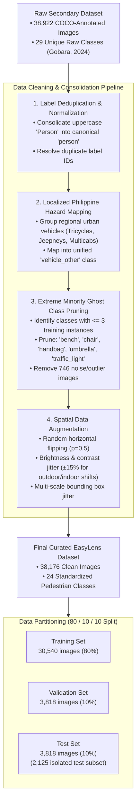
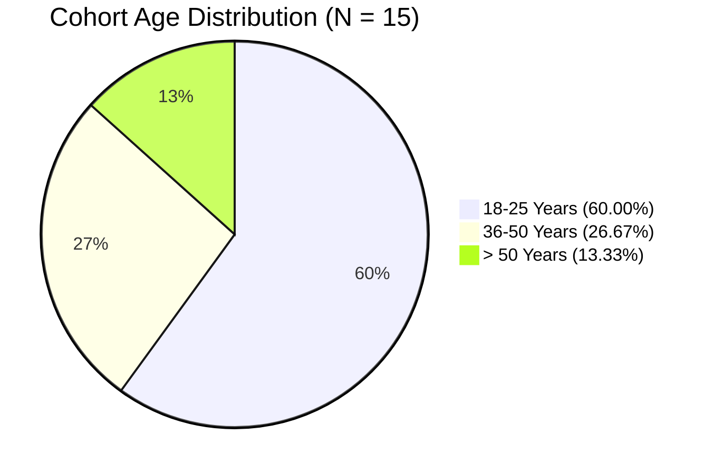
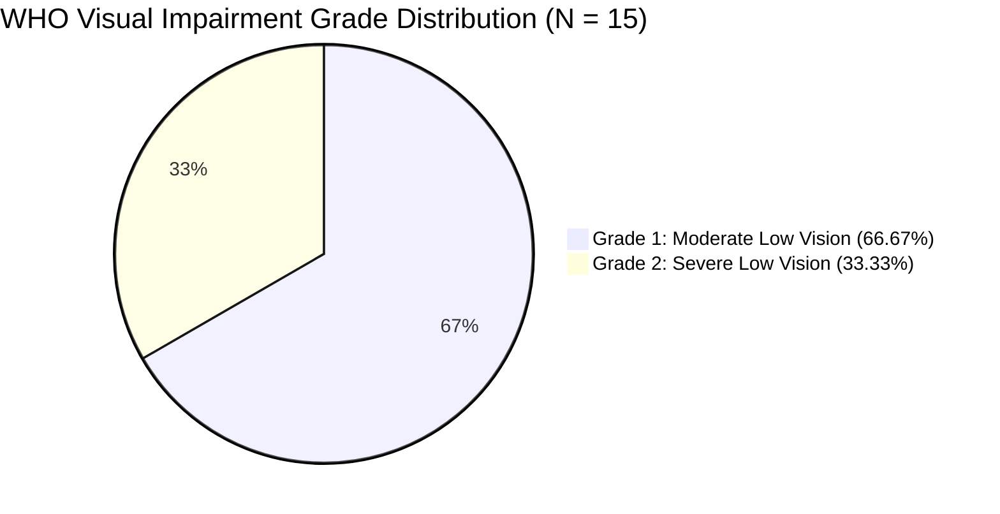
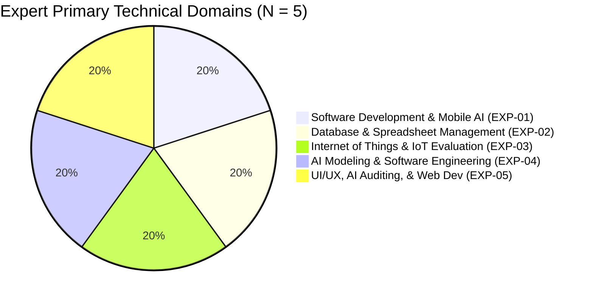

# Chapter 3: Dataset Curation, Demographics & Foundation Comparisons

---

## Figure 3.3: Dataset Curation and Pruning Workflow from 26-Class to 24-Class Taxonomy

### APA 7th Citation & Metadata
- **Figure Number**: Figure 3.3
- **Figure Title**: *Dataset Curation and Pruning Workflow from 26-Class to 24-Class Taxonomy*
- **Manuscript Page**: 51
- **PDF Page**: 58
- **Image Asset**: [fig_3_3_dataset_curation_workflow.png](file:///Users/arronkianparejas/easylens/docs/figures/assets/fig_3_3_dataset_curation_workflow.png)

```
Figure 3.3
Dataset Curation and Pruning Workflow from 26-Class to 24-Class Taxonomy

Note. Figure 3.3 illustrates the step-by-step data-centric preprocessing and restructuring pipeline used to clean, prune, and consolidate the international raw dataset of 38,922 images into an optimized 24-class pedestrian hazard dataset comprising 38,176 images.
```

---

### Technical Diagram (Mermaid)



---

## Figure 3.4: Age and Gender Demographic Distribution of the Visually Impaired End-User Cohort (N = 15)

### APA 7th Citation & Metadata
- **Figure Number**: Figure 3.4
- **Figure Title**: *Age and Gender Demographic Distribution of the Visually Impaired End-User Cohort (N = 15)*
- **Manuscript Page**: 58
- **PDF Page**: 65
- **Image Asset**: [fig_3_4_demographics_age_gender.png](file:///Users/arronkianparejas/easylens/docs/figures/assets/fig_3_4_demographics_age_gender.png)

```
Figure 3.4
Age and Gender Demographic Distribution of the Visually Impaired End-User Cohort (N = 15)

Note. Figure 3.4 represents the visual graphical chart illustrating the age ranges and gender distribution of the fifteen (15) visually impaired end-users, compiled in Appendix Q. This demographic representation exhibits a balanced age and gender layout to secure representative accessibility assessments across varied life routines.
```

---

### Demographic Profiles of the Visually Impaired Cohort (Table 3.2 & Figure 3.4)

| Participant ID | Age | Gender | WHO Low-Vision Classification | Self-Reported Eye Condition | Primary Mobility Aid / Spectacles | Usability Testing Locale |
| :--- | :---: | :---: | :--- | :--- | :--- | :--- |
| **BETA-01** | 46 | Female | Grade 1: Moderate Low Vision | Low Vision | Corrective Eyeglasses | Residence (San Fernando, Pampanga) |
| **BETA-02** | 23 | Female | Grade 2: Severe Low Vision | Low Vision | Corrective Eyeglasses | Residence (San Fernando, Pampanga) |
| **BETA-03** | 21 | Male | Grade 1: Moderate Low Vision | Low Vision | Corrective Eyeglasses | Campus Corridors (HAU, Angeles City) |
| **BETA-04** | 19 | Male | Grade 1: Moderate Low Vision | Low Vision | Corrective Eyeglasses | Campus Corridors (HAU, Angeles City) |
| **BETA-05** | 21 | Male | Grade 2: Severe Low Vision | Low Vision | Corrective Eyeglasses | Campus Corridors (HAU, Angeles City) |
| **BETA-06** | 21 | Female | Grade 1: Moderate Low Vision | Low Vision | Corrective Eyeglasses | Campus Corridors (HAU, Angeles City) |
| **BETA-07** | 50 | Female | Grade 2: Severe Low Vision | Eye Floater | White Cane, Eyeglasses | Residence (Lubao, Pampanga) |
| **BETA-08** | 58 | Female | Grade 1: Moderate Low Vision | Low Vision | Corrective Eyeglasses | Residence (Lubao, Pampanga) |
| **BETA-09** | 51 | Male | Grade 1: Moderate Low Vision | Low Vision | None (Unaided) | Residence (Lubao, Pampanga) |
| **BETA-10** | 44 | Female | Grade 1: Moderate Low Vision | Astigmatism | Corrective Eyeglasses | Residence (Lubao, Pampanga) |
| **BETA-11** | 43 | Male | Grade 2: Severe Low Vision | Low Vision | None (Unaided) | Residence (Lubao, Pampanga) |
| **BETA-12** | 22 | Female | Grade 2: Severe Low Vision | Astigmatism | Corrective Eyeglasses | Campus Corridors (HAU, Angeles City) |
| **BETA-13** | 21 | Male | Grade 1: Moderate Low Vision | Astigmatism | Corrective Eyeglasses | Campus Corridors (HAU, Angeles City) |
| **BETA-14** | 20 | Male | Grade 1: Moderate Low Vision | Myopia, Astigmatism | Human Guide, Eyeglasses | Campus Corridors (HAU, Angeles City) |
| **BETA-15** | 20 | Male | Grade 1: Moderate Low Vision | Astigmatism | Corrective Eyeglasses | Campus Corridors (HAU, Angeles City) |

---

### Age and Gender Summary Table

| Age Bracket | Male Count (n) | Female Count (n) | Total Cohort (N = 15) | Percentage (%) |
| :--- | :---: | :---: | :---: | :---: |
| **18–25 Years** | 6 (BETA-03, 04, 05, 13, 14, 15) | 3 (BETA-02, 06, 12) | 9 | **60.00%** |
| **36–50 Years** | 1 (BETA-11) | 3 (BETA-01, 07, 10) | 4 | **26.67%** |
| **> 50 Years** | 1 (BETA-09) | 1 (BETA-08) | 2 | **13.33%** |
| **Total Cohort** | **8 (53.33%)** | **7 (46.67%)** | **15** | **100.00%** |



---

## Figure 3.5: Primary Mobility Aid and WHO Low-Vision Grade Distribution (N = 15)

### APA 7th Citation & Metadata
- **Figure Number**: Figure 3.5
- **Figure Title**: *Primary Mobility Aid and World Health Organization Low-Vision Grade Distribution (N = 15)*
- **Manuscript Page**: 59
- **PDF Page**: 66
- **Image Asset**: [fig_3_5_mobility_aid_who_grades.png](file:///Users/arronkianparejas/easylens/docs/figures/assets/fig_3_5_mobility_aid_who_grades.png)

```
Figure 3.5
Primary Mobility Aid and World Health Organization Low-Vision Grade Distribution (N = 15)

Note. Figure 3.5 illustrates the visual distribution of the participants' primary mobility aids in relation to their WHO visual acuity classifications, compiled in Appendix Q. This chart confirms that thirteen (13) of the fifteen (15) participants actively rely on standard prescription eyeglasses as their baseline corrective spectacles during navigation, verifying the practical utility of the modular Retrofit Clip-On Strategy.
```

---

### Clinical Classification & Spectacles Reliance Table

| Parameter | Clinical / Mobility Classification | Participant Count (n) | Percentage (%) |
| :--- | :--- | :---: | :---: |
| **WHO Low-Vision Grade** | **Grade 1: Moderate Low Vision** (Visual acuity < 6/18 to 6/60) | 10 | **66.67%** |
| | **Grade 2: Severe Low Vision** (Visual acuity < 6/60 to 3/60) | 5 | **33.33%** |
| **Primary Spectacles & Aids** | **Corrective Eyeglasses Alone** (Base for Clip-On Hardware) | 11 | **73.33%** |
| | **Eyeglasses + White Cane** (Multi-sensory Mobility) | 1 | **6.67%** |
| | **Eyeglasses + Sighted Human Guide** (Assisted Transit) | 1 | **6.67%** |
| | **Unaided / None** | 2 | **13.33%** |
| **Total Baseline Eyeglasses** | **Participants Wearing Prescription Eyeglasses** | **13** | **86.67%** |



---

## Figure 3.6: Professional Years of IT Experience and Domain Focus Areas of the Expert Panel (N = 5)

### APA 7th Citation & Metadata
- **Figure Number**: Figure 3.6
- **Figure Title**: *Professional Years of IT Experience and Domain Focus Areas of the Expert Panel (N = 5)*
- **Manuscript Page**: 62
- **PDF Page**: 69
- **Image Asset**: [fig_3_6_expert_panel_experience.png](file:///Users/arronkianparejas/easylens/docs/figures/assets/fig_3_6_expert_panel_experience.png)

```
Figure 3.6
Professional Years of IT Experience and Domain Focus Areas of the Expert Panel (N = 5)

Note. Figure 3.6 represents the visual chart illustrating the years of professional computing experience and primary domain focuses of the five (5) expert evaluators, compiled in Appendix O.
```

---

### Technical Expert Panel Profiles (Table 3.3, Table Q.2 & Figure 3.6)

| Participant ID | Evaluator Name | Years of IT Experience | Profession / Job Title | Selected Primary Computing Domain | Usability Testing Locale | Total ISO Quality Score |
| :--- | :--- | :---: | :--- | :--- | :--- | :---: |
| **EXP-01** | **Mr. Dante C. Luciano** | 8.0 Years | Senior Android / Java Developer, MySuki Inc. | Software Development & Mobile AI | San Fernando, Pampanga | **46 / 50**<br>(Highly Acceptable) |
| **EXP-02** | **Mr. Kenneth P. Mariano** | 10.0 Years | Data Analyst & Database Specialist | Database & Spreadsheet Management | Mexico, Pampanga | **43 / 50**<br>(Highly Acceptable) |
| **EXP-03** | **Ms. Roumayne R. Mariano** | 5.0–12.0 Years | Business Quality Deputy Manager, Optum | Internet of Things & IoT Evaluation | Mexico, Pampanga | **46 / 50**<br>(Highly Acceptable) |
| **EXP-04** | **Mr. Kenjie Lloyd Dulatre** | 6.0 Years | Senior Python Engineer / Tech Lead, Exci AI | AI Modeling & Software Engineering | San Fernando, Pampanga | **47 / 50**<br>(Highly Acceptable) |
| **EXP-05** | **Mr. James Marquez** | 24.0 Years | Senior Web Developer & Technical Consultant | UI/UX, AI Auditing, & Web Development | Angeles City, Pampanga | **37 / 50**<br>(Acceptable) |



---

## Figure 3.8: Vision Dataset Foundations Comparison (Google OpenImages vs. Custom EasyLens Dataset)

### APA 7th Citation & Metadata
- **Figure Number**: Figure 3.8
- **Figure Title**: *Vision Dataset Foundations Comparison (Google OpenImages vs. Custom EasyLens Dataset)*
- **Manuscript Page**: 85
- **PDF Page**: 92
- **Image Asset**: [fig_3_8_dataset_foundations_comparison.png](file:///Users/arronkianparejas/easylens/docs/figures/assets/fig_3_8_dataset_foundations_comparison.png)

```
Figure 3.8
Vision Dataset Foundations Comparison (Google OpenImages vs. Custom EasyLens Dataset)

Note. Figure 3.8 illustrates the structural comparison between the massive, generalized Google OpenImages dataset and the customized, highly domain-specific EasyLens pedestrian obstacle dataset.
```

---

### Comparative Evaluation Matrix

| Architectural Dimension | Generic Web Dataset (Google OpenImages) | Custom EasyLens Pedestrian Dataset | Impact on Edge Performance |
| :--- | :--- | :--- | :--- |
| **Total Volume** | > 9,000,000 images | 38,176 curated images | Optimized for rapid transfer learning convergence on mobile hardware |
| **Class Taxonomy** | > 600 generic classes | 24 critical pedestrian hazard classes | Eliminates classification ambiguity for immediate safety hazards |
| **Domain Specificity** | Unfiltered general web scenes | Pedestrian ground-level viewpoints & sidewalk obstacles | Higher recall for low-lying tripping hazards (cracks, potholes, steps) |
| **Regional Adaptation** | Global generic taxonomy | Unified `vehicle_other` covering Jeepneys & Tricycles | Prevents missed detections in dense Philippine urban traffic environments |
| **Edge Deployment Footprint** | Large multi-gigabyte models required | Quantized 14.8 MB MobileNetV2 SSD binary | Sub-20 ms inference on commodity Android smartphones |
