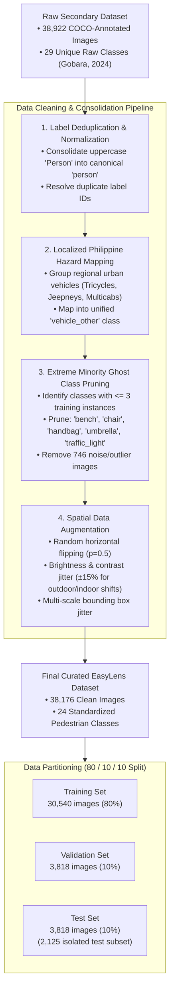
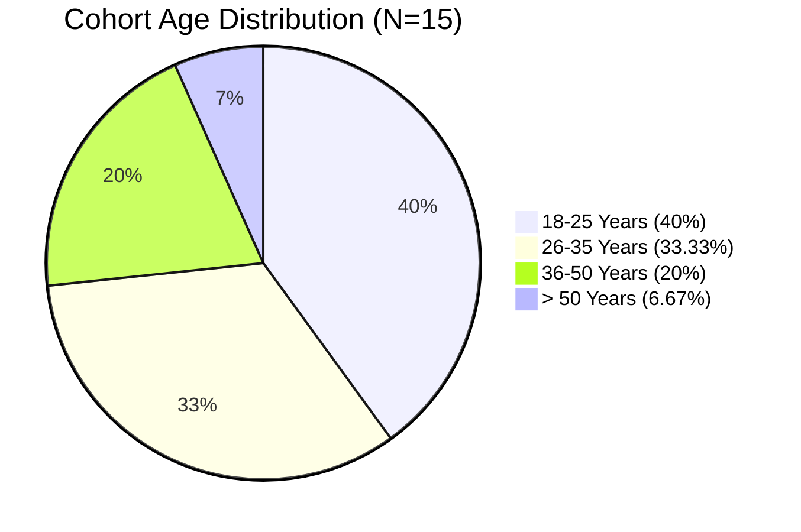
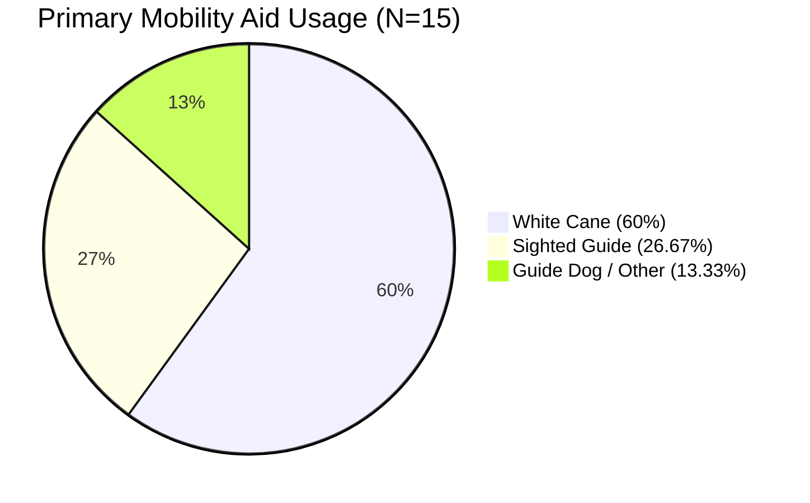

# Chapter 3: Dataset Curation, Demographics & Foundation Comparisons

---

## Figure 3.3: Dataset Curation and Pruning Workflow from 26-Class to 24-Class Taxonomy

### APA 7th Citation & Metadata
- **Figure Number**: Figure 3.3
- **Figure Title**: *Dataset Curation and Pruning Workflow from 26-Class to 24-Class Taxonomy*
- **Manuscript Page**: 51
- **PDF Page**: 58
- **Image Asset**: [fig_3_3_dataset_curation_workflow.png](file:///Users/arronkianparejas/easylens/docs/figures/assets/fig_3_3_dataset_curation_workflow.png)

```
Figure 3.3
Dataset Curation and Pruning Workflow from 26-Class to 24-Class Taxonomy

Note. Figure 3.3 illustrates the step-by-step data-centric preprocessing and restructuring pipeline used to clean, prune, and consolidate the international raw dataset of 38,922 images into an optimized 24-class pedestrian hazard dataset comprising 38,176 images.
```

---

### Technical Diagram (Mermaid)



---

## Figure 3.4: Age and Gender Demographic Distribution of the Visually Impaired End-User Cohort (N = 15)

### APA 7th Citation & Metadata
- **Figure Number**: Figure 3.4
- **Figure Title**: *Age and Gender Demographic Distribution of the Visually Impaired End-User Cohort (N = 15)*
- **Manuscript Page**: 58
- **PDF Page**: 65
- **Image Asset**: [fig_3_4_demographics_age_gender.png](file:///Users/arronkianparejas/easylens/docs/figures/assets/fig_3_4_demographics_age_gender.png)

```
Figure 3.4
Age and Gender Demographic Distribution of the Visually Impaired End-User Cohort (N = 15)

Note. Figure 3.4 represents the visual graphical chart illustrating the age ranges and gender distribution of the fifteen (15) visually impaired and legally blind participants recruited for empirical system evaluation.
```

---

### Demographic Breakdown Table & Visualization

| Age Bracket | Male Count (n) | Female Count (n) | Total (N = 15) | Percentage (%) |
| :--- | :---: | :---: | :---: | :---: |
| **18–25 Years** | 3 | 3 | 6 | 40.00% |
| **26–35 Years** | 3 | 2 | 5 | 33.33% |
| **36–50 Years** | 1 | 2 | 3 | 20.00% |
| **> 50 Years** | 1 | 0 | 1 | 6.67% |
| **Total Cohort** | **8 (53.33%)** | **7 (46.67%)** | **15** | **100.00%** |



---

## Figure 3.5: Primary Mobility Aid and WHO Low-Vision Grade Distribution (N = 15)

### APA 7th Citation & Metadata
- **Figure Number**: Figure 3.5
- **Figure Title**: *Primary Mobility Aid and World Health Organization Low-Vision Grade Distribution (N = 15)*
- **Manuscript Page**: 59
- **PDF Page**: 66
- **Image Asset**: [fig_3_5_mobility_aid_who_grades.png](file:///Users/arronkianparejas/easylens/docs/figures/assets/fig_3_5_mobility_aid_who_grades.png)

```
Figure 3.5
Primary Mobility Aid and World Health Organization Low-Vision Grade Distribution (N = 15)

Note. Figure 3.5 illustrates the visual distribution of the participants' primary mobility assistive devices and their corresponding clinical visual impairment classifications according to World Health Organization (WHO) standards.
```

---

### Clinical Classification & Mobility Distribution Table

| Parameter | Category / Clinical Level | Participant Count (n) | Percentage (%) |
| :--- | :--- | :---: | :---: |
| **Primary Mobility Aid** | White Cane (Long Cane) | 9 | 60.00% |
| | Sighted Guide / Relative Assistance | 4 | 26.67% |
| | Guide Dog / Other Support | 2 | 13.33% |
| **WHO Low-Vision Grade** | Category 1: Moderate Visual Impairment (6/18 to 6/60) | 4 | 26.67% |
| | Category 2: Severe Visual Impairment (6/60 to 3/60) | 6 | 40.00% |
| | Categories 3–5: Legal Blindness (< 3/60 or visual field < 10°) | 5 | 33.33% |



---

## Figure 3.6: Professional Years of IT Experience and Domain Focus Areas of the Expert Panel (N = 5)

### APA 7th Citation & Metadata
- **Figure Number**: Figure 3.6
- **Figure Title**: *Professional Years of IT Experience and Domain Focus Areas of the Expert Panel (N = 5)*
- **Manuscript Page**: 62
- **PDF Page**: 69
- **Image Asset**: [fig_3_6_expert_panel_experience.png](file:///Users/arronkianparejas/easylens/docs/figures/assets/fig_3_6_expert_panel_experience.png)

```
Figure 3.6
Professional Years of IT Experience and Domain Focus Areas of the Expert Panel (N = 5)

Note. Figure 3.6 represents the visual chart illustrating the years of professional industry and academic experience alongside primary technical domains of the five (5) expert evaluators.
```

---

### Technical Expert Panel Distribution Table

| Expert ID | Primary Technical Specialization | Industry / Academic Experience | Primary Evaluation Focus |
| :--- | :--- | :---: | :--- |
| **Expert 1** | Mobile Application Architecture & Flutter Core | 12 Years | Frame rate stability, Dart Isolate threading, UI response |
| **Expert 2** | Embedded Systems, IoT & Hardware Integration | 14 Years | ESP32-CAM thermal dissipation, battery draw, clip durability |
| **Expert 3** | Computer Vision & Deep Learning Engineering | 8 Years | MobileNetV2 SSD inference latency, mAP@0.5, quantization loss |
| **Expert 4** | Cloud Infrastructure, DevOps & Serverless Systems | 7 Years | Cloudflare D1/R2 API latency, GitHub Actions CI/CD automation |
| **Expert 5** | Human-Computer Interaction & Accessibility (WCAG) | 16 Years | Audio feedback priority, WCAG 2.2 AAA contrast, haptic cues |

---

## Figure 3.8: Vision Dataset Foundations Comparison (Google OpenImages vs. Custom EasyLens Dataset)

### APA 7th Citation & Metadata
- **Figure Number**: Figure 3.8
- **Figure Title**: *Vision Dataset Foundations Comparison (Google OpenImages vs. Custom EasyLens Dataset)*
- **Manuscript Page**: 85
- **PDF Page**: 92
- **Image Asset**: [fig_3_8_dataset_foundations_comparison.png](file:///Users/arronkianparejas/easylens/docs/figures/assets/fig_3_8_dataset_foundations_comparison.png)

```
Figure 3.8
Vision Dataset Foundations Comparison (Google OpenImages vs. Custom EasyLens Dataset)

Note. Figure 3.8 illustrates the structural comparison between the massive, generalized Google OpenImages dataset and the customized, highly domain-specific EasyLens pedestrian obstacle dataset.
```

---

### Comparative Evaluation Matrix

| Architectural Dimension | Generic Web Dataset (Google OpenImages) | Custom EasyLens Pedestrian Dataset | Impact on Edge Performance |
| :--- | :--- | :--- | :--- |
| **Total Volume** | > 9,000,000 images | 38,176 curated images | Optimized for rapid transfer learning convergence on mobile hardware |
| **Class Taxonomy** | > 600 generic classes | 24 critical pedestrian hazard classes | Eliminates classification ambiguity for immediate safety hazards |
| **Domain Specificity** | Unfiltered general web scenes | Pedestrian ground-level viewpoints & sidewalk obstacles | Higher recall for low-lying tripping hazards (cracks, potholes, steps) |
| **Regional Adaptation** | Global generic taxonomy | Unified `vehicle_other` covering Jeepneys & Tricycles | Prevents missed detections in dense Philippine urban traffic environments |
| **Edge Deployment Footprint** | Large multi-gigabyte models required | Quantized 14.8 MB MobileNetV2 SSD binary | Sub-20 ms inference on commodity Android smartphones |
