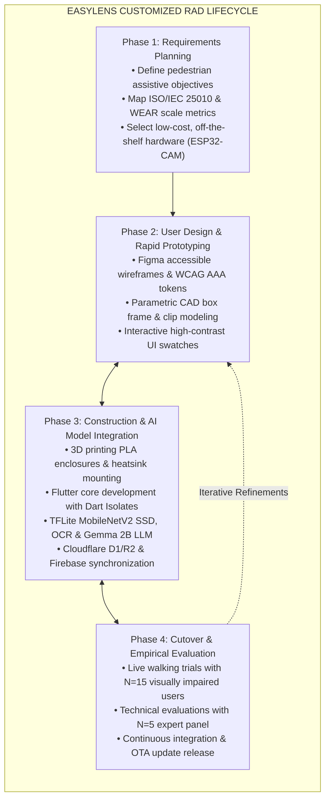

# Chapter 3: Interface Design, RAD Lifecycle & User Journey Flowcharts

---

## Figure 3.7: Side-by-Side Interface Layout of the EasyLens Default Light Theme and High-Contrast AMOLED Black Theme

### APA 7th Citation & Metadata
- **Figure Number**: Figure 3.7
- **Figure Title**: *Side-by-Side Interface Layout of the EasyLens Default Light Theme and High-Contrast AMOLED Black Theme*
- **Manuscript Page**: 67
- **PDF Page**: 74
- **Image Asset**: [fig_3_7_theme_comparison_layout.png](file:///Users/arronkianparejas/easylens/docs/figures/assets/fig_3_7_theme_comparison_layout.png)

```
Figure 3.7
Side-by-Side Interface Layout of the EasyLens Default Light Theme and High-Contrast AMOLED Black Theme

Note. Figure 3.7 illustrates the side-by-side interface layout comparing the default clean light accessibility theme with the high-contrast AMOLED black theme engineered to maximize contrast ratios and reduce photophobia for low-vision users.
```

---

### Contrast Ratios & Color Specification Table

| Interface Element | Default Light Theme Hex | High-Contrast AMOLED Black Hex | Contrast Ratio (vs. Canvas) | WCAG 2.2 Level |
| :--- | :---: | :---: | :---: | :---: |
| **Canvas Background** | `#FFFFFF` | `#000000` | — | Base |
| **Primary Typography** | `#1A1A1A` | `#FFFFFF` | **21.00:1** | AAA (Pass) |
| **Warning / Hazard Highlight** | `#D32F2F` | `#E6E600` (Yellow) | **16.51:1** | AAA (Pass) |
| **Success / Navigation Arrow** | `#2E7D32` | `#33CC33` (Green) | **10.37:1** | AAA (Pass) |
| **Card Surface Border** | `#E0E0E0` | `#FCFCFC` | **16.49:1** | AAA (Pass) |

---

## Figure 3.9: The Customized Rapid Application Development (RAD) Prototyping and Evaluation Lifecycle

### APA 7th Citation & Metadata
- **Figure Number**: Figure 3.9
- **Figure Title**: *The Customized Rapid Application Development (RAD) Prototyping and Evaluation Lifecycle*
- **Manuscript Page**: 98
- **PDF Page**: 105
- **Image Asset**: [fig_3_9_rad_prototyping_lifecycle.png](file:///Users/arronkianparejas/easylens/docs/figures/assets/fig_3_9_rad_prototyping_lifecycle.png)

```
Figure 3.9
The Customized Rapid Application Development (RAD) Prototyping and Evaluation Lifecycle

Note. Figure 3.9 illustrates the customized Rapid Application Development (RAD) lifecycle model incorporating rapid CAD enclosure modeling, continuous machine learning integration, and iterative usability testing with visually impaired participants.
```

---

### Technical Diagram (Mermaid)



---

## Figure 3.10: EasyLens Simplified User Journey and System Interaction Flowchart

### APA 7th Citation & Metadata
- **Figure Number**: Figure 3.10
- **Figure Title**: *EasyLens Simplified User Journey and System Interaction Flowchart*
- **Manuscript Page**: 100
- **PDF Page**: 107
- **Image Asset**: [fig_3_10_user_journey_flowchart.png](file:///Users/arronkianparejas/easylens/docs/figures/assets/fig_3_10_user_journey_flowchart.png)

```
Figure 3.10
EasyLens Simplified User Journey and System Interaction Flowchart

Note. Figure 3.10 maps the simplified user journey and logical interaction flows within the EasyLens system, illustrating hands-free initiation, real-time edge computer vision analysis, multimodal feedback dispatch, and emergency SOS routing.
```

---

### Technical Diagram (Mermaid)

```mermaid
flowchart TD
    START(["User Powers On Smart Glasses & Launches App"]) --> WIFI["Auto-Connect to Wi-Fi AP 'EasyLens-Camera' (192.168.4.1)"]
    
    WIFI --> DASH["Main Dashboard Navigation Screen\n(Personalized Time-Aware Greeting & Voice Prompt)"]

    DASH --> CHOICE{"User Selects Operational Mode\n(Voice Command or Touch Card)"}

    CHOICE -->|Object Detection| OBJ["Active Edge-AI Object Detector\n(Continuous 30 FPS Stream Receiver)"]
    CHOICE -->|OCR Text Reader| OCR["Nearby Text Scanner\n(Capture Image & ML Kit Extraction)"]
    CHOICE -->|Local AI Assistant| BUDDY["Talk to Buddy (Gemma-IT 2B / Gemini 3.6)\n(Hands-Free Speech Dialogue & Q&A)"]
    CHOICE -->|Walking Navigation| NAV["GPS Clock-Face Audio Navigation\n(Turn-by-Turn Spoken Bearings)"]
    CHOICE -->|Emergency SOS| SOS["Emergency SOS Dispatch Flow\n(5-Second Audible Countdown)"]

    OBJ --> ISOLATE["Dart Parallel Worker Isolate\n(Resize to 300x300 & Normalize Frame)"]
    ISOLATE --> INFER["MobileNetV2 SSD 24-Class Inference"]
    
    INFER --> CHECK_HAZARD{"Obstacle Detected?\n(Score > 0.65)"}
    
    CHECK_HAZARD -->|Critical Threat (Stop/Vehicle/Wires)| CRIT["Double Haptic Vibration Pulse\n+ High-Priority Voice Override: 'STOP! Vehicle Approaching'"]
    CHECK_HAZARD -->|Moderate Threat (Steps/Pothole/Pole)| MOD["Single Haptic Vibration Pulse\n+ Directional Voice Alert: 'Stairs Ahead at 12 o\'clock'"]
    CHECK_HAZARD -->|No Threat / Clear Path| CLEAR["Maintain Silent Scanning / Periodic Status Cue"]

    OCR --> OCR_SPEAK["Bilingual Text-to-Speech Reads Detected Text Aloud"]
    BUDDY --> BUDDY_SPEAK["Spoken Conversational Response Generated Locally"]
    NAV --> NAV_SPEAK["Spoken Directional Instruction: 'Head towards 2 o\'clock'"]

    SOS --> COUNTDOWN{"Cancelled within 5 seconds?"}
    COUNTDOWN -->|Yes (Tap / Shake)| SOS_CANCEL["Cancel SOS & Announce Cancellation via Voice"]
    COUNTDOWN -->|No (Timer Expires)| SOS_FIRE["Dispatch SMS with Real-Time GPS Coordinates\n+ Upload Snapshot to Cloudflare R2"]

    CRIT --> CYCLE(["Loop Continuous Processing"])
    MOD --> CYCLE
    CLEAR --> CYCLE
    OCR_SPEAK --> CYCLE
    BUDDY_SPEAK --> CYCLE
    NAV_SPEAK --> CYCLE
    SOS_FIRE --> END(["Standby / Monitoring State"])
```
