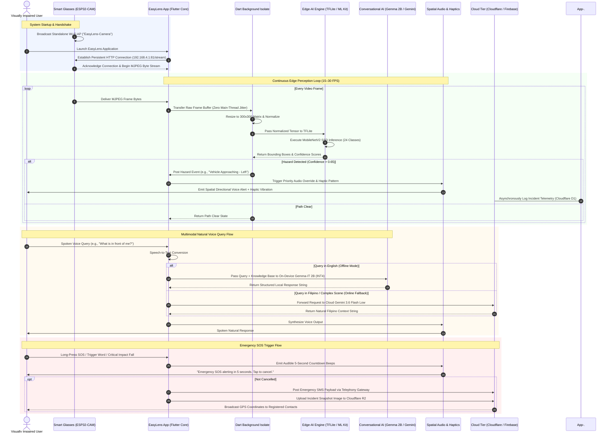

# Chapter 3: System Architecture & UML Sequence Diagram

---

## Figure 3.11: EasyLens System Architecture and Detailed UML Sequence Diagram

### APA 7th Citation & Metadata
- **Figure Number**: Figure 3.11
- **Figure Title**: *EasyLens System Architecture and Detailed UML Sequence Diagram*
- **Manuscript Page**: 102
- **PDF Page**: 109
- **Image Asset**: [fig_3_11_system_architecture_sequence.png](file:///Users/arronkianparejas/easylens/docs/figures/assets/fig_3_11_system_architecture_sequence.png)

```
Figure 3.11
EasyLens System Architecture and Detailed UML Sequence Diagram

Note. Figure 3.11 exhibits the overall EasyLens system architecture and unified modeling language (UML) sequence diagram, outlining the asynchronous data transmission, thread separation protocols via Dart Isolates, and dual Large Language Model reasoning paths.
```

---

### Technical Diagram (Mermaid Sequence Diagram)



---

### Architectural Characteristics

1. **Dart Isolate Concurrency**: Offloads raw frame resizing, tensor formatting, and TFLite execution to background threads, guaranteeing that the Flutter UI thread renders at a consistent 60 FPS without frame stutter.
2. **Dual-Tier Large Language Model Orchestration**: Ensures complete offline functionality via the local Gemma-IT 2B INT4 quantized LLM while providing high-quality contextual reasoning via Gemini 3.6 Flash Low when network access is available.
3. **Priority Audio Management**: Audio alerts operate on a strict priority queue where immediate collision and hazard warnings instantly preempt background voice dialogue or navigation prompts.
