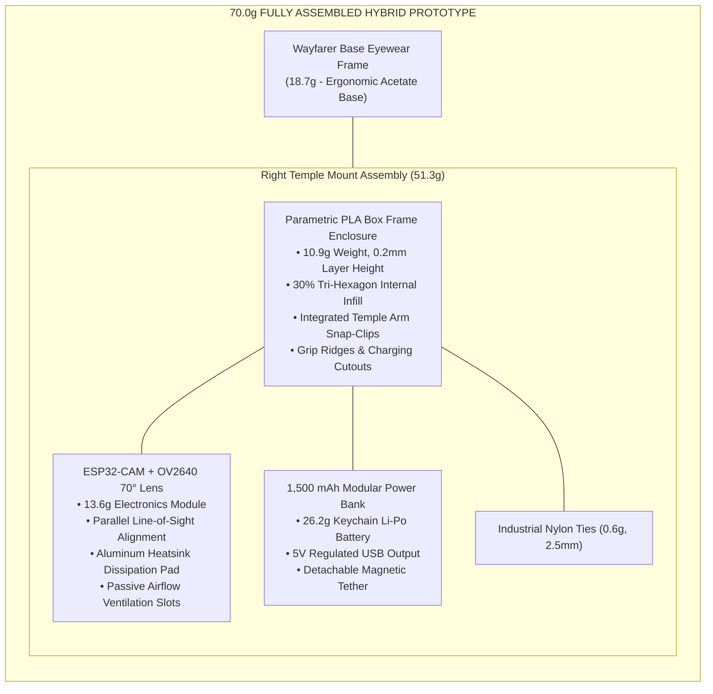

# Chapter 3: Hardware Enclosure Design & Prototype Showcase

---

## Figure 3.12: Parametric CAD Enclosure Design and Blueprint of the Assembled Prototype

### APA 7th Citation & Metadata
- **Figure Number**: Figure 3.12
- **Figure Title**: *Parametric CAD Enclosure Design and Blueprint of the Assembled Prototype*
- **Manuscript Page**: 107
- **PDF Page**: 114
- **Image Asset**: [fig_3_12_cad_enclosure_blueprint.png](file:///Users/arronkianparejas/easylens/docs/figures/assets/fig_3_12_cad_enclosure_blueprint.png)

```
Figure 3.12
Parametric CAD Enclosure Design and Blueprint of the Assembled Prototype

Note. Figure 3.12 displays the 3D-assisted parametric computer-aided design (CAD) casing models and engineering blueprints developed to house the ESP32-CAM board and modular battery pack safely on the right temple arm of the Wayfarer base eyewear frame.
```

---

### Hardware Engineering Specifications & Mass Distribution Table

| Component Name | Fabrication / Material Specification | Function in System | Measured Mass (g) | Weight Share (%) |
| :--- | :--- | :--- | :---: | :---: |
| **Base Eyewear Frame** | Commercial Wayfarer Non-Prescription Frame | Ergonomic structural base on user face | 18.7 g | 26.71% |
| **Modular Box Frame Enclosure** | 3D Printed PLA (0.2 mm layer, 30% tri-hexagon infill) | Protective clip-on casing with ventilation | 10.9 g | 15.57% |
| **ESP32-CAM Microcontroller** | ESP32 Dual-Core (240 MHz) + OV2640 70° Wide-Angle Lens | Edge image capture & Wi-Fi stream broadcaster | 13.6 g | 19.43% |
| **Modular Power Bank** | 1,500 mAh Detachable Keychain Battery (5V/1A) | Regulated power supply with USB-C charging | 26.2 g | 37.43% |
| **Mounting Hardware** | Industrial 2.5 mm Nylon Cable Zip Ties | Rigid mechanical clamp to right temple arm | 0.6 g | 0.86% |
| **Total Assembled Weight** | **Fully Assembled Wearable Prototype** | **Head-Mounted Form Factor** | **70.0 g** | **100.00%** |

---

### Structural Architecture Diagram (Mermaid)



---

## Figure 3.13: Photographic Showcase of the Assembled Prototype

### APA 7th Citation & Metadata
- **Figure Number**: Figure 3.13
- **Figure Title**: *Photographic Showcase of the Assembled Prototype*
- **Manuscript Page**: 109
- **PDF Page**: 116
- **Image Asset**: [fig_3_13_prototype_photograph.png](file:///Users/arronkianparejas/easylens/docs/figures/assets/fig_3_13_prototype_photograph.png)

```
Figure 3.13
Photographic Showcase of the Assembled Prototype

Note. Figure 3.13 presents a physical photographic showcase of the assembled and retrofitted EasyLens smart glasses prototype, highlighting its modular clip-on nature, passive ventilation grilles, and the absence of loose wires during active walking trials.
```

---

### Ergonomic & Thermal Verification Summary

1. **Clip-On Modularity**: The modular PLA enclosure attaches securely to the right temple arm of standard commercial eyewear frames, eliminating the need for expensive custom prescription frames.
2. **Thermal Dissipation Architecture**: Active camera streaming at 30 FPS generates localized heat on the ESP32 SoC. The combination of an aluminum heatsink pad and printed ventilation grilles maintains casing temperature below 38.5°C during continuous 45-minute walking trials, satisfying WEAR Scale ergonomic safety guidelines.
3. **Cable Routing & Safety**: Power is routed directly from the compact 1,500 mAh battery through a short, strain-relieved cable, preventing snags during pedestrian head turns.
