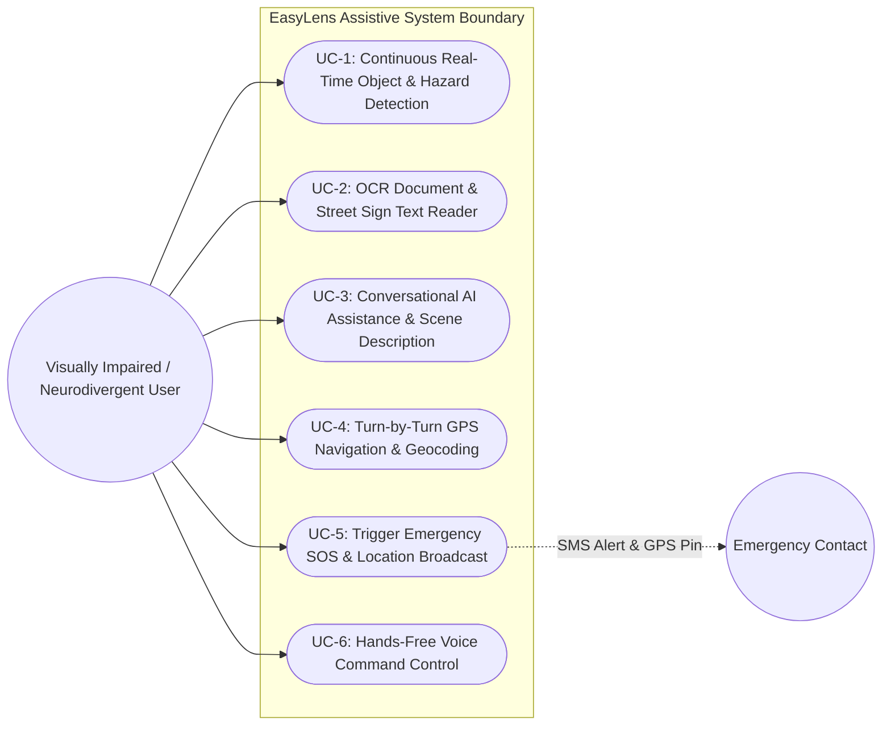
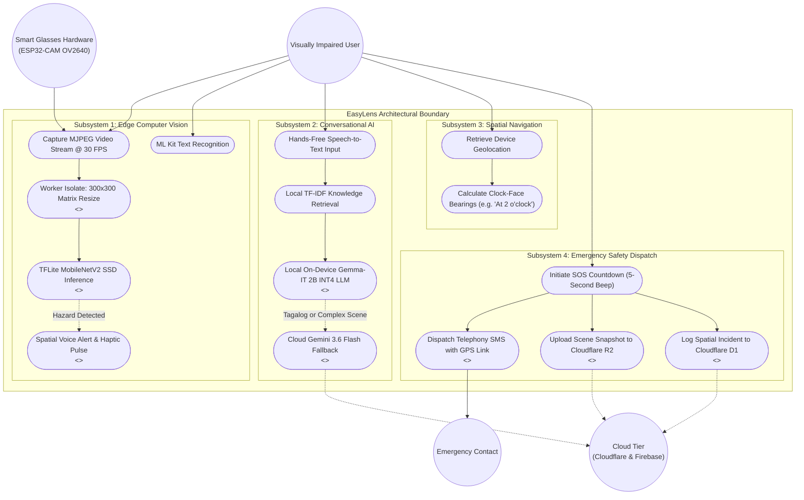

# Appendix D: Use Case Diagrams

---

## Figure D.1: High-Level Simplified Use Case Diagram

### APA 7th Citation & Metadata
- **Figure Number**: Figure D.1
- **Figure Title**: *High-Level Simplified Use Case Diagram*
- **Manuscript Page**: 179
- **PDF Page**: 187
- **Image Asset**: [fig_d_use_case_diagrams.png](file:///Users/arronkianparejas/easylens/docs/figures/assets/fig_d_use_case_diagrams.png)

```
Figure D.1
High-Level Simplified Use Case Diagram

Note. Figure D.1 illustrates the high-level system boundary and primary operational use cases accessible to the visually impaired user and designated emergency contacts within the EasyLens ecosystem.
```

---

### Technical Diagram (Mermaid)



---

## Figure D.2: Detailed Architectural Use Case Diagram

### APA 7th Citation & Metadata
- **Figure Number**: Figure D.2
- **Figure Title**: *Detailed Architectural Use Case Diagram*
- **Manuscript Page**: 179
- **PDF Page**: 187
- **Image Asset**: [fig_d_use_case_diagrams.png](file:///Users/arronkianparejas/easylens/docs/figures/assets/fig_d_use_case_diagrams.png)

```
Figure D.2
Detailed Architectural Use Case Diagram

Note. Figure D.2 maps the granular sub-functions, system inclusions (<<include>>), extensions (<<extend>>), and hardware/cloud boundary interactions across the EasyLens edge architecture.
```

---

### Technical Diagram (Mermaid)


