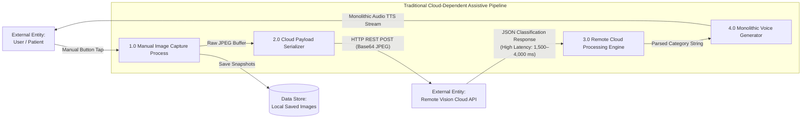
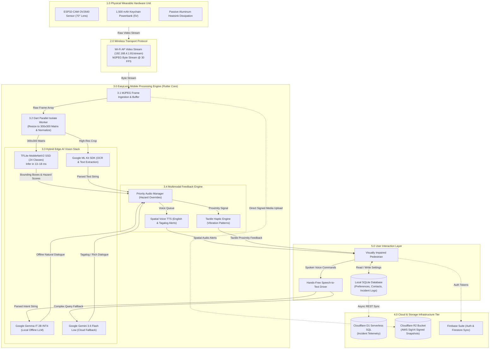

# Appendix E: Current & Proposed Data Flow Diagrams (DFD)

---

## Figure E.1: Current Baseline System Detailed Data Flow Diagram

### APA 7th Citation & Metadata
- **Figure Number**: Figure E.1
- **Figure Title**: *Current Baseline System Detailed Data Flow Diagram*
- **Manuscript Page**: 180
- **PDF Page**: 188
- **Image Asset**: [fig_e_1_baseline_dfd.png](file:///Users/arronkianparejas/easylens/docs/figures/assets/fig_e_1_baseline_dfd.png)

```
Figure E.1
Current Baseline System Detailed Data Flow Diagram

Note. Figure E.1 illustrates the traditional cloud-reliant assistive application pipeline, highlighting the severe latency bottlenecks caused by continuous image uploading to remote servers.
```

---

### Technical Diagram (Mermaid Level-1 DFD)



---

## Figure E.2: Proposed EasyLens Wearable Edge-AI System Detailed Data Flow Diagram

### APA 7th Citation & Metadata
- **Figure Number**: Figure E.2
- **Figure Title**: *Proposed EasyLens Wearable Edge-AI System Detailed Data Flow Diagram*
- **Manuscript Page**: 181
- **PDF Page**: 189
- **Image Asset**: [fig_e_2_proposed_edge_ai_dfd.png](file:///Users/arronkianparejas/easylens/docs/figures/assets/fig_e_2_proposed_edge_ai_dfd.png)

```
Figure E.2
Proposed EasyLens Wearable Edge-AI System Detailed Data Flow Diagram

Note. Figure E.2 presents the comprehensive Level-1 and Level-2 data flow diagram of the proposed EasyLens wearable edge-AI system, demonstrating the localized real-time data streaming, parallel Dart Isolate processing, on-device machine learning inference, and asynchronous cloud synchronization tiers.
```

---

### Technical Diagram (Mermaid Detailed Architecture DFD)


