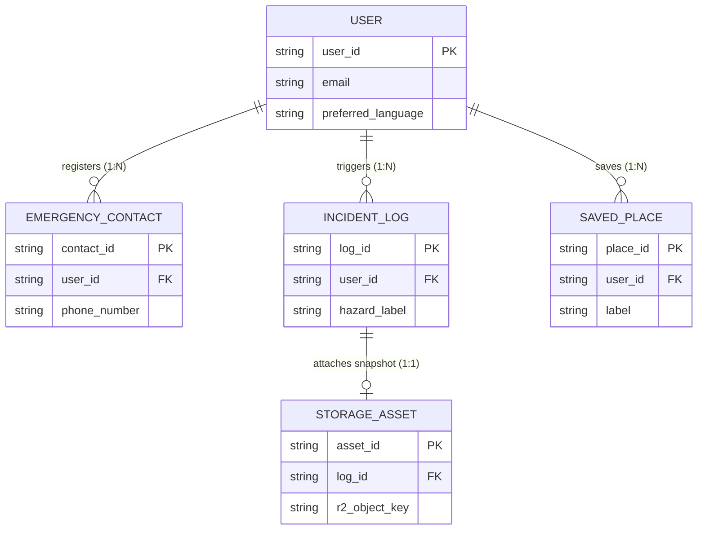
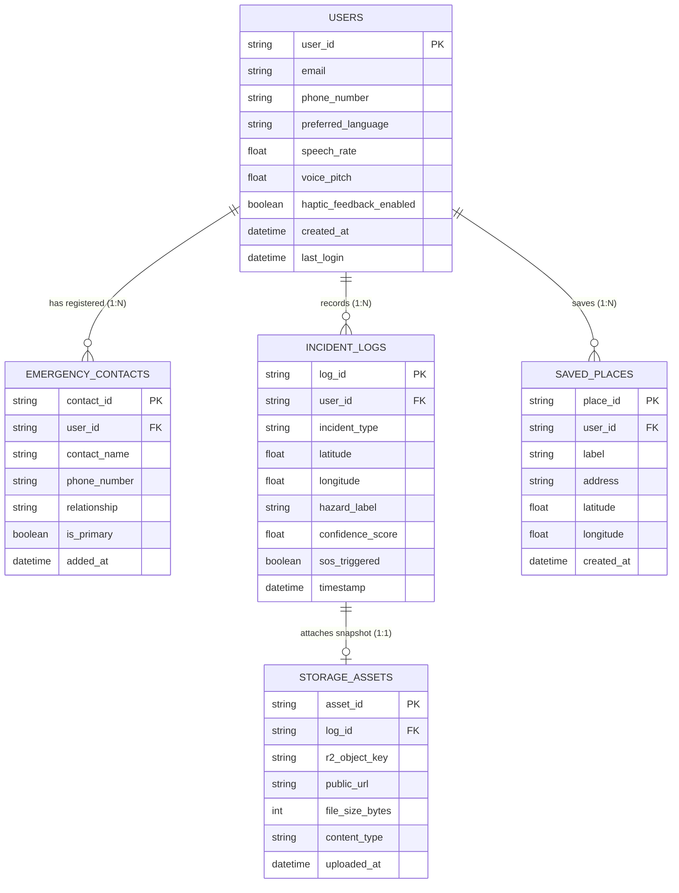

# Appendix F: Entity Relationship Diagrams (ERD)

---

## Figure F.1: Conceptual Entity Relationship Diagram

### APA 7th Citation & Metadata
- **Figure Number**: Figure F.1
- **Figure Title**: *Conceptual Entity Relationship Diagram*
- **Manuscript Page**: 182
- **PDF Page**: 190
- **Image Asset**: [fig_f_1_conceptual_erd.png](file:///Users/arronkianparejas/easylens/docs/figures/assets/fig_f_1_conceptual_erd.png)

```
Figure F.1
Conceptual Entity Relationship Diagram

Note. Figure F.1 models the high-level conceptual entities and cardinalities governing the EasyLens relational data architecture.
```

---

### Technical Diagram (Mermaid Conceptual ERD)



---

## Figure F.2: Relational Entity Relationship Diagram

### APA 7th Citation & Metadata
- **Figure Number**: Figure F.2
- **Figure Title**: *Relational Entity Relationship Diagram*
- **Manuscript Page**: 183
- **PDF Page**: 191
- **Image Asset**: [fig_f_2_relational_erd.png](file:///Users/arronkianparejas/easylens/docs/figures/assets/fig_f_2_relational_erd.png)

```
Figure F.2
Relational Entity Relationship Diagram

Note. Figure F.2 details the physical relational schema, field definitions, primary keys (PK), foreign keys (FK), and referential integrity constraints implemented across the local SQLite database and Cloudflare D1 serverless database.
```

---

### Technical Diagram (Mermaid Relational ERD)


