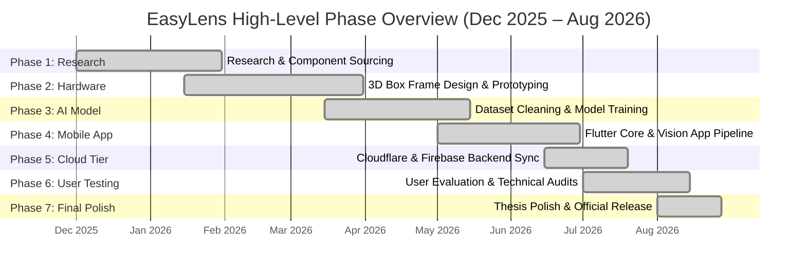
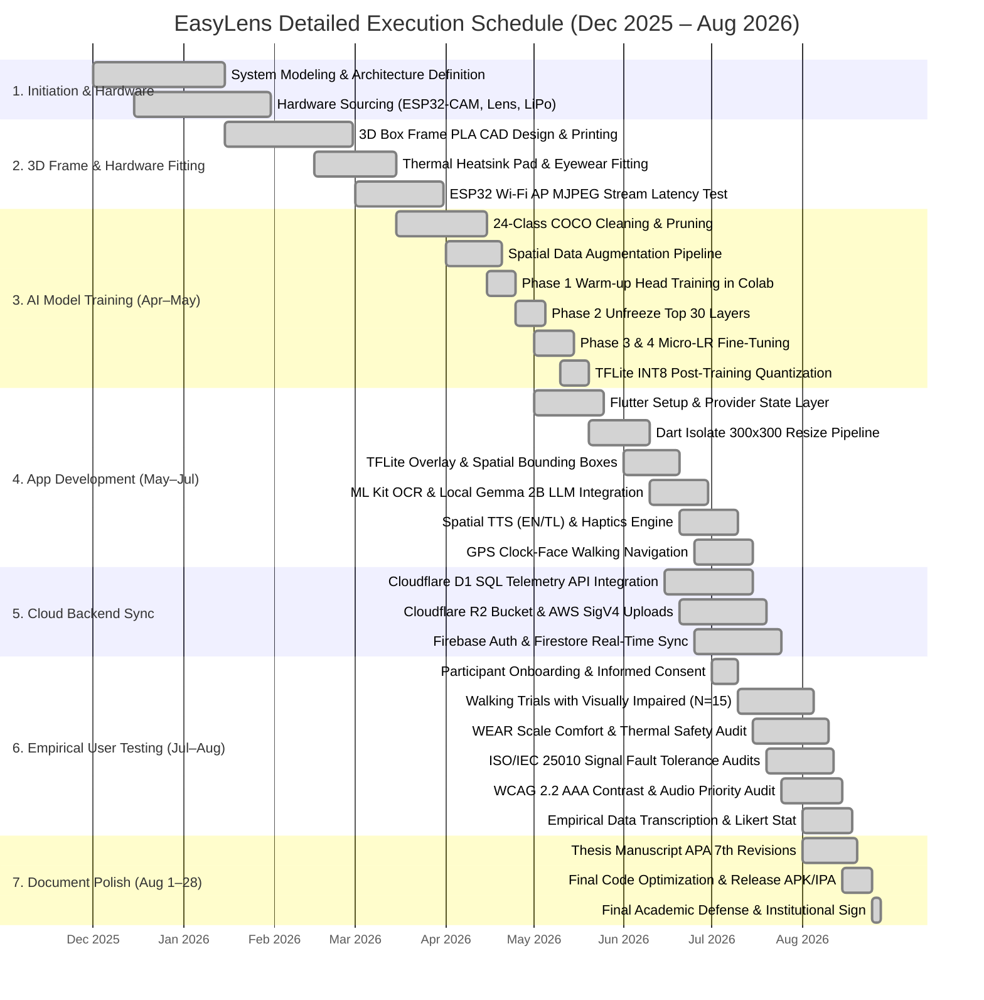

# Appendix H: Project Timeline & Gantt Charts

---

## Figure H.1: Simplified Gantt Chart (Phase-Level Overview)

### APA 7th Citation & Metadata
- **Figure Number**: Figure H.1
- **Figure Title**: *Simplified Gantt Chart (Phase-Level Overview)*
- **Manuscript Page**: 187
- **PDF Page**: 195
- **Image Asset**: [fig_h_gantt_charts.png](file:///Users/arronkianparejas/easylens/docs/figures/assets/fig_h_gantt_charts.png)

```
Figure H.1
Simplified Gantt Chart (Phase-Level Overview)

Note. Figure H.1 provides a high-level visual summary of the seven (7) core phases comprising the EasyLens research and development schedule between December 2025 and August 2026.
```

---

### Technical Diagram (Mermaid High-Level Gantt)



---

## Figure H.2: Detailed Gantt Chart (Task & Deliverable Breakdown)

### APA 7th Citation & Metadata
- **Figure Number**: Figure H.2
- **Figure Title**: *Detailed Gantt Chart (Task & Deliverable Breakdown)*
- **Manuscript Page**: 187
- **PDF Page**: 195
- **Image Asset**: [fig_h_gantt_charts.png](file:///Users/arronkianparejas/easylens/docs/figures/assets/fig_h_gantt_charts.png)

```
Figure H.2
Detailed Gantt Chart (Task & Deliverable Breakdown)

Note. Figure H.2 outlines the comprehensive work-breakdown structure (WBS), itemizing the twenty-one (21) discrete engineering tasks, AI fine-tuning milestones, and field-testing protocols executed during project implementation.
```

---

### Technical Diagram (Mermaid Detailed Gantt)


