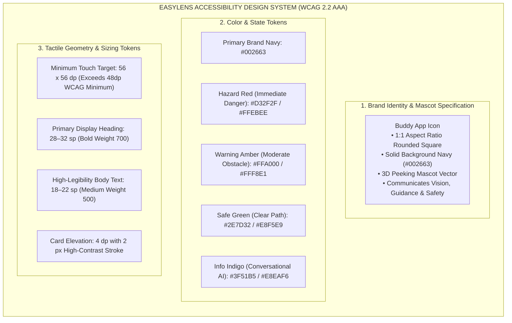

# Appendix I: Accessibility Design System, UI Tokens & Clinical Swatches

---

## Figure I.1: EasyLens Accessibility Design System and UI Toolkit Tokens

### APA 7th Citation & Metadata
- **Figure Number**: Figure I.1
- **Figure Title**: *EasyLens Accessibility Design System and UI Toolkit Tokens*
- **Manuscript Page**: 188
- **PDF Page**: 196
- **Image Asset**: [fig_i_1_design_system_tokens.png](file:///Users/arronkianparejas/easylens/docs/figures/assets/fig_i_1_design_system_tokens.png)

```
Figure I.1
EasyLens Accessibility Design System and UI Toolkit Tokens

Note. Figure I.1 illustrates the Buddy accessibility design system, incorporating tokenized typography scales, minimum tactile target geometries, and structured mascot branding specifications.
```

---

### Design System Token Hierarchy



---

## Figure I.2: EasyLens Deployed High-Fidelity UI Screens and Theme Swatches

### APA 7th Citation & Metadata
- **Figure Number**: Figure I.2
- **Figure Title**: *EasyLens Deployed High-Fidelity UI Screens and Theme Swatches*
- **Manuscript Page**: 190
- **PDF Page**: 198
- **Image Asset**: [fig_i_2_deployed_ui_swatches.png](file:///Users/arronkianparejas/easylens/docs/figures/assets/fig_i_2_deployed_ui_swatches.png)

```
Figure I.2
EasyLens Deployed High-Fidelity UI Screens and Theme Swatches

Note. Figure I.2 exhibits the four deployed high-contrast visual themes designed to satisfy WCAG 2.2 Level AAA standards and accommodate specific low-vision pathologies.
```

---

### High-Contrast Swatches, Contrast Ratios & Clinical Benefit Matrix

| Theme Name | Hex Fill Tokens | Contrast Ratio | Target Clinical Demographic | Visual & Medical-Accessibility Benefit |
| :--- | :--- | :---: | :--- | :--- |
| **Black on White Theme** | Background: `#FFFFFF`<br>Foreground: `#000000` | **21.00:1 (AAA)** | Mild visual drop-offs, astigmatism, high myopia | Delivers traditional reading contrast with maximum text sharpness and edge definition. |
| **White on Black Theme** | Background: `#000000`<br>Foreground: `#FFFFFF` | **21.00:1 (AAA)** | Cataracts, corneal scarring, severe photophobia | Restricts backlight emission to prevent internal light-scattering, glare-induced halos, and eye fatigue. |
| **Yellow on Black Theme** | Background: `#000000`<br>Foreground: `#E6E600` | **16.51:1 (AAA)** | Macular degeneration, central vision field loss | Accentuates edge contours with high-luminance yellow to stimulate remaining peripheral visual fields. |
| **Green on Black Theme** | Background: `#000000`<br>Foreground: `#33CC33` | **10.37:1 (AAA)** | Diabetic retinopathy, patchy vision loss | Targets high-sensitivity retinal cone cells to maximize visual clarity in shaded or low-light conditions. |
