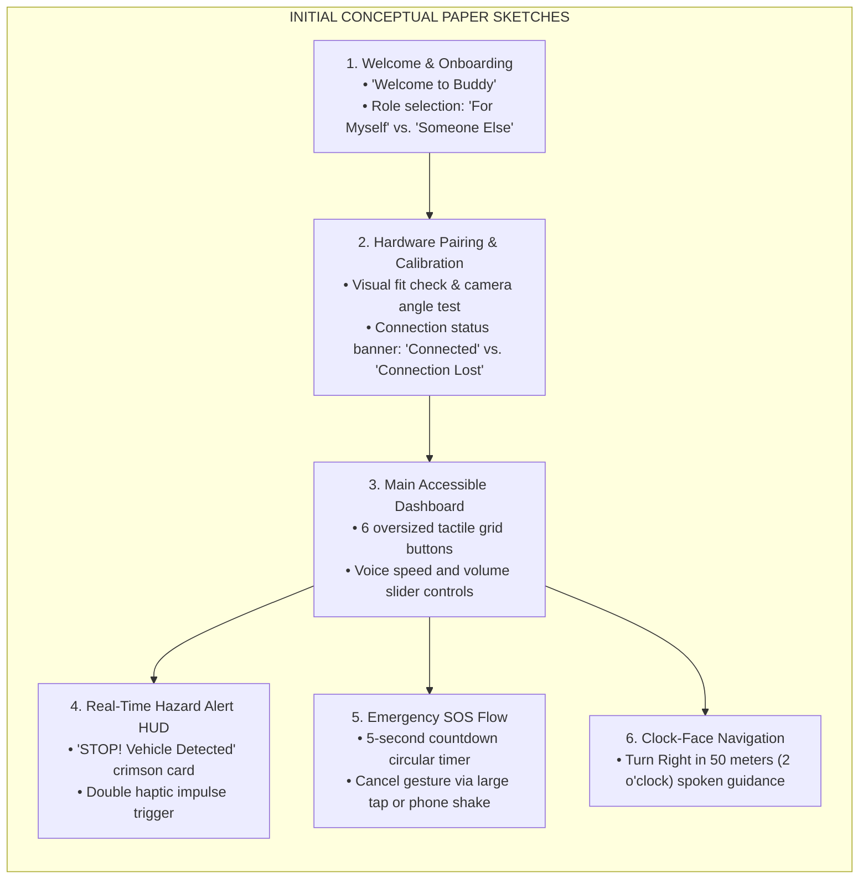
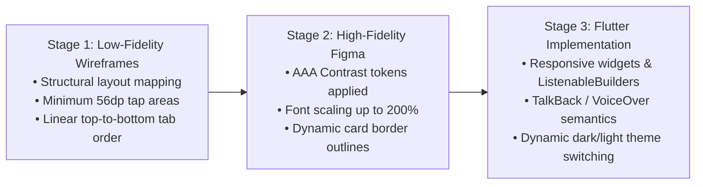

# Appendix J: UI/UX Figma Screens & Design Progression

---

## Figure J.1: Initial Hand-Drawn Concept Sketches

### APA 7th Citation & Metadata
- **Figure Number**: Figure J.1
- **Figure Title**: *Initial Hand-Drawn Concept Sketches*
- **Manuscript Page**: 192
- **PDF Page**: 200
- **Image Asset**: [fig_j_1_hand_drawn_sketches.png](file:///Users/arronkianparejas/easylens/docs/figures/assets/fig_j_1_hand_drawn_sketches.png)

```
Figure J.1
Initial Hand-Drawn Concept Sketches

Note. Figure J.1 shows the initial ideation and hand-drawn conceptual sketches illustrating the user onboarding flows, emergency trigger layout, tactile button positions, and spatial feedback mechanisms.
```

---

### Hand-Drawn Conceptual Interaction Schemas



---

## Figure J.2: Low-Fidelity Wireframes and User Navigation Flows

### APA 7th Citation & Metadata
- **Figure Number**: Figure J.2
- **Figure Title**: *Low-Fidelity Wireframes and User Navigation Flows*
- **Manuscript Page**: 193
- **PDF Page**: 201
- **Image Asset**: [fig_j_2_j_3_wireframes_figma.png](file:///Users/arronkianparejas/easylens/docs/figures/assets/fig_j_2_j_3_wireframes_figma.png)

```
Figure J.2
Low-Fidelity Wireframes and User Navigation Flows

Note. Figure J.2 details the low-fidelity wireframe flows mapping out screen transitions, hierarchical state management, and gesture feedback loops in Figma.
```

---

## Figure J.3: High-Fidelity Figma Screens with Accessible Colors

### APA 7th Citation & Metadata
- **Figure Number**: Figure J.3
- **Figure Title**: *High-Fidelity Figma Screens with Accessible Colors*
- **Manuscript Page**: 193
- **PDF Page**: 201
- **Image Asset**: [fig_j_2_j_3_wireframes_figma.png](file:///Users/arronkianparejas/easylens/docs/figures/assets/fig_j_2_j_3_wireframes_figma.png)

```
Figure J.3
High-Fidelity Figma Screens with Accessible Colors

Note. Figure J.3 presents the polished high-fidelity vector screens in Figma incorporating WCAG 2.2 Level AAA compliant color tokens, dynamic text scaling, and high-contrast card outlines.
```

---

### Design Progression Lifecycle


