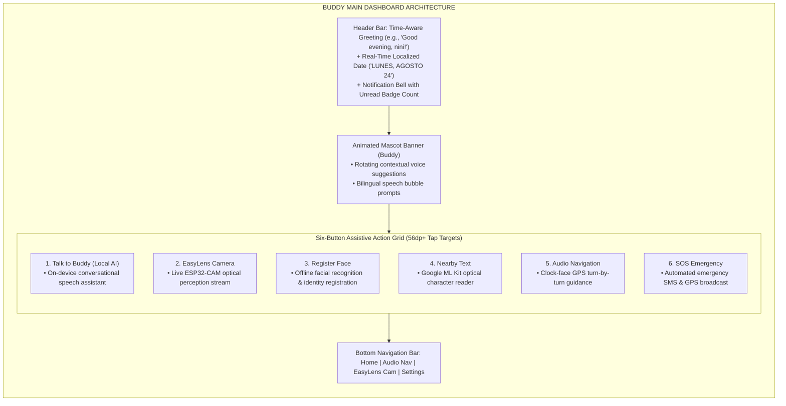
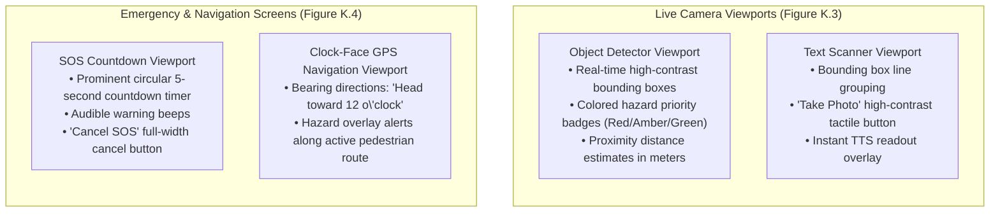

# Appendix K: Deployed Buddy Mobile Application Screen Walkthrough

---

## Overview of Appendix K Figures (Figures K.1 – K.10)

This document provides complete architectural specifications, user flow breakdowns, and exact APA 7th metadata for all ten (10) high-fidelity screens of the Buddy mobile client application compiled from the Flutter codebase.

---

## Figures K.1 & K.2: Splash Screen & Main Dashboard

### APA 7th Metadata
- **Figure K.1**: *Deployed Splash Screen and Initial Welcome Layout* (Manuscript Page 194, PDF Page 202)
- **Figure K.2**: *Main Dashboard Six-Button Grid Interface* (Manuscript Page 194, PDF Page 202)
- **Image Asset**: [fig_k_1_k_2_splash_dashboard.png](file:///Users/arronkianparejas/easylens/docs/figures/assets/fig_k_1_k_2_splash_dashboard.png)

```
Figure K.1
Deployed Splash Screen and Initial Welcome Layout

Note. Figure K.1 showcases the production splash screen and account authentication gateway, supporting email/password sign-in and Google OAuth.

Figure K.2
Main Dashboard Six-Button Grid Interface

Note. Figure K.2 presents the primary home dashboard featuring the personalized time-aware header greeting, Buddy animated mascot banner, and modular six-button assistive action grid.
```

---

### Dashboard Modular Grid Architecture



---

## Figures K.3 & K.4: Active Perception, SOS & Walking Navigation

### APA 7th Metadata
- **Figure K.3**: *Active Edge-AI Object Detection and Text Scanner Viewports* (Manuscript Page 195, PDF Page 203)
- **Figure K.4**: *SOS Countdown and GPS Clock-Face Navigation Screens* (Manuscript Page 195, PDF Page 203)
- **Image Asset**: [fig_k_3_k_4_detection_sos_nav.png](file:///Users/arronkianparejas/easylens/docs/figures/assets/fig_k_3_k_4_detection_sos_nav.png)

```
Figure K.3
Active Edge-AI Object Detection and Text Scanner Viewports

Note. Figure K.3 displays the live camera viewports for real-time edge computer vision object classification and Google ML Kit OCR text scanning with high-contrast bounding boxes.

Figure K.4
SOS Countdown and GPS Clock-Face Navigation Screens

Note. Figure K.4 exhibits the five-second emergency SOS countdown safety screen and the turn-by-turn clock-face walking navigation interface.
```

---

### Live Perception & Safety State Flows



---

## Figures K.5 & K.6: Onboarding Wizard & System Settings

### APA 7th Metadata
- **Figure K.5**: *Multi-Step Setup Onboarding Wizard Sequence* (Manuscript Page 196, PDF Page 204)
- **Figure K.6**: *System Settings and Accessibility Control Panel* (Manuscript Page 196, PDF Page 204)
- **Image Asset**: [fig_k_5_k_6_onboarding_settings.png](file:///Users/arronkianparejas/easylens/docs/figures/assets/fig_k_5_k_6_onboarding_settings.png)

```
Figure K.5
Multi-Step Setup Onboarding Wizard Sequence

Note. Figure K.5 maps the complete multi-step onboarding wizard sequence guiding visually impaired users through language selection, role attribution, visual impairment grading, voice persona selection, and emergency contact pairing.

Figure K.6
System Settings and Accessibility Control Panel

Note. Figure K.6 details the system settings panel, enabling granular control over language localization (English/Filipino), contrast themes, TTS speech rate, and haptic impulse strength.
```

---

### Onboarding Steps Sequence

1. **Step 1: Language Selection** — English or Filipino (Tagalog) with instant voice confirmation.
2. **Step 2: Role Attribution** — "For Myself" or "For Someone Else" (Configuring caretaker/patient mode).
3. **Step 3: Clinical Impairment Grading** — Selection of condition (Moderate, Severe, Blindness) for UI optimization.
4. **Step 4: Voice Persona Selection** — Aria (Calm Female), Echo (Deep Male), or Buddy (Friendly Companion).
5. **Step 5: Emergency Contact Setup** — Register primary phone number for SOS SMS dispatch.
6. **Step 6: Completion** — Voice walkthrough confirmation and dashboard transition.

---

## Figures K.7 & K.8: Contacts Management & Notification History

### APA 7th Metadata
- **Figure K.7**: *Emergency Contact Registration and Management* (Manuscript Page 197, PDF Page 205)
- **Figure K.8**: *In-App Notification Log and Warning Registry* (Manuscript Page 197, PDF Page 205)
- **Image Asset**: [fig_k_7_k_8_contacts_notifications.png](file:///Users/arronkianparejas/easylens/docs/figures/assets/fig_k_7_k_8_contacts_notifications.png)

```
Figure K.7
Emergency Contact Registration and Management

Note. Figure K.7 shows the emergency contact management interface with direct contact book import and custom relationship assignment.

Figure K.8
In-App Notification Log and Warning Registry

Note. Figure K.8 illustrates the chronological notification registry and incident history log displaying past hazard warnings and system telemetry events.
```

---

## Figures K.9 & K.10: Dynamic Preferences & Offline AI Chat

### APA 7th Metadata
- **Figure K.9**: *User Preferences and Dynamic Customization Panel* (Manuscript Page 198, PDF Page 206)
- **Figure K.10**: *Offline Local AI Chat and Conversational Companion* (Manuscript Page 198, PDF Page 206)
- **Image Asset**: [fig_k_9_k_10_preferences_local_ai.png](file:///Users/arronkianparejas/easylens/docs/figures/assets/fig_k_9_k_10_preferences_local_ai.png)

```
Figure K.9
User Preferences and Dynamic Customization Panel

Note. Figure K.9 exhibits the dashboard card reordering and dynamic text scaling preference screen.

Figure K.10
Offline Local AI Chat and Conversational Companion

Note. Figure K.10 displays the conversational AI chat interface powered by the on-device Gemma-IT 2B model for hands-free offline assistance.
```
