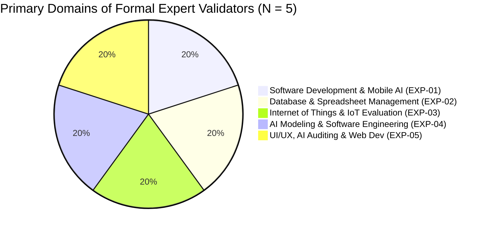
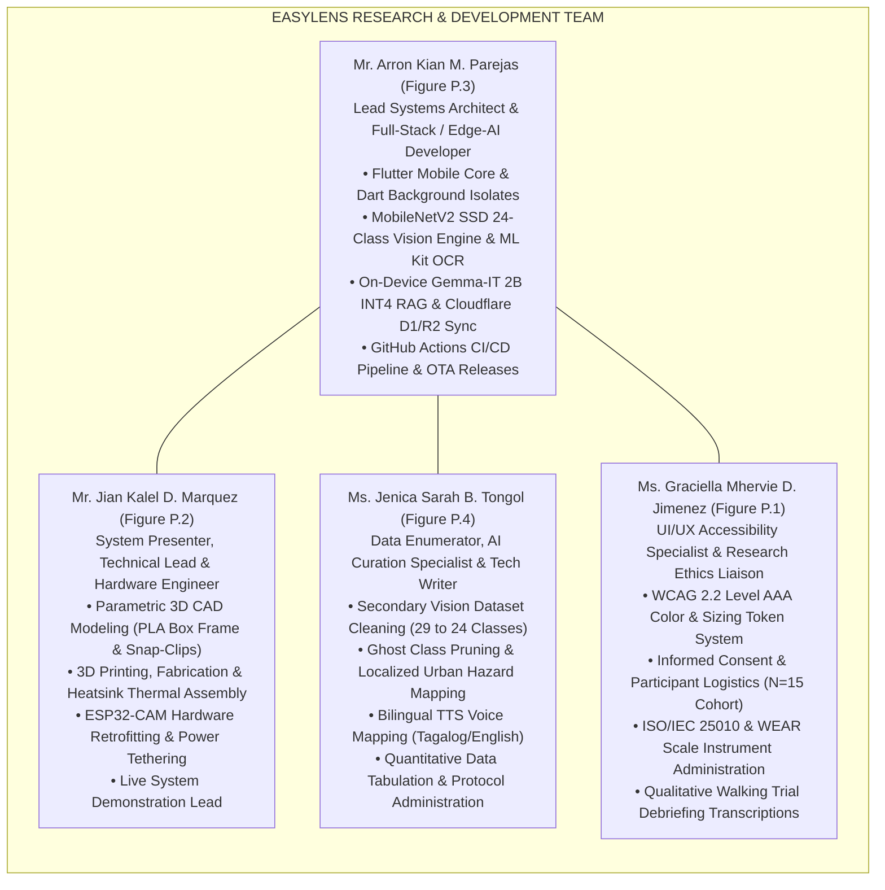

# Appendices O & P: Technical Evaluators & Research Team Profiles

---

## Appendix O: Technical Expert Evaluators & Specialized Consultants

### Overview of Evaluator Panel & Validation Consultants
Appendix O compiles the professional Curriculum Vitae (Figures O.1 – O.8) of the technical experts, academic specialists, and industry consultants who formally evaluated the EasyLens system against ISO/IEC 25010:2023 software quality standards, audited hardware safety, and validated the research instruments.

---

### Figures O.1 – O.8 Comprehensive Evaluation Matrix

| Figure ID | Evaluator Name | Professional Title & Affiliation | IT / Domain Experience | Selected Primary Technical Domain | Formal Capstone Role & Contribution | Total Quality Score |
| :--- | :--- | :--- | :---: | :--- | :--- | :---: |
| **Figure O.1** | **Mr. Dante C. Luciano** | Senior Android / Java Developer, MySuki Inc. | 8.0 Years | Software Development & Mobile AI | **Formal Expert Validator (EXP-01)** Evaluated native Android/Flutter lifecycle, Dart background isolate threading, dependency injection, and edge inference latency (Appendix R.6). | **46 / 50** (Highly Acceptable) |
| **Figure O.2** | **Mr. Kenneth P. Mariano** | Data Analyst & Database Specialist (B.S. Information Technology, STI College - Recto) | 10.0 Years | Database & Spreadsheet Management | **Formal Expert Validator (EXP-02)** Evaluated local SQLite caching, Cloudflare D1 serverless schema integrity, data pipelines, and quantitative metric tracking (Appendix R.4.1). | **43 / 50** (Highly Acceptable) |
| **Figure O.3** | **Ms. Roumayne R. Mariano** | Business Quality Deputy Manager, Optum Global Solutions Inc. Phil | 12.0 Years | Internet of Things & IoT Evaluation | **Formal Expert Validator (EXP-03)** Evaluated end-to-end IoT communication, Six Sigma quality assurance, process workflows, and audit checklists (Appendix R.4.2). | **46 / 50** (Highly Acceptable) |
| **Figure O.4** | **Mr. Kenjie Lloyd Dulatre** | Senior Python Engineer / Tech Lead, Exci AI (B.S. Computer Science, UP Diliman) | 6.0 Years (5+ yrs Python/AI) | AI Modeling & Software Engineering | **Formal Expert Validator (EXP-04)** Evaluated computer vision pipelines, multi-camera orchestration, MobileNetV2 SSD transfer learning, INT8 quantization, and containerized Docker CI/CD reliability (Appendix R.5). | **47 / 50** (Highly Acceptable) |
| **Figure O.5** | **Mr. James Marquez** | Senior Web Developer & Technical Consultant (Topcoder Copilot / KAPSARC / IBM Consulting Essentials) | 24.0 Years (20+ yrs Web/UI) | UI/UX, AI Auditing, & Web Development | **Formal Expert Validator (EXP-05)** Evaluated cross-platform UI responsiveness, REST API integration, frontend accessibility tokens, and overall code maintainability. | **37 / 50** (Acceptable) |
| **Figure O.6** | **Mr. Lothar Mark-Aurel Ehrlich** | Technology Consultant, Accenture (Global Business & Digital Transformation) | Enterprise Consulting (50+ countries) | Requirements Engineering & Transformation | **Research Instrument Validation Specialist** Formally verified and checked the construct validity, technical statement clarity, and logical structure of the research questionnaires and ISO/IEC 25010 checklists prior to field administration (Appendix R.1). | *Instrument Validator* |
| **Figure O.7** | **Dr. Ferdinand "Bam" D. Bermudo** | Registered Optometrist (Lic. # 0008738), Low Vision Specialist, Assistive Tech Researcher | Clinical Optometry & Low-Vision Rehab | Low Vision Care & Assistive Ocular Devices | **Hardware Safety & Ergonomics Consultant** Audited and approved the physical, electrical, and structural safety of the smart glasses prototype, ocular ergonomics, thermal dissipation parameters, and facial skin contact wearability (Appendix R.2). | *Safety Consultant* |
| **Figure O.8** | **Mr. Mel Jhun T. Carlos** | GIS Specialist & Spatial Data Analyst (CENRO-Taytay / Municipal Gov of Taytay) | 4+ Years Spatial Data & GIS | GIS Mapping, IoT & Hardware Enclosures | **IoT & Spatial Hardware Casing Consultant** Conducted preliminary developmental checkups on the physical hardware box enclosures, spatial positioning, and IoT peripheral integration (Appendix R.3). | *Developmental Checkup* |

---

### Descriptive Statistics of Formal Expert Panel (EXP-01 to EXP-05)

- **Mean Expert IT Experience**: 12.00 Years ($\text{SD} = 7.07$ years, Range: 6.0 – 24.0 years).
- **Mean Technical Quality Rating**: 43.80 / 50.00 (87.60% — *Highly Acceptable*).

---

## Appendix P: Research Proponents & Engineering Development Team

### Overview of Proponent Profiles
Appendix P presents the Curriculum Vitae (Figures P.1 – P.4) of the undergraduate research team from the School of Computing at Holy Angel University who designed, fabricated, trained, evaluated, and documented the EasyLens assistive system.

---

### Figures P.1 – P.4 Detailed Team Responsibilities & Profiles

---

### Detailed Proponent Specifications

#### Figure P.1: Ms. Graciella Mhervie D. Jimenez
- **Manuscript Page**: 212 | **PDF Page**: 220
- **Academic Degree**: Bachelor of Science in Information Technology (Senior Student), Holy Angel University.
- **Key Credentials & Certifications**: AWS Academy Cloud Foundation, Cisco Networking Academy (Data Analytics, Networks, Cybersecurity, Endpoint Security), IBM AI Fundamentals, Notion Certified, freeCodeCamp Relational Databases, DataCamp AI Fundamentals.
- **Core Capstone Responsibilities**:
  1. Accessibility UI/UX Design: Developed accessible theme swatches meeting WCAG 2.2 Level AAA contrast thresholds (up to 21:1).
  2. Research Protocol Administration: Administered standardized usability checklists and the WEAR comfort scale to the 15 visually impaired participants and sighted guides.
  3. Participant Logistics & Ethics: Managed institutional consent forms, participant coordination, and transcribed qualitative walking feedback.

#### Figure P.2: Mr. Jian Kalel D. Marquez
- **Manuscript Page**: 213 | **PDF Page**: 221
- **Academic Degree**: Bachelor of Science in Computer Science (Senior Student, GPA: 1.39, President's / Dean's Lister, Skydev Hackathon Champion), Holy Angel University.
- **Key Credentials & Certifications**: HackerRank SQL, Meta Data Analytics, Cisco Python Essentials 2, freeCodeCamp Relational Database.
- **Core Capstone Responsibilities**:
  1. Hardware CAD Modeling: Designed the parametric 3D-printable PLA box frame enclosure (10.9g) and modular snap-clips for the Wayfarer base eyewear frame.
  2. Fabrication & Thermal Assembly: Supervised 3D printing at 0.2mm layer height with 30% tri-hexagon infill, integrated passive ventilation slots, and fitted aluminum heatsink pads.
  3. Technical Presentations: Acted as primary system presenter and hardware technical lead during empirical evaluation sessions.

#### Figure P.3: Mr. Arron Kian M. Parejas
- **Manuscript Page**: 214 | **PDF Page**: 222
- **Academic Degree**: Bachelor of Science in Computer Science (Senior Student), Holy Angel University; Chapter Lead (CEO) of Google Developer Groups on Campus - HAU; Top 1 DataCamp Scholar; Ranked #11 GitHub Developer in the Philippines; 29 Hackathons (15 wins, 7 championships including UP GenAI 2025 National Champion).
- **Core Capstone Responsibilities**:
  1. Mobile Edge Architecture: Engineered the entire Flutter mobile application, implementing Dart background isolates to guarantee 60 FPS UI responsiveness during 30 FPS video streaming.
  2. Edge-AI Vision & OCR Stack: Integrated the quantized MobileNetV2 SSD 24-class object detector and Google ML Kit OCR engine.
  3. Dual-Tier Conversational RAG Engine: Developed the on-device Gemma-IT 2B INT4 local conversational assistant with TF-IDF knowledge base grounding, with cloud fallback to Gemini 3.6 Flash Low.
  4. Cloud Backend & CI/CD Pipeline: Built the Cloudflare D1 serverless database sync, Cloudflare R2 AWS SigV4 signed uploads, Firebase authentication, and the automated GitHub Actions CI/CD and OTA update delivery pipeline.

#### Figure P.4: Ms. Jenica Sarah B. Tongol
- **Manuscript Page**: 215 | **PDF Page**: 223
- **Academic Degree**: Bachelor of Science in Computer Science (Senior Student), Holy Angel University; Chief Operations Officer (COO) of Google Developer Groups on Campus - HAU; DEVCON Philippines Volunteer.
- **Key Credentials & Certifications**: CompTIA IT Fundamentals (ITF+), IBM AI Fundamentals, Cisco Networking Academy (Data Analytics, Cyber Threat Management, Endpoint Security, JavaScript Essentials 1).
- **Core Capstone Responsibilities**:
  1. Data-Centric Dataset Curation: Executed the 29-to-24 class dataset restructuring pipeline, pruning minority ghost classes (<=3 instances) and consolidating local urban hazards into `vehicle_other`.
  2. Multimodal Speech & TTS Mapping: Configured bilingual Filipino/English audio cue strings and spatial directional speech prompts.
  3. Technical Documentation: Co-authored manuscript data tables, managed empirical test spreadsheets, and assisted with protocol administration.
