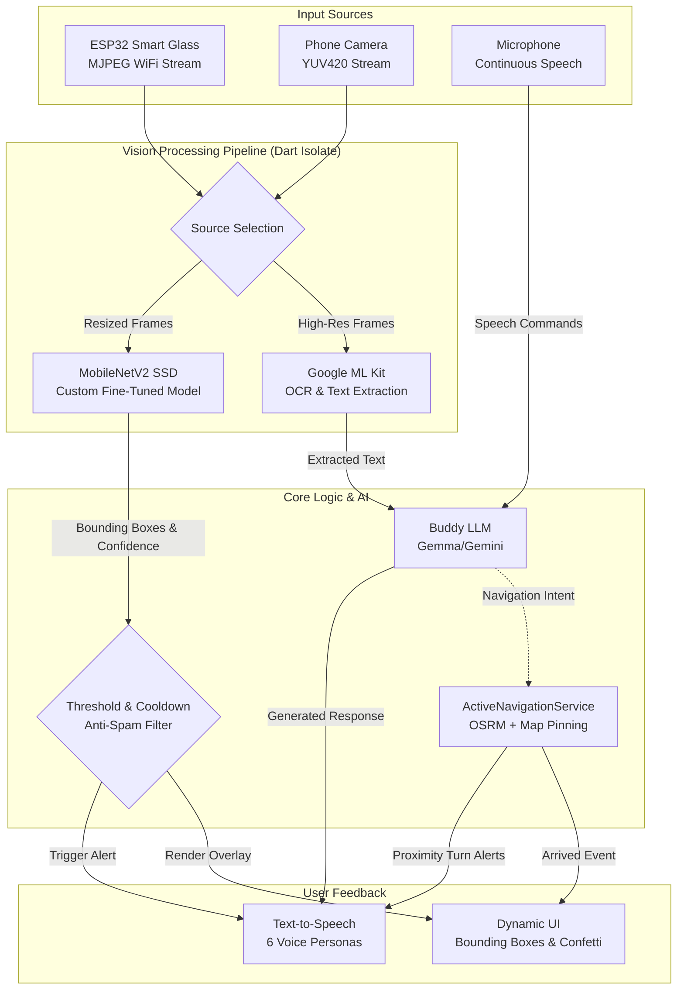

# EasyLens: Deep Object Detection Architecture

EasyLens relies on a custom fine-tuned **MobileNetV2 Single Shot Detector (SSD)** as its primary engine. This edge-vision component acts as the user's "digital eyes," processing real-time video frames from the local phone camera or the external ESP32 smart glass hardware.

## The Core Pipeline

### 1. MobileNetV2 (Custom Fine-Tuned SSD)
Our custom MobileNetV2 model is trained to detect specific everyday obstacles, crosswalks, stairs, and common items with extremely low latency. 
- **Processing**: The camera stream grabs YUV420 format frames. These frames are processed via a dedicated **Dart Isolate** (background thread) to prevent UI blocking.
- **Output**: Generates real-time bounding boxes and confidence scores. When a high-confidence obstacle is detected within a designated spatial proximity (e.g., center-bottom of the frame), it triggers a voice alert.
- **Anti-Spam System**: To avoid overwhelming the user, the alert system uses an 8-second localized cooldown for repetitive objects.

### 2. Google ML Kit Integration
While MobileNetV2 is optimized for spatial awareness and object detection, **Google ML Kit** provides powerful supporting layers:
- **Text Recognition (OCR)**: Extracts nearby text dynamically. If the user encounters a sign, document, or label, ML Kit converts it to text and passes it to the Buddy (Gemma/Gemini LLM) for contextual explanation.
- **Image Labeling**: Serves as a fallback classifier for nuanced scenes that may not have distinct bounding box definitions in our custom SSD.

### 3. Speech Navigation & Alert Systems
EasyLens integrates spatial awareness with comprehensive turn-by-turn guidance:
- **Speech-to-Text (STT) Navigation**: Users can activate continuous listening. A dynamic 1.5-second silence trigger evaluates commands (e.g., "Take me to Holy Angel University" or Tagalog inputs like "Pumunta sa...").
- **Proximity Alerts**: While navigating, GPS distance and MobileNetV2 bounding box heights are correlated. Turn-by-turn alerts ("In 30 meters, turn left") are issued natively via TTS.
- **Arrival Confetti**: When the user reaches the geographical destination, `ActiveNavigationService` triggers a global state change, launching a celebratory confetti animation over any active screen.
- **Map Pinning**: Users can long-press anywhere on the map to set dynamic travel routes seamlessly using speech or touch.

---

## Complete System Flowchart

The following flowchart outlines how a single frame of video is processed and transformed into an auditory instruction for the user:

## System Workflow in Detail

1. **Hardware Ingestion**: The system continuously captures frames. Users can wear the ESP32 glasses (connected via local WiFi hotspot), which streams frames, or use their phone's rear camera. 
2. **Isolate Thread Processing**: To maintain a 60FPS UI, the image tensors are parsed and fed into the TensorFlow Lite interpreter inside an isolated background thread. 
3. **Obstacle Heuristics**: The custom MobileNetV2 model outputs bounding boxes. The system calculates the area of the bounding box. If an object takes up more than 40% of the screen (indicating it is very close), it passes the threshold analyzer.
4. **Cooldown Verification**: The analyzer checks a memory cache. If "Chair" was announced 3 seconds ago, it is suppressed (8-second cooldown). If it's a new obstacle, an alert is queued.
5. **Auditory Output**: The `TtsService` uses the user's selected Voice Persona (e.g., *Maya* for Filipino or *Aria* for English) to clearly announce: "Warning: Chair ahead."
6. **Navigation Synergy**: Simultaneously, if a route is active via `ActiveNavigationService`, the app monitors the `Geolocator` stream. Speech Navigation merges route commands with obstacle warnings seamlessly.
