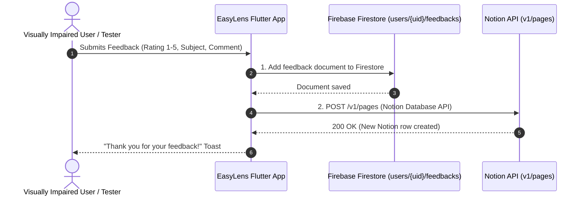

# Notion Feedback API Integration & Setup Guide

This guide details how to integrate and configure Notion API in EasyLens so user feedback submitted from Settings -> Send Feedback is automatically saved and synchronized directly into a Notion Database (alongside Firestore).

---

### 01 — STEP-BY-STEP NOTION API SETUP GUIDE

#### Step 1: Create a Notion Integration (API Key)
1. Go to [https://www.notion.so/my-integrations](https://www.notion.so/my-integrations).
2. Log in with your Notion account.
3. Click the "+ New integration" button.
4. Fill in the integration details:
   - **Name**: `EasyLens Feedback Bot`
   - **Associated workspace**: Select your workspace.
   - **Type**: `Internal`
5. Under **Capabilities**, ensure the following permissions are checked:
   - Read content
   - Update content
   - Insert content
6. Click **Save** / **Submit**.
7. Copy the **Internal Integration Secret** (Starts with `ntn_...` or `secret_...`). This is your `NOTION_API_KEY`.

#### Step 2: Create the Notion Database
1. Open Notion and create a new **Database Page** (or a **Table View** page).
2. Name the database **`EasyLens Feedbacks`**.
3. Create the following **7 exact columns (properties)** in your database table:

| Column / Property Name | Notion Property Type | Description |
|---|---|---|
| **`User ID`** | **Title** *(Default main column)* | User UID (or `anonymous`) |
| **`Name`** | **Text** *(Rich Text)* | User display name |
| **`Email`** | **Email** *(or Text)* | User email address |
| **`Subject`** | **Select** *(or Text)* | Feedback category (`Bug`, `Suggestion`, `Content`, `Compliment`, `Other`) |
| **`Rating`** | **Number** | Rating score from 1 to 5 |
| **`Comment`** | **Text** *(Rich Text)* | Detailed user comment / message |
| **`Timestamp`** | **Date** | Date and time submitted |

> [!IMPORTANT]
> Property names are case-sensitive. Make sure they match the exact names: `User ID`, `Name`, `Email`, `Subject`, `Rating`, `Comment`, `Timestamp`.

#### Step 3: Share the Database with your Integration
By default, Notion integrations cannot access pages unless explicitly granted access.

1. Open your **`EasyLens Feedbacks`** database page in Notion.
2. Click the **...** (three dots) icon at the top-right corner of the page.
3. Scroll down and click **+ Add connections** (or **Connect to**).
4. Search for **`EasyLens Feedback Bot`** (the integration created in Step 1).
5. Click **Confirm** / **Allow**.

#### Step 4: Extract your Database ID
1. Look at the URL of your Notion database page in your browser address bar:
   ```text
   https://www.notion.so/workspace/3a1b2c3d4e5f6a7b8c9d0e1f2a3b4c5d?v=123456...
   ```
2. Copy the **32-character ID string** located between your workspace name and `?v=`:
   - Example Database ID: `3a1b2c3d4e5f6a7b8c9d0e1f2a3b4c5d`

#### Step 5: Add Keys to `.env`
Open your local `.env` file in the root directory of the project and add your keys:

```env
# Notion API Configuration for Settings Feedback Sync
NOTION_API_KEY=ntn_your_actual_integration_secret_here
NOTION_DATABASE_ID=3a1b2c3d4e5f6a7b8c9d0e1f2a3b4c5d
```

---

### 02 — HOW THE DUAL FIRESTORE + NOTION SYNC WORKS

When a user opens Settings -> Send Feedback (`SurveyScreen`) and clicks Submit:



1. **Firestore Database**: The feedback document is stored under `users/{userId}/feedbacks/{feedbackId}`.
2. **Notion Database**: A new row page is created instantly in your Notion `EasyLens Feedbacks` table with columns: `User ID`, `Name`, `Email`, `Subject`, `Rating`, `Comment`, `Timestamp`.
3. **Offline / Fallback Resilience**: If Notion API keys are not set, the app logs a notice in debug mode and safely falls back to Firestore without breaking user experience.
