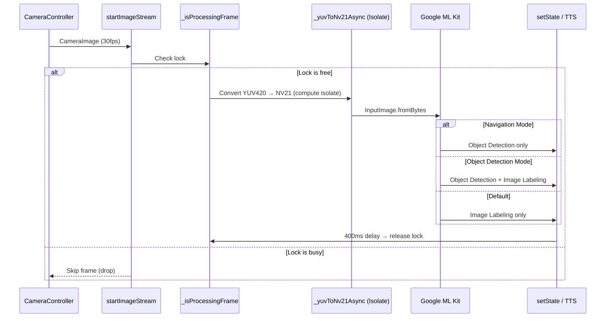

# 02 — Architecture

## Design Principles

1. **Offline-First** — Core features (object detection, OCR, face recognition, Buddy AI) work without internet using on-device ML models.
2. **Singleton Services** — All services use the `factory` singleton pattern for global access without dependency injection.
3. **Reactive UI** — `SettingsService` extends `ChangeNotifier`. The root `MaterialApp` is wrapped in `AnimatedBuilder(animation: settingsService)` so theme/language changes propagate instantly.
4. **Accessibility by Default** — Every interaction has a TTS announcement. Contrast themes, large tap targets, and haptic feedback are first-class citizens.

---

## System Architecture Diagram

```mermaid
graph TD
    subgraph UI["Flutter UI Layer"]
        Welcome[WelcomeScreen]
        Login[LoginScreen]
        Signup[SignupScreen]
        Home[HomeTab / DashboardHome]
        Camera[HardwareScreen]
        RAG[RagAssistantScreen]
        Settings[SettingsScreen]
    end

    subgraph Services["Service Layer (Singletons)"]
        SettingsSvc[SettingsService]
        TTSSvc[TtsService]
        STTSvc[SttService]
        RagSvc[RagService]
        FirebaseSvc[FirebaseService]
        NotifSvc[NotificationService]
        FaceRegSvc[FaceRegistrationService]
        ESP32Svc[Esp32Service]
        WeatherSvc[WeatherService]
        TransSvc[TranslationService]
        SmsSvc[SmsService]
        NavSvc[ActiveNavigationService]
        UndoSvc[UndoService]
        JournalSvc[JournalService]
    end

    subgraph ML["ML / AI Layer"]
        MLKit[Google ML Kit]
        TFLite[TFLite SSD MobileNetV2]
        Gemma[Gemma 2B Local LLM]
        Gemini[Gemini Flash Cloud LLM]
        Ollama[Ollama Local Server]
    end

    subgraph Storage["Storage Layer"]
        Firebase[Firebase Auth + Firestore]
        CloudflareD1[Cloudflare D1 SQL]
        CloudflareR2[Cloudflare R2 Objects]
        SharedPrefs[SharedPreferences]
    end

    Home --> Camera
    Home --> RAG
    Home --> Settings

    Camera --> MLKit
    Camera --> TFLite
    RAG --> RagSvc
    RagSvc --> Gemma
    RagSvc --> Gemini
    RagSvc --> Ollama

    Camera --> TTSSvc
    Camera --> NotifSvc
    RAG --> TTSSvc
    RAG --> STTSvc

    SettingsSvc --> SharedPrefs
    FirebaseSvc --> Firebase
    FirebaseSvc --> CloudflareD1
    FirebaseSvc --> CloudflareR2
```



---

## Service Dependency Graph

All services are singletons accessed via their factory constructor (e.g., `TtsService()`). There is **no** DI framework.

```
SettingsService (root — no service dependencies)
  ├── read by: TtsService, TranslationService, all screens
  └── persists to: SharedPreferences

TtsService
  ├── depends on: SettingsService (voice persona, rate, pitch)
  └── platform: flutter_tts

RagService
  ├── depends on: SettingsService (language), WeatherService, TranslationService
  ├── uses: Gemma (offline), Gemini (cloud), Ollama (local server)
  └── guardrails: off-topic filter, curated Q&A, keyword context retrieval

FirebaseService
  ├── depends on: firebase_core, firebase_auth, cloud_firestore
  └── provides: user profile CRUD, auth state

NotificationService
  ├── depends on: SharedPreferences
  └── provides: in-app alerts (obstacle, battery, buddy follow-up)

Esp32Service
  ├── depends on: SharedPreferences
  └── provides: MJPEG frame stream, LED control
```

---

## Data Flow: Camera Frame Processing

This is the most performance-critical pipeline in the app.



### Key Design Decisions
- **Single-frame lock** (`_isProcessingFrame`): Only one frame is processed at a time. All other frames are dropped. This prevents memory accumulation.
- **400ms cooldown**: After each processed frame, a 400ms delay ensures ~2.5 FPS processing rate, preventing CPU saturation.
- **Navigation mode skips image labeling**: In `HudMode.navigation`, only `_detectObjectsOnFrame` runs — NOT `_processCameraImage`. This halves per-frame memory and CPU load.
- **YUV→NV21 in isolate**: The byte conversion runs in a `compute()` isolate to avoid blocking the main thread.
- **`stopImageStream()` in `dispose()`**: Critical — the camera stream MUST be stopped before the controller is disposed to prevent native memory leaks.

---

## Widget Tree Overview

```
MaterialApp
  └── AnimatedBuilder (listens to SettingsService)
      └── ConfettiOverlay
          └── SpeechNavigationOverlay
              └── WelcomeScreen → LoginScreen → HomeTab
                  └── Scaffold + BottomNavigationBar
                      ├── Tab 0: DashboardHome
                      ├── Tab 1: HardwareScreen (Camera)
                      ├── Tab 2: RagAssistantScreen (Buddy Chat)
                      └── Tab 3: SettingsScreen
```
