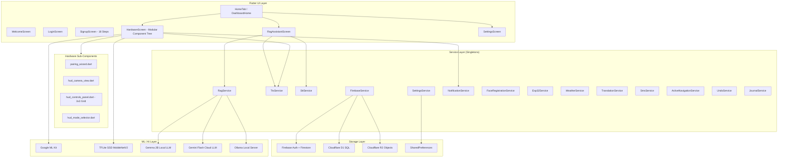
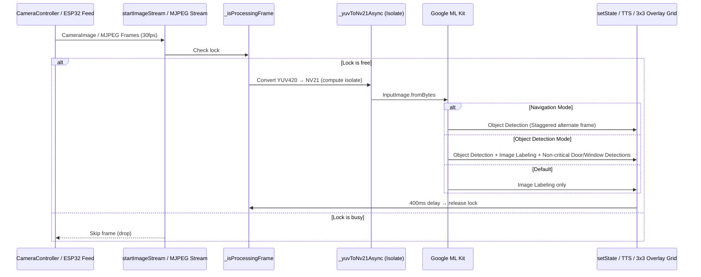

# 02 — Architecture

## Design Principles

1. **Offline-First** — Core features (object detection, OCR, face recognition, Buddy AI) work without internet using on-device ML models.
2. **Singleton Services** — All services use the `factory` singleton pattern for global access without dependency injection.
3. **Reactive UI** — `SettingsService` extends `ChangeNotifier`. The root `MaterialApp` is wrapped in `AnimatedBuilder(animation: settingsService)` so theme/language changes propagate instantly.
4. **Accessibility by Default** — Every interaction has a TTS announcement. Contrast themes, large tap targets, and haptic feedback are first-class citizens.
5. **Power & Screen Persistence** — Continuous camera stream HUD modes and multi-step onboarding wizard utilize `wakelock_plus` to maintain active display power without unexpected OS dimming or screen lock.
6. **Zero-Lag Disk Filtering** — High-frequency transient notifications (such as rapid obstacle warnings) are announced via speech and rendered in UI but filtered out of `SharedPreferences` write queues; only critical alerts are persisted to disk to eliminate main-thread I/O jank.

---

## System Architecture Diagram



---

## Service Dependency Graph

All services are singletons accessed via their factory constructor (e.g., `TtsService()`). There is **no** DI framework.

```
SettingsService (root — no service dependencies)
  ├── read by: TtsService, TranslationService, all screens
  └── persists to: SharedPreferences

TtsService
  ├── depends on: SettingsService (voice persona, rate, pitch)
  ├── platform: flutter_tts (with lazy Android binding & safe pitch [0.5, 2.0])
  └── fallback: dynamic voice persona resolution & locale fallback

RagService
  ├── depends on: SettingsService (language), WeatherService, TranslationService
  ├── uses: Gemma (offline), Gemini (cloud), Ollama (local server)
  └── guardrails: off-topic filter, curated Q&A, keyword context retrieval

FirebaseService
  ├── depends on: firebase_core, firebase_auth, cloud_firestore
  └── provides: user profile CRUD (including isForMyself & selectedConditions), auth state

NotificationService
  ├── depends on: SharedPreferences
  └── provides: filtered in-app alerts (obstacle, battery, buddy follow-up; only critical write to disk)

Esp32Service
  ├── depends on: SharedPreferences
  └── provides: MJPEG frame stream, LED control, Smart Glasses mobile camera fallback
```

---

## Data Flow: Camera Frame Processing

This is the most performance-critical pipeline in the app.



### Key Design Decisions
- **Single-frame lock** (`_isProcessingFrame`): Only one frame is processed at a time. All other frames are dropped. This prevents memory accumulation.
- **400ms cooldown**: After each processed frame, a 400ms delay ensures ~2.5 FPS processing rate, preventing CPU saturation.
- **Navigation mode skips image labeling**: In `HudMode.navigation`, only `_detectObjectsOnFrame` runs — NOT `_processCameraImage`. This halves per-frame memory and CPU load.
- **YUV→NV21 in isolate**: The byte conversion runs in a `compute()` isolate to avoid blocking the main thread.
- **`stopImageStream()` in `dispose()`**: Critical — the camera stream MUST be stopped before the controller is disposed to prevent native memory leaks.
- **Smart Glasses Fallback**: If the external ESP32 stream drops, the system seamlessly falls back to the device's native camera preview, keeping HUD features active.
- **Disk I/O Optimization**: Transient obstacle warnings write only to memory and UI state. Storage persistence is reserved for critical safety alerts (`"STOP"`, `"FIRE"`, `"HAZARD"`, `"EMERGENCY"`) to ensure zero main-thread jank.

---

## Widget Tree Overview

```
MaterialApp
  └── AnimatedBuilder (listens to SettingsService)
      └── ConfettiOverlay
          └── SpeechNavigationOverlay
              └── WelcomeScreen → LoginScreen / SignupScreen (18 Steps) → HomeTab
                  └── Scaffold + BottomNavigationBar
                      ├── Tab 0: DashboardHome
                      ├── Tab 1: HardwareScreen (Camera Feed + 3x3 Controls + Mode Selector)
                      ├── Tab 2: RagAssistantScreen (Buddy Chat)
                      └── Tab 3: SettingsScreen
```
