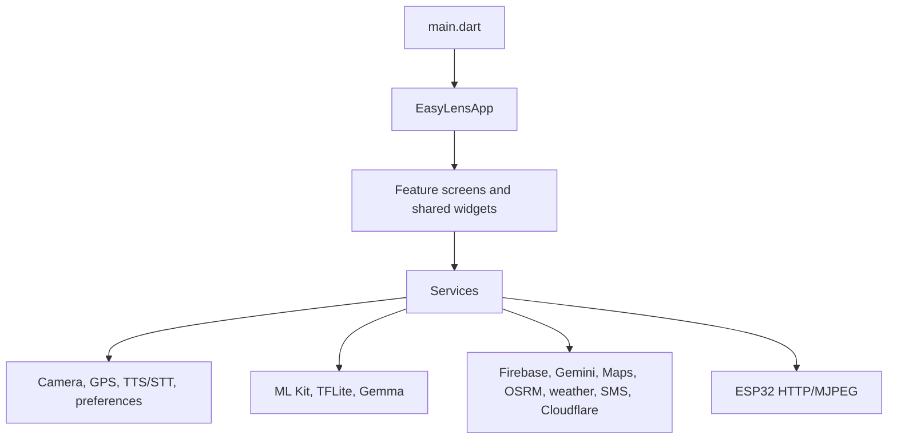

# 02 — Architecture

## Bootstrap and state

`main.dart` initializes Flutter bindings, portrait orientation and immersive UI, loads `.env` when present, initializes Firebase, schedules RAG knowledge-base loading, initializes notifications and ESP32 preferences, then runs `EasyLensApp`. Firebase and dotenv failures are caught so the application can continue with reduced/local behavior.

`SettingsService` is the principal app-wide `ChangeNotifier`. Other notable notifiers include notification, ESP32, active-navigation, emergency-contact, and face-registration services. Many screens also own transient `StatefulWidget` state for camera frames and interactions.

## Boundary notes

- `SharedPreferences` stores settings locally. Cloud connections are optional and should fail gracefully.
- The RAG service owns Buddy knowledge/model routing; it is not a general backend service.
- Android includes runtime permissions for several capabilities; request and denial behavior must be verified on device.
- Cloudflare D1/R2 client code exists but is not initialized from `main.dart`. Treat its use as feature-driven, not a boot requirement.

## Navigation

`AppRoute` supplies custom Flutter page transitions. Screens use `Navigator` push/pop rather than a named-route table. `RagService.recordNavigation` records assistant-oriented screen context; it is not a router.
