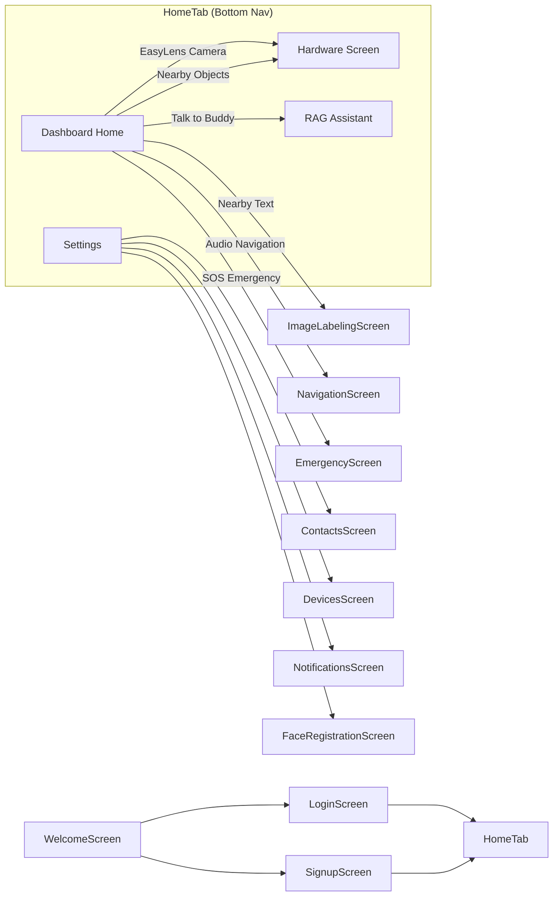

# 03 — Screens & Navigation

## Screen Map

EasyLens has **16 screen modules** organized under `lib/screens/`. The app uses a custom `AppRoute` wrapper for page transitions.

---

## Navigation Flow



---

## Screen Reference

### 1. Welcome Screen
| | |
|---|---|
| **Path** | `lib/screens/welcome/welcome_screen.dart` |
| **Purpose** | Animated splash screen with Buddy mascot. Entry point of the app. |
| **Navigates to** | `LoginScreen` or `SignupScreen` |

### 2. Login Screen
| | |
|---|---|
| **Path** | `lib/screens/login/login_screen.dart` |
| **Purpose** | Email/password and Google Sign-In authentication |
| **Auth** | `FirebaseService` → Firebase Auth |
| **Navigates to** | `HomeTab` (on success) |

### 3. Signup Screen
| | |
|---|---|
| **Path** | `lib/screens/signup/signup_screen.dart` |
| **Purpose** | Multi-step onboarding registration (name, language, voice persona, preferences) |
| **Steps** | 7 steps with animated step indicators |
| **Navigates to** | `HomeTab` (on completion) |

### 4. Home Tab (Shell)
| | |
|---|---|
| **Path** | `lib/screens/home/home_tab.dart` |
| **Purpose** | Bottom navigation bar shell containing 4 tabs |
| **Tabs** | Dashboard (0), Camera (1), Buddy Chat (2), Settings (3) |

### 5. Dashboard Home
| | |
|---|---|
| **Path** | `lib/screens/dashboard/dashboard_home.dart` |
| **Purpose** | Central hub with greeting, mascot banner, and configurable action cards |
| **Components** | `mascot_banner.dart`, `dashboard_button.dart`, `header_bar.dart`, `custom_navbar.dart` |
| **Features** | Personalized greeting, bark sound on return, shake-to-undo, notification badge |

### 6. Hardware Screen (Camera)
| | |
|---|---|
| **Path** | `lib/screens/hardware/hardware_screen.dart` |
| **Size** | ~3,100 lines — **refactored for modularity** |
| **Purpose** | Real-time camera feed with 4 Buddy/HUD modes. |
| **HUD Modes** | `HudMode.navigation`, `HudMode.objectDetection`, `HudMode.faceRecognition`, default (image labeling) |
| **Modular Sub-Components** | Located under `lib/screens/hardware/components/`:<br>- [pairing_wizard.dart](file:///Users/arronkianparejas/easylens/lib/screens/hardware/components/pairing_wizard.dart) (Onboarding connection steps)<br>- [hud_camera_view.dart](file:///Users/arronkianparejas/easylens/lib/screens/hardware/components/hud_camera_view.dart) (Camera previews & label drawings)<br>- [hud_controls_panel.dart](file:///Users/arronkianparejas/easylens/lib/screens/hardware/components/hud_controls_panel.dart) (Status indicators grid)<br>- [hud_mode_selector.dart](file:///Users/arronkianparejas/easylens/lib/screens/hardware/components/hud_mode_selector.dart) (Horizontal mode switch tab row) |
| **Key Concerns** | Memory management (alternating ML Kit pipelines), dynamic TTS voice persona selection |

### 7. RAG Assistant Screen (Buddy Chat)
| | |
|---|---|
| **Path** | `lib/screens/rag_assistant/rag_assistant_screen.dart` |
| **Purpose** | Chat interface for Buddy AI assistant |
| **Input** | Text keyboard + Speech-to-Text |
| **Processing** | `RagService` → Gemma (offline) / Gemini (online) / Ollama (local) |

### 8. Settings Screen
| | |
|---|---|
| **Path** | `lib/screens/settings/settings_screen.dart` |
| **Purpose** | User preferences management |
| **Sections** | Profile, Appearance, Voice & Sound, Notifications, Accessibility, About |

### 9. Emergency Screen
| | |
|---|---|
| **Path** | `lib/screens/emergency/emergency_screen.dart` |
| **Purpose** | SOS alert with GPS location, emergency SMS, and contact management |

### 10. Contacts Screen
| | |
|---|---|
| **Path** | `lib/screens/contacts/contacts_screen.dart` |
| **Purpose** | Emergency contact CRUD management |

### 11. Face Registration Screen
| | |
|---|---|
| **Path** | `lib/screens/face_registration/face_registration_screen.dart` |
| **Purpose** | Register known faces for the face recognition HUD mode |

### 12. Navigation Screen
| | |
|---|---|
| **Path** | `lib/screens/navigation/navigation_screen.dart` |
| **Purpose** | Google Maps-based audio navigation |
| **Persistence** | Resumes the active navigation state (destination, route, current step index, tapped map pins) automatically. Protected by a `PopScope` to prevent accidental exits, offering options to continue tracking in the background. |

### 13. Notifications Screen
| | |
|---|---|
| **Path** | `lib/screens/notifications/notifications_screen.dart` |
| **Purpose** | View and manage in-app notification history |

### 14. Devices Screen
| | |
|---|---|
| **Path** | `lib/screens/devices/devices_screen.dart` |
| **Purpose** | ESP32-CAM pairing and connection management |

### 15. Image Labeling Screen
| | |
|---|---|
| **Path** | `lib/screens/image_labeling/image_labeling_screen.dart` |
| **Purpose** | Dedicated text scanner / image labeling view |

### 16. Onboarding Screen
| | |
|---|---|
| **Path** | `lib/screens/onboarding/onboarding_screen.dart` |
| **Purpose** | First-time user walkthrough |

---

## Navigation Patterns

### `AppRoute.to(Widget screen)`
All in-app navigation uses the custom `AppRoute` wrapper for consistent page transitions:

```dart
Navigator.push(context, AppRoute.to(TargetScreen()));
```

### Frame Processing Pause on Navigation
When navigating away from `HardwareScreen`, `_navigateTo()` pauses frame processing:
1. Sets `_isPaused = true`
2. Stops TTS
3. Pushes the new route
4. Sets `_isPaused = false` on return

### Tutorial Cards
Every major screen shows a one-time pop-up tutorial dialog for first-time users:
- Triggered via `ScreenTutorialCard.showIfNeeded(context, screenKey, ...)` in `initState`
- Persisted to `SharedPreferences` with key `tutorial_dismissed_<screenKey>`
- Supports English and Tagalog translations
