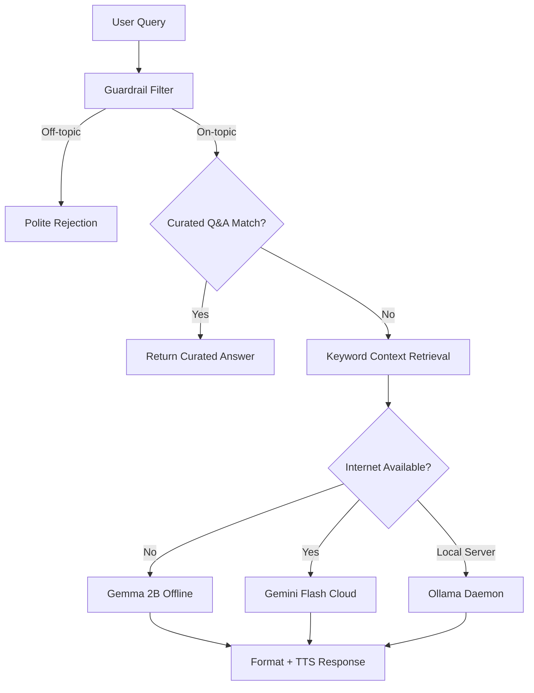

# 05 — AI & ML Pipeline

## Overview

EasyLens runs a **multi-tier AI pipeline** that blends on-device ML inference with local and cloud LLMs:

```
Camera Frame → ML Kit (on-device) → Labels / Objects / Faces / Text
User Query  → RAG Pipeline → Gemma (offline) | Gemini (cloud) | Ollama (local)
```

---

## 1. On-Device ML Kit Models

All ML Kit models run **on-device** with zero latency and no internet required.

### Image Labeling (`google_mlkit_image_labeling`)
- **Purpose:** Classifies the scene visible in the camera (e.g., "furniture", "person", "outdoor")
- **Usage:** Default HUD mode and Object Detection mode
- **Throttle:** Processed every frame (~400ms cooldown)
- **Label Refinement:** Raw labels are refined via `_refineLabel()` to user-friendly names:
  - `"musical instrument"` → `"laptop or keyboard"`
  - `"partition"` → `"wall"`
  - `"stool"` → `"chair"`

### Object Detection (`google_mlkit_object_detection`)
- **Purpose:** Draws bounding boxes around detected objects with tracking IDs
- **Usage:** Object Detection mode and Navigation mode
- **Configuration:** Uses the base `ObjectDetectorOptions` (NOT custom TFLite models — see Known Issues)
- **Options:**
  ```dart
  ObjectDetectorOptions(
    mode: DetectionMode.stream,
    classifyObjects: true,
    multipleObjects: true,
  )
  ```
- **Throttle:** 400ms minimum between detections

### Text Recognition (`google_mlkit_text_recognition`)
- **Purpose:** OCR to read printed text (labels, signs, prescriptions)
- **Usage:** Nearby Text scanner mode

### Face Detection (`google_mlkit_face_detection`)
- **Purpose:** Detects faces in frame for recognition against registered faces
- **Usage:** Face Recognition HUD mode
- **Throttle:** 1500ms minimum between detections

---

## 2. TFLite SSD MobileNetV2

### Model Specs
| Property | Value |
|---|---|
| File | `assets/models/ssd_mobilenet_v2.tflite` |
| Labels | `assets/models/coco_labels.txt` (91 COCO classes) |
| Input | `300×300` RGB float32 array |
| Output | Bounding boxes, class IDs, confidence scores |
| Threads | 4 CPU threads |
| Service | `TfliteProcessor` (`lib/services/tflite_processor.dart`) |

### Processing Pipeline
1. Camera frame (YUV420) → `compute()` isolate → NV21 bytes
2. NV21 → crop/resize to 300×300 → normalize to `[0, 1]` float32
3. Run TFLite interpreter
4. Post-process: apply confidence threshold, NMS, map class IDs to COCO labels

---

## 3. RAG (Retrieval-Augmented Generation) System

### Architecture



### Guardrails
The RAG service implements multiple safety layers:

1. **Off-Topic Filter** — Rejects math problems, trivia, and queries unrelated to visual assistance
2. **Curated Q&A Database** — Pre-written answers for common questions:
   - "What is EasyLens?"
   - "How to read text?"
   - "How to register a face?"
   - "How to use this app?"
3. **Keyword Context Retrieval** — Extracts relevant context chunks based on query keywords before sending to the LLM
4. **System Prompt** — Constrains Buddy's personality (friendly golden retriever assistant) and scope (visual assistance only)

### LLM Backends

#### Gemma 2B (Primary — Offline)
- **Package:** `flutter_gemma: ^0.13.6`
- **Model:** Gemma-IT 2B (Instruction Tuned)
- **Initialization:** Background async in `main.dart` via `RagService().initializeGemma()`
- **Hardware:** Uses NNAPI/GPU delegates where available

#### Gemini Flash (Cloud)
- **Package:** `google_generative_ai: ^0.4.4`
- **Model:** `gemini-3.5-flash`
- **API Key:** `GEMINI_API_KEY` from `.env`
- **Usage:** When internet is available and user prefers cloud responses. Supports **multimodal input** by accepting real-time JPEG frame bytes directly from the camera/ESP32-CAM to perform visual scene description and answer scene-specific questions.

#### Ollama (Local Server Fallback)
- **Endpoint:** `http://10.0.2.2:11434` (Android emulator) or `http://localhost:11434` (iOS)
- **Models:** `llama3.2`, `gemma2:2b`, `qwen2.5:0.5b`
- **Usage:** Development/testing with a local Ollama daemon

---

## 4. Continuous Conversation History (Context-Aware Dialogue)

EasyLens supports continuous, follow-up voice assistant conversations:
- **Conversation History Store:** Caches the last 5 turns (up to 10 dialogue exchanges) in a dynamic `_conversationHistory` list.
- **Context Injection:** Injects formatted chat history turns directly into the Gemma/Gemini prompts before inference, giving the LLM memory of past exchanges.
- **Auto-Cleanup:** Automatically clears the conversation cache when toggling continuous voice modes or switching tabs to prevent context pollution.

---

## 5. Camera Frame Processing Rules

### Mode-Specific Processing

| HUD Mode | Object Detector | Image Labeler | Rationale |
|---|---|---|---|
| `navigation` | ✅ | ✅ | Runs both, but **staggered on alternate 800ms frames** (staggered by 400ms) to avoid CPU/memory contention. |
| `objectDetection` | ✅ | ✅ | SSD MobileNet/COCO label bounding boxes. |
| `faceRecognition` | ❌ | ❌ | Only face detection runs (separate pipeline). |
| Default | ❌ | ✅ | Standard image labeling for scene classification. |

### Memory Management Rules
1. **Single-frame lock** — `_isProcessingFrame` boolean prevents concurrent processing
2. **Staggered Execution** — In `navigation` mode, Object Detector and Image Labeler alternate frames, reducing memory allocation and processor contention by 50%.
3. **400ms cooldown** — Enforced delay between frames (~2.5 FPS)
4. **`mounted` guards** — All async callbacks check `mounted` before `setState`
5. **`stopImageStream()` in `dispose()`** — Prevents native memory leak on screen exit
6. **YUV conversion in isolate** — `compute()` runs byte conversion off the main thread

### Coordinate System (Portrait Mode)
Due to 90° sensor rotation, the screen's horizontal X axis maps to the raw image's vertical Y axis:

```dart
// Screen-relative horizontal center of a detected object:
final normCenterX = 1.0 - (((obj.boundingBox.top + obj.boundingBox.bottom) / 2.0) / height);
// normCenterX ∈ [0.0, 1.0] where 0.0 = screen left, 1.0 = screen right
```

This inversion (`1.0 - ...`) accounts for the mirrored coordinate space.
