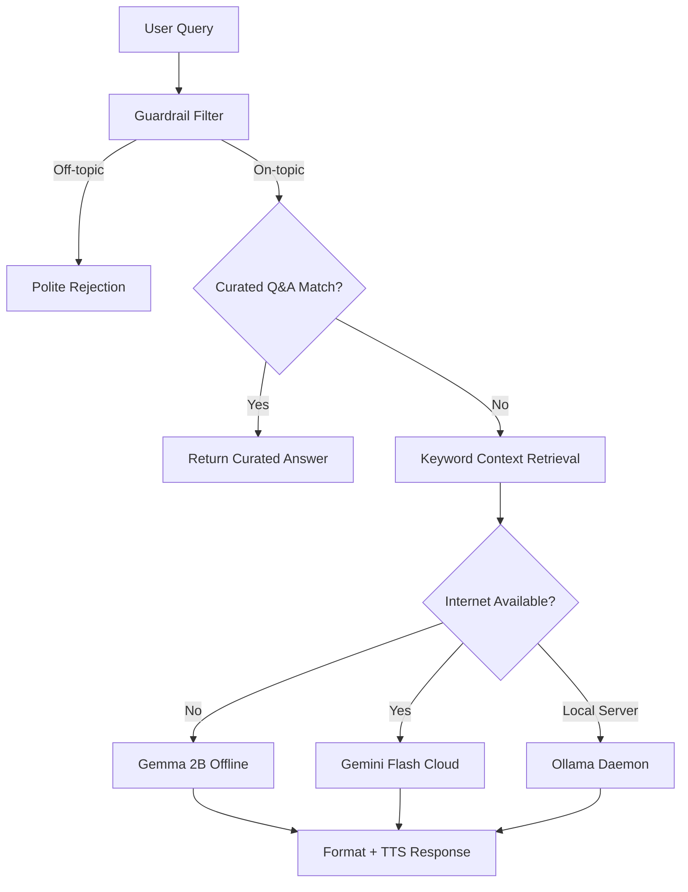

# 05 — AI & ML Pipeline

---

### 01 — OVERVIEW

EasyLens runs a multi-tier AI pipeline that blends on-device ML inference with local and cloud LLMs:

```text
Camera Frame → ML Kit (on-device) → Labels / Objects / Faces / Text / Door & Window Warnings
User Query  → RAG Pipeline → Gemma (offline) | Gemini (cloud) | Ollama (local)
```

---

### 02 — CORE MACHINE LEARNING & VISION ALGORITHMS

EasyLens utilizes specialized, high-performance algorithms to perform real-time visual scene parsing on edge devices:

#### 1. Object Detection: SSD MobileNet V2
* **Algorithm**: **Single Shot MultiBox Detector (SSD) with a MobileNet V2 backbone**.
* **Details**: SSD performs localization (bounding box coordinates) and classification (class label scores) in a single unified feedforward convolutional network. MobileNet V2 serves as the feature extractor, utilizing depthwise separable convolutions and linear bottlenecks to minimize CPU and RAM cycles on mobile hardware.
* **Non-Critical Architectural Cues**: Detects structural elements like doors and windows, rendering subtle ambient guidance ("Door detected", "Window detected") without interrupting primary navigation warnings.

#### 2. Face Detection & Recognition: Convolutional Landmarks + L2 Euclidean Distance
* **Detection Algorithm**: A **Multi-task Cascade Convolutional Network (MTCNN)** / Google Face Detector that outputs bounding boxes, rotation angles, and landmark locations.
* **Recognition Algorithm**: **L2 Euclidean Distance Vector Matching** (nearest-neighbor search). The face image is cropped and translated into a 128-dimensional normalized floating-point embedding vector space. When recognizing a face, the system calculates the L2 Euclidean distance between the live embedding vector and the registered vectors database:
  $$\text{Distance} = \sqrt{\sum_{i=1}^{n} (p_i - q_i)^2}$$
  If the L2 distance is below a strict confidence threshold (typically $d \le 0.6$), it announces the user's name.

#### 3. Image Labeling: MobileNet V3 / CNN Classifier
* **Algorithm**: **MobileNet V3 Large / Small Convolutional Neural Network**.
* **Details**: Performs real-time multi-label classification on the raw video stream, returning semantic labels mapped to COCO or Google Knowledge Graph taxonomies. Enhanced with creative indoor and outdoor dialogue generators for natural voice feedback.

---

### 03 — ON-DEVICE ML KIT MODELS

#### Image Labeling (`google_mlkit_image_labeling`)
- **Purpose:** Classifies the scene visible in the camera (e.g., "furniture", "person", "outdoor")
- **Usage:** Default HUD mode and Object Detection mode
- **Throttle:** Processed every frame (~400ms cooldown)
- **Label Refinement & Scenery Dialogues:** Raw labels are refined via `_refineLabel()` to user-friendly names:
  - `"musical instrument"` → `"laptop or keyboard"`
  - `"partition"` → `"wall"`
  - `"stool"` → `"chair"`
  - Creative indoor/outdoor dialogues synthesize these labels into spoken environment descriptions.

#### Object Detection (`google_mlkit_object_detection`)
- **Purpose:** Draws bounding boxes around detected objects with tracking IDs and triggers obstacle/architectural warnings
- **Usage:** Object Detection mode and Navigation mode
- **Configuration:** Uses the base `ObjectDetectorOptions` (NOT custom TFLite models — see Known Issues)
- **Options:**
  ```dart
  ObjectDetectorOptions(
    mode: DetectionMode.stream,
    classifyObjects: true,
    multipleObjects: true,
  )
  ```
- **Throttle:** 400ms minimum between detections

#### Text Recognition (`google_mlkit_text_recognition`)
- **Purpose:** OCR to read printed text (labels, signs, prescriptions)
- **Usage:** Nearby Text scanner mode

#### Face Detection (`google_mlkit_face_detection`)
- **Purpose:** Detects faces in frame for recognition against registered faces
- **Usage:** Face Recognition HUD mode
- **Throttle:** 1500ms minimum between detections

---

### 04 — ON-DEVICE TFLITE MODELS

#### Standard SSD MobileNetV2 (80 COCO Classes)
| Property | Value |
|---|---|
| File | `assets/models/ssd_mobilenet_v2.tflite` |
| Labels | `assets/models/coco_labels.txt` (80 COCO classes) |
| Input | `300×300` RGB float32 array |
| Output | Bounding boxes `[ymin, xmin, ymax, xmax]`, class IDs, confidence scores |
| Threads | 4 CPU threads |
| Service | `TfliteProcessor` ([`lib/services/tflite_processor.dart`](file:///Users/arronkianparejas/easylens/lib/services/tflite_processor.dart)) |

#### Custom Fine-Tuned 24-Class MobileNetV2 (Navigation Safety Classifier)
EasyLens integrates a custom fine-tuned MobileNetV2 model trained on 38,176 cleaned images across 24 high-priority navigation classes (`pothole`, `crosswalk`, `stairs`, `red_light`, `green_light`, `door`, `elevator`, etc.).

* **Training Strategy**: 4-Phase Transfer Learning (Warm-up $\rightarrow$ Mid-Level 30-Layer Unfreezing with Class Weights $\rightarrow$ Deep Full Unfreezing $\rightarrow$ Ultra-Low LR Optimization).
* **Top-1 Accuracy**: 85.55% | **Top-2 Accuracy**: 92.10% | **Top-3 Accuracy**: 94.54%
* **Balanced Accuracy**: 85.02% | **Macro ROC AUC**: 0.9902
* **Hazard Sensitivity**: 97% Recall on Potholes, 95% F1 on Crosswalks, 92% Recall on Stairs.
* **Inference Speed**: 2.48 ms per image (>400 FPS latency profile).
* **Technical Report**: See [`docs/training/mobilenetv2_finetuning_report.md`](file:///Users/arronkianparejas/easylens/docs/training/mobilenetv2_finetuning_report.md)
* **Hybrid Fusion Architecture**: See [`docs/training/hybrid_ai_fusion_app_integration.md`](file:///Users/arronkianparejas/easylens/docs/training/hybrid_ai_fusion_app_integration.md)

#### Processing Pipeline
1. Camera frame (YUV420 or Smart Glasses stream) → `compute()` isolate → NV21 bytes
2. NV21 → crop/resize to 300×300 → normalize to `[-1, 1]` float32
3. Run TFLite interpreter
4. Post-process: apply confidence threshold, NMS, map class IDs to COCO & Custom Navigation labels

---

### 05 — RAG (RETRIEVAL-AUGMENTED GENERATION) SYSTEM

#### Architecture

**Simplified AI/ML Pipeline Overview**


**Detailed RAG Architecture Diagram**


#### Guardrails
The RAG service implements multiple safety layers:

1. **Off-Topic Filter** — Rejects math problems, trivia, and queries unrelated to visual assistance
2. **Curated Q&A Database** — Pre-written answers for common questions:
   - "What is EasyLens?"
   - "How to read text?"
   - "How to register a face?"
   - "How to use this app?"
3. **Keyword Context Retrieval** — Extracts relevant context chunks based on query keywords before sending to the LLM
4. **System Prompt** — Constrains Buddy's personality (friendly assistant) and scope (visual assistance only)

#### LLM Backends

**Gemma 2B (Primary — Offline)**
- **Package:** `flutter_gemma: ^0.13.6`
- **Model:** Gemma-IT 2B (Instruction Tuned)
- **Initialization:** Background async in `main.dart` via `RagService().initializeGemma()`
- **Hardware:** Uses NNAPI/GPU delegates where available

**Gemini Flash (Cloud)**
- **Package:** `google_generative_ai: ^0.4.4`
- **Model:** `gemini-3.5-flash`
- **API Key:** `GEMINI_API_KEY` from `.env`
- **Usage:** When internet is available and user prefers cloud responses. Supports multimodal input by accepting real-time JPEG frame bytes directly from the camera/ESP32-CAM to perform visual scene description and answer scene-specific questions.

**Ollama (Local Server Fallback)**
- **Endpoint:** `http://10.0.2.2:11434` (Android emulator) or `http://localhost:11434` (iOS)
- **Models:** `gemma2:2b`
- **Usage:** Development/testing with a local Ollama daemon

---

### 06 — CONTINUOUS CONVERSATION HISTORY (CONTEXT-AWARE DIALOGUE)

EasyLens supports continuous, follow-up voice assistant conversations:
- **Conversation History Store:** Caches the last 5 turns (up to 10 dialogue exchanges) in a dynamic `_conversationHistory` list.
- **Context Injection:** Injects formatted chat history turns directly into the Gemma/Gemini prompts before inference, giving the LLM memory of past exchanges.
- **Auto-Cleanup:** Automatically clears the conversation cache when toggling continuous voice modes or switching tabs to prevent context pollution.

---

### 07 — CAMERA FRAME PROCESSING RULES

#### Mode-Specific Processing

| HUD Mode | Object Detector | Image Labeler | Rationale |
|---|---|---|---|
| `navigation` | Yes | Yes | Runs both, but staggered on alternate 800ms frames (staggered by 400ms) to avoid CPU/memory contention. |
| `objectDetection` | Yes | Yes | SSD MobileNet/COCO label bounding boxes + Non-critical Door and Window warnings. |
| `faceRecognition` | No | No | Only face detection runs (separate pipeline). |
| Default | No | Yes | Standard image labeling for scene classification & indoor/outdoor dialogues. |

#### Memory Management Rules
1. **Single-frame lock** — `_isProcessingFrame` boolean prevents concurrent processing
2. **Staggered Execution** — In `navigation` mode, Object Detector and Image Labeler alternate frames, reducing memory allocation and processor contention by 50%.
3. **400ms cooldown** — Enforced delay between frames (~2.5 FPS)
4. **`mounted` guards** — All async callbacks check `mounted` before `setState`
5. **`stopImageStream()` in `dispose()`** — Prevents native memory leak on screen exit
6. **YUV conversion in isolate** — `compute()` runs byte conversion off the main thread
7. **Smart Glasses Fallback** — System handles stream interruptions by reverting to native mobile camera frames without crashing ML pipelines

#### Coordinate System (Portrait Mode)
Due to 90° sensor rotation, the screen's horizontal X axis maps to the raw image's vertical Y axis:

```dart
// Screen-relative horizontal center of a detected object:
final normCenterX = 1.0 - (((obj.boundingBox.top + obj.boundingBox.bottom) / 2.0) / height);
// normCenterX ∈ [0.0, 1.0] where 0.0 = screen left, 1.0 = screen right
```

This inversion (`1.0 - ...`) accounts for the mirrored coordinate space.
