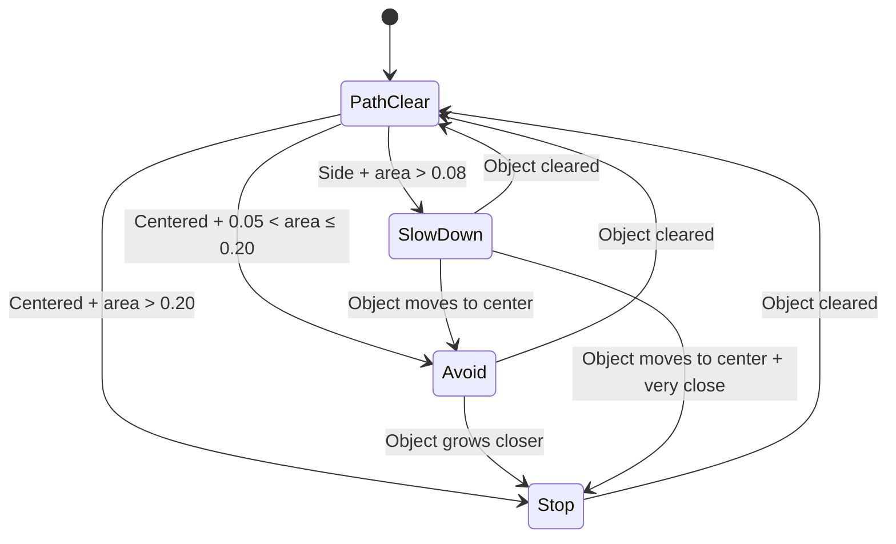

# 06 — Walking Navigation System

## Overview

The walking navigation system provides real-time obstacle warnings for visually impaired users. It uses Google ML Kit's object detector to track objects in the camera feed and maps their positions to **4 distinct guidance states**.

---

## State Machine



---

## 4 Guidance States

### 1. 🔴 Stop Immediately (`area > 0.20` + centered)
| Property | English | Tagalog |
|---|---|---|
| Title | Stop immediately | Huminto agad |
| Speech | "Stop immediately. {Object} is directly in front of you." | "Huminto agad. May {Object} sa iyong tapat." |
| UI Color | `#FFEBEE` (red tint) |
| Icon | `Icons.report_problem` (red) |
| Haptic | Critical (strong vibration) |

### 2. 🟠 Avoid Obstacle (`0.05 < area ≤ 0.20` + centered)
| Property | English | Tagalog |
|---|---|---|
| Title | Avoid Obstacle | Iwasan ang Harang |
| Speech | "Obstacle ahead: {Object} is directly in your path. Avoid it by stepping to your {left/right}." | "May harang sa harap: ang {Object} ay nasa tapat mo. Iwasan ito sa pamamagitan ng paghakbang sa {kaliwa/kanan}." |
| UI Color | `#FFF3E0` (orange tint) |
| Icon | `Icons.warning_amber_rounded` (orange) |
| Haptic | Normal |
| Escape Direction | Checks all other detected objects to find the clearer side |

### 3. 🟡 Slow Down (`area > 0.08` + NOT centered)
| Property | English | Tagalog |
|---|---|---|
| Title | Slow Down | Dahan-dahan |
| Speech | "Slow down. {Object} detected on your {left/right}." | "Magdahan-dahan. May {Object} sa iyong {kaliwa/kanan}." |
| UI Color | `#FFFDE7` (yellow tint) |
| Icon | `Icons.speed` (yellow) |
| Haptic | None |

### 4. 🟢 Path Clear (default — all other cases)
| Property | English | Tagalog |
|---|---|---|
| Title | Path Clear | Malinis ang Daan |
| Speech | "The pathway ahead is clear." (only spoken once on transition from blocked) | "Malinis ang daan." |
| UI Color | `#E8F5E9` (green tint) |
| Icon | `Icons.check_circle_outline` (green) |
| Haptic | None |

---

## Coordinate Math

### Centering Detection
An object is "centered" when it occupies the middle ~24% of the screen horizontally:

```dart
final isCentered = normCenterX >= 0.38 && normCenterX <= 0.62;
```

### Portrait Rotation Correction
Phone cameras in portrait mode have a 90° sensor rotation. The raw image Y axis corresponds to the screen X axis:

```dart
final normCenterX = 1.0 - (((obj.boundingBox.top + obj.boundingBox.bottom) / 2.0) / height);
```

### Area Calculation
Object size is measured as normalized area (fraction of total frame):

```dart
final normW = obj.boundingBox.width / width;
final normH = obj.boundingBox.height / height;
final area = normW * normH;
```

---

## Escape Direction Logic

When an obstacle is centered (Avoid state), the system checks all other detected objects to determine which side is clearer:

```dart
bool leftBlocked = false;
bool rightBlocked = false;
for (final r in objects) {
  if (r == targetObject) continue;
  final cX = 1.0 - (((r.boundingBox.top + r.boundingBox.bottom) / 2.0) / height);
  if (cX < 0.42) leftBlocked = true;
  if (cX > 0.58) rightBlocked = true;
}
final escapeDir = (leftBlocked && !rightBlocked) ? 'right' : 'left';
```

---

## Speech Cooldowns

| State | Repeat same message | New message |
|---|---|---|
| Stop | Every 3 seconds | Immediately |
| Avoid | Every 5 seconds | Immediately |
| Slow Down | Every 6 seconds | Immediately |
| Path Clear | Once per transition | — |

The `_wasPathBlocked` flag ensures "Path Clear" is only spoken once when transitioning from a blocked state.

---

## Key Variables

| Variable | Type | Purpose |
|---|---|---|
| `_wasPathBlocked` | `bool` | Tracks if path was previously blocked (for "clear" announcement) |
| `_lastGuidanceText` | `String` | Last spoken guidance text (dedup) |
| `_lastGuidanceTime` | `DateTime?` | Timestamp of last speech (cooldown) |
| `_lastObjectDetectionTime` | `int` | Milliseconds epoch of last detection run |

---

## Key File

All navigation logic lives in:
- `lib/screens/hardware/hardware_screen.dart` → `_processObjectResults()` and `_clearPath()`
