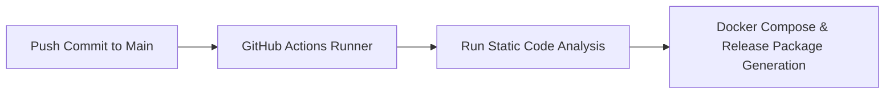

# 09 — Testing & CI/CD

This document details the testing framework, continuous integration setup, and manual/automated deployment procedures for EasyLens.

---

### 01 — TEST SUITE & VERIFICATION

EasyLens utilizes Flutter's standard testing tools for unit, widget, and integration testing.

#### Running Unit & Widget Tests
To run all tests in the test suite locally:
```bash
flutter test
```

#### Running Static Code Analysis
To verify code formatting, guidelines, and compilation correctness:
```bash
flutter analyze --no-fatal-warnings --no-fatal-infos
```

#### Manual Pre-Release Quality Checklist
Before committing to `main` or building release packages, verify:
- [x] Static code analysis passes with zero severe errors (`flutter analyze`)
- [x] Audio TTS persona switching executes cleanly on Android without binder disconnects
- [x] Camera stream stops cleanly on screen pop (`stopImageStream()`)
- [x] Wakelock stays active during camera and onboarding wizard flows
- [x] Multi-step signup wizard (18 steps) saves profile data (`isForMyself`, `selectedConditions`) to Firestore

---

### 02 — SIMPLIFIED CI/CD & RELEASE FLOWCHART



---

### 03 — CI/CD GITHUB ACTIONS PIPELINE

The pipeline is defined in [.github/workflows/ci_cd.yml](file:///Users/arronkianparejas/easylens/.github/workflows/ci_cd.yml).

#### Triggers
- **Push events** to the `main` branch.
- **Pull requests** targeting the `main` branch.

#### Jobs & Steps
The CI pipeline is lightweight, focusing on static code analysis to ensure changes build successfully:
1. **Environment Setup**: Initializes standard JDK 17 (Zulu distribution) and the Flutter SDK (`^3.11.5`).
2. **Install Dependencies**: Fetches package dependencies via `flutter pub get`.
3. **Environment Prep**: Creates a mock `.env` file to satisfy dependency imports.
4. **Code Analysis**: Executes `flutter analyze --no-fatal-warnings --no-fatal-infos` to verify formatting, syntax, and type safety constraints.

*Note: Unit tests and automated APK builds have been removed from the CI workflow to optimize runner resources and prevent unnecessary build issues.*

---

### 04 — MANUAL DEPLOYMENT & RELEASE

To compile and package the app for manual release:

#### 1. Build Split-per-ABI Release APKs (Recommended for Fast Upload & Target Devices)
```bash
flutter build apk --split-per-abi --obfuscate --split-debug-info=build/app/outputs/symbols
```
This compiles architecture-optimized standalone binaries with stripped debug symbols:
- **`app-arm64-v8a-release.apk`** (~317 MB): **Recommended build for 95%+ of modern Android phones** (Samsung, Pixel, Xiaomi, OnePlus, Oppo, Vivo). Offers the fastest cloud upload / download time and lowest memory consumption.
- **`app-armeabi-v7a-release.apk`** (~183 MB): Targeted for older 32-bit budget Android devices.
- **`app-x86_64-release.apk`** (~241 MB): Targeted for Android Studio Emulators & Intel ChromeOS devices.

#### 2. Build Universal FAT Release APK
```bash
flutter build apk --obfuscate --split-debug-info=build/app/outputs/symbols
```
- **Location**: `build/app/outputs/flutter-apk/app-release.apk` (~498 MB)
- **Output Type**: Production multi-arch FAT package containing all 3 C++ runtimes (`arm64-v8a`, `armeabi-v7a`, `x86_64`) for universal distribution.
